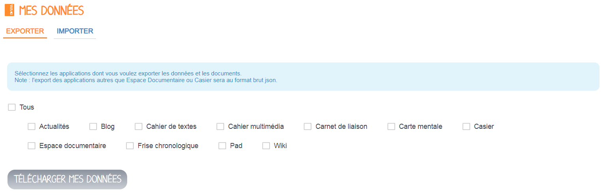

# Mes données

Des documents importants à conserver ? Des données à récupérer lors d’un changement de compte ou d’ENT ? Pas de panique ! Grâce à l’appli MES DONNEES, générez un fichier compressé \(archive\) contenant tout ou une partie de vos données. Puis importez ce fichier .zip sur un autre compte. Tout simplement !

## Présentation

Le service Mes Données a pour objectif de permettre à chaque utilisateur d'exporter les données de son compte et d'importer sur son compte des données issues de la fonctionnalité d'export.

## Exporter mes données

Connectez-vous avec le compte pour lequel vous souhaitez exporter les données de l’ENT. Sur l’onglet EXPORTER de l’application, cocher les cases des applications dont vous souhaitez récupérer le contenu \(1\) puis cliquer sur le bouton « Télécharger mes données » \(2\) :

Le téléchargement des données peut prendre plusieurs minutes pour les fichiers volumineux. Vous pouvez quitter la page et retrouver votre Export sur une notification du fil de nouveauté :

Le fichier généré \(fichier compressé\) peut être enregistré sur votre appareil. Il contient un dossier par application exportée. Les documents de l’espace personnels \(documents personnels, documents partagés, et documents ajoutés dans les applis\) ainsi que les documents associés aux contenus partagées avec vous sont exportées dans leur format d’origine. Les données propres aux applications sont exportées au format JSON.

## Importer des données

Connectez-vous avec le compte sur lequel vous souhaitez importer des données issues de l’ENT. Dans l’onglet EXPORTER de l’application, cliquez sur le bouton Parcourir \(ou utiliser la fonctionnalité glisser-déposer sur votre ordinateur\) pour charger le fichier d’export compressé que vous souhaitez importer sur votre compte.

_Seul un fichier au format .zip, généré par la fonction EXPORTER de l’application MES DONNEES, peut être importé._

Une fois le fichier sélectionné et chargé, une fenêtre s’affiche vous proposant de sélectionner les applications pour lesquelles vous souhaitez importer les contenus. Cocher les contenus à importer \(1\) puis cliquer sur le bouton Importer \(2\) _:_

_Pour que le contenu d’une application puisse être importé, il faut :_

* _Que le compte sur lequel est réalisé l’import ait des droits de création sur l’application concernée_
* _Que l’export ait été effectué sur une version compatible de l’application. Si l’export est ancien et que l’application a évolué de manière conséquente depuis, l’import ne sera pas réalisable._

A la fin de l’import, un rapport s’affiche sur l’onglet IMPORTER, indiquant notamment le nombre de contenus importés par Application.

