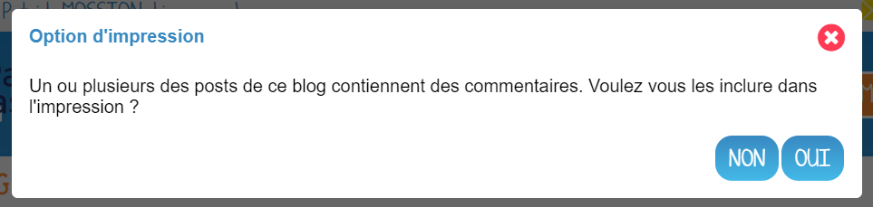

# Blog

Endossez la casquette du petit reporter en créant un **Blog** ! Publiez et partagez facilement vos informations, en y intégrant différents types de contenus : texte, images, vidéos, etc. Permettez à vos collègues ou vos élèves de contribuer ou de commenter vos billets facilement.

## Présentation

L’appli **Blog** permet de publier facilement des informations, en y intégrant **différents types de contenus** : texte, images, fichiers audio, vidéos, liens externes, etc. Les articles ou « billets » de blog sont datés, identifiés par leur auteur et sont affichés par ordre chronologique inversé (visualisation des derniers contenus publiés en haut de page).

En cas de contribution de la part d’autres utilisateurs, le gestionnaire du blog choisit le **circuit de publication** souhaité : soit il relit les billets soumis par les autres utilisateurs avant de les publier, soit les billets sont publiés immédiatement quel qu’en soit l’auteur.

## Créer un blog public ou privé

Cliquez sur la page « Mes applis » puis sur l’icône « Blog ».

Dans le service Blog, cliquez sur le bouton « Créer un blog » présent en haut à droite de la page.

Vous accédez à l’interface de création du blog.

1. Indiquez le titre de votre blog.
2. Ajoutez une description (optionnel)
3. N'oubliez pas d'illustrer le blog par une vignette (si vous ne modifiez pas l’image, c’est la vignette par défaut qui s’affichera).

Cliquez sur « Créer » pour valider la création du blog.

**Créer un blog public**

Si vous êtes administrateur, vous avez la possibilité de créer un blog public.

Pour créer un blog accessible à des personnes extérieures à l'ENT, allez dans la page d’accueil des blogs et ouvrez le toaster d’actions via les 3 petits points du blog concerné.

Cliquez sur "Propriétés". La page des propriétés du blog s'ouvre et vous pouvez y trouver une rubrique nommée "Accès au blog".

Activez l’option “Accessible publiquement via une URL" (1)

L'URL se crée automatiquement. C'est l'adresse qui permettra d'accéder au blog sans être connecté à l'ENT.

Pour communiquer facilement cette URL, vous pouvez cliquer sur le bouton "Copier URL". (2)

Note : Si l'on rend public un blog, les documents chargés sur le blog (par vous ou par un autre utilisateur) seront, eux aussi publics.

Sur la vignette du blog, le symbole suivant vous informe que le contenu est public :

L'URL du blog public est également visible dans le blog, sous l'image du blog. L'adresse apparaît tronquée. Par un clic-droit, vous pouvez récupérer l'URL en choisissant l'option "Copier l'adresse du lien".

Note : Les commentaires qui s'affichent dans l'ENT ne sont pas visibles sur la version publique du blog.

## Partager un blog et gérer le circuit de publication

Le blog a été créé, mais n’est pas encore visible par les autres utilisateurs.

Pour partager un blog avec d’autres utilisateurs, suivez les étapes suivantes :

1. Cliquez sur les 3 petits points qui apparaissent au survol de la souris sur le blog à partager (1)
2. Cliquez sur le bouton « Partager » qui se trouve dans le toaster d’actions qui vient de s’ouvrir (2)

Pour le partager, suivez les étapes suivantes :

1. Saisissez les premières lettres du nom de l’utilisateur ou du groupe d’utilisateurs que vous recherchez.
2. Sélectionnez le résultat.
3. Cochez les cases correspondant aux droits que vous souhaitez leur attribuer.

Les différents droits que vous pouvez attribuer aux autres utilisateurs sont les suivants :

* **Consulter** : l’utilisateur peut lire le contenu du blog
* **Contribuer** : l’utilisateur peut publier un nouveau billet
* **Gérer** : l’utilisateur peut gérer le blog, c’est-à-dire le modifier, le partager ou le supprimer
* **Commenter** : l’utilisateur peut commenter les billets

Pour valider, cliquez sur le bouton "Partager".

De plus, concernant les blogs sur lesquels vous êtes propriétaire, une icône vous permet de savoir si le contenu a déjà été partagé :

Pour gérer le circuit de publication de votre blog, ouvrez la fenêtre de partage. En bas de la fenêtre de partage, vous pouvez choisir entre deux options :

* **Publication immédiate** : lorsque des utilisateurs contributeurs créent un billet, celui-ci est directement publié dans le blog.
* **Billet à soumettre** : lorsque des utilisateurs contributeurs créent un billet, le billet passe au statut « Soumis » et c’est le gestionnaire du blog qui effectue l’action de publication du billet.

## Publier et valider un billet

Une fois votre blog créé, vous pouvez publier un billet. Pour cela, cliquez sur le bouton « Créer un billet » présent en haut de l’écran.

L’outil de création du billet s’affiche dans la page :

1. Saisissez le titre
2. Rédigez le contenu du billet.

Une fois la saisie terminée, vous avez différents boutons d'action (3) :

* **Enregistrer le billet** : il passe alors au format brouillon et n’est pas visible des autres utilisateurs ayant accès au blog
* **Publier le billet** : le billet est alors visible par les utilisateurs ayant accès au blog
* **Annuler** la création du billet

Pour les utilisateurs pouvant contribuer à un blog dans lequel le circuit de publication a été activé, un bouton « Envoyer » s’affiche : il leur permet de soumettre leur billet au gestionnaire du blog qui se chargera de la publication ou non du billet.

**Valider un billet**

Si vous avez activé un circuit de publication (billets à soumettre pour les contributeurs), les billets en attente de validation se trouvent dans la catégorie « Soumis ».

Cliquez la case à cocher des billets soumis pour afficher les billets rédigés par les contributeurs du blog.

Vous pouvez réaliser les actions suivantes en cliquant sur « Publier » ou sur l’icône

* **Publier** le billet sans mise à jour : le billet est alors visible par tous les utilisateurs ayant accès au blog
* **Modifier** le billet avant publication : vous accédez à l’éditeur de texte pour apporter vos modifications
* **Imprimer** le billet
* **Supprimer** le billet

## Organiser vos blogs et billets de blog

Vous disposez de 3 filtres (1) pour afficher vos blogs :

* **Mes blogs**, pour afficher/masquer les blogs dont vous êtes le propriétaire
* **Les blogs partagés avec moi**, pour afficher/masquer les blogs qui vous ont été partagés
* **Blogs publics**, pour afficher/masquer les blogs accessibles publiquement

Une barre de recherche (2) vous permet de trouver rapidement un blog en saisissant son nom.

Afin d'organiser vos blogs, vous disposez de l'arborescence (3) suivante :

* **Mes blogs**, qui est le dossier principal, dans lequel vous pourrez créer tous vos sous-dossiers (grâce au bouton **Nouveau dossier**)
* **Corbeille** où vous retrouverez les blogs que vous aurez supprimés, pour éviter toute suppression définitive involontaire

Fonctionnement de la **corbeille** et mise en sourdine :

* Les ressources que vous avez placées ou qu’un auteur/gestionnaire a placées dans votre propre corbeille ne génèrent plus de notifications mails ni de notifications dans le fil de nouveautés.

* Les dossiers placés dans la corbeille sont automatiquement et définitivement supprimés. Les ressources contenues de ces dossiers ne sont cependant pas définitivement supprimées, et s’ajouteront simplement aux autres éléments de la corbeille.

* Les ressources restaurées depuis la corbeille se replaceront dans leur dossier d’origine si celui-ci existe toujours. Les notifications seront également réactivées pour les ressources restaurées.

**Déplacer un blog**

Après avoir créé vos différents dossiers, sélectionnez le ou les blogs que vous voulez mettre dans vos dossiers via les 3 petits points des blogs (1), puis cliquez sur le bouton "Déplacer" (2).

Une fenêtre s'ouvrira, vous permettant de déplacer le blog sélectionné dans un dossier existant ou d'en créer un nouveau. Il vous est également possible de déplacer des dossiers.

**Organiser les billets d'un blog**

Il vous est possible de modifier l'ordre des billets. Ainsi, vous pouvez choisir pour chaque billet de le remonter en première position.

Cliquer sur le bouton "+" du billet que vous souhaitez remonter (1) puis cliquer sur "Remonter" (2).

Un message de confirmation apparaît pour vous demander de confirmer la remontée du billet.

## Publier dans la Bibliothèque

La Bibliothèque est un espace de partage et d’inspiration entre enseignants.

Si vous souhaitez publier votre blog dans la bibliothèque pour inspirer d’autres enseignants, faites comme ceci :

1. Ouvrez le toast d’actions via les 3 petits points sur le blog que vous souhaitez publier. Un bandeau apparaît en bas avec le bouton "publier dans la bibliothèque".

2. Vous devez ensuite renseigner les caractéristiques de votre contenu pour expliquer votre usage :

* **Titre** : le plus explicatif possible
* **Vignette** : carrée au format JPG ou PNG
* **Description et contexte pédagogique** : Décrivez l’activité, son contexte, vos intentions pédagogiques, les résultats obtenus… Dites-nous tout ! 
* **Type d’activité** : activité en classe, à la maison, individuelle, en groupe ? 
* **Discipline** : Quelle est la discipline concernée par l’activité
* **Langue** : Dans quelle langue est l’activité ? 
* **Âge des élèves** : Quel est la tranche d’âge des élèves concernés par l’activité ? 
* **Mots-clés** : Quels sont les mots-clés qui caractérisent le mieux votre activité ? 

Attention, tous les champs sont obligatoires sauf les mots clefs.

Vous aurez ensuite la possibilité de modifier les champs saisis ou de supprimer la publication de votre blog en cliquant sur “Modifier” depuis la page de votre activité.

**Raccourcis vers la bibliothèque**

En tant qu'enseignant, dans la page d’accueil contenant la liste de vos blogs, un encart à gauche vous permet d’accéder rapidement à la bibliothèque pour récupérer de nouvelles activités.

## Imprimer et exporter un blog

Lorsque vous naviguez sur votre blog, vous avez la possibilité de l'imprimer, en cliquant sur le bouton "**Imprimer**" :

Une option vous permettra de choisir si vous souhaitez imprimer le blog avec les commentaires ou non :

**Exporter un blog en PDF**

Si vous souhaitez exporter votre blog sous la forme d'un fichier PDF, il vous faut suivre les mêmes démarches que pour imprimer. Ensuite selon le navigateur utilisé :

* Pour Chrome :

Dans le champ "Destination", choisissez l'option Enregistrer au format PDF

* Pour Internet Explorer, Microsoft Edge et Mozilla Firefox :

Dans le champ "Nom", choisissez l'option "Microsoft Print to PDF"

* Pour Safari :

Cliquez sur la flèche vers le bas situé à côté du PDF puis choisissez l'option "Enregistrer au format PDF"

