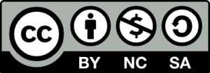
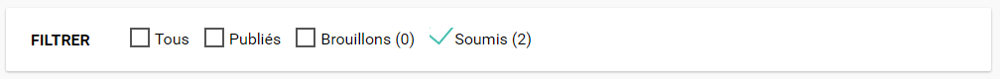

[[blog]]
= Blog

Endossez la casquette du petit reporter !  Créez un *Blog* ! Publier et partager facilement vos informations, en y intégrant différents types de contenus : texte, images, vidéos, etc. 

* link:index.html?iframe=true#presentation[Présentation]
* link:index.html?iframe=true#cas-d-usage-1[Créer un blog]
* link:index.html?iframe=true#cas-d-usage-2[Partager un blog]
* link:index.html?iframe=true#cas-d-usage-3[Gérer le circuit de
publication]
* link:index.html?iframe=true#cas-d-usage-4[Publier un billet]
* link:index.html?iframe=true#cas-d-usage-5[Valider un billet]

[[presentation]]
== Présentation

L'appli *Blog* permet de publier facilement des informations, en y
intégrant **différents types de contenus** : texte, images, fichiers
audio, vidéos, liens externes, etc. Les articles ou « billets » de blog
sont datés, identifiés par leur auteur et sont affichés par ordre
chronologique inversé (visualisation des derniers contenus publiés en
haut de page).

En cas de contribution de la part d'autres utilisateurs, le gestionnaire
du blog choisit le **circuit de publication** souhaité : soit il relit
les billets soumis par les autres utilisateurs avant de les publier,
soit les billets sont publiés immédiatement quel qu'en soit l'auteur.

image:/assets/Blog 1.png[]

[[cas-d-usage-1]]
== Créer un blog

Cliquez sur la page « Mes applis » puis sur l’icône « Blog ».

image:/assets/Blog 2.png[]

Dans le service Blog, cliquez sur le bouton « Créer un blog » présent en
haut à droite de la page.

image:/assets/Blog 3.png[]

Vous accédez à l’interface de création du blog.

1.  Indiquez le titre de votre blog.
2.  Ajoutez une vignette d’illustration du blog (si vous ne modifiez pas
l’image, c’est la vignette par défaut qui s’affichera).
3.  Cliquez sur « Enregistrer ».

image:/assets/Blog 4.png[]

[[cas-d-usage-2]]
== Partager un blog

Pour partager un blog avec d’autres utilisateurs, suivez les étapes
suivantes :

1.  Cliquez sur le + du blog (1)
2.  Cliquez sur le bouton « Partager » (2)

image:/assets/Blog 5.png[]

Le blog a été créé mais n’est pas encore visible par les autres
utilisateurs. Pour le partager, suivez les étapes suivantes :

1.  Saisissez les premières lettres du nom de l’utilisateur ou du groupe
d’utilisateurs que vous recherchez.
2.  Sélectionnez le résultat.
3.  Cochez les cases correspondant aux droits que vous souhaitez leur
attribuer.

image:/assets/Blog 6.png[]

Les différents droits que vous pouvez attribuer aux autres utilisateurs
sont les suivants :

* *Consulter* : l’utilisateur peut lire le contenu du blog
* *Contribuer* : l’utilisateur peut publier un nouveau billet
* *Gérer* : l’utilisateur peut gérer le blog, c'est-à-dire le modifier,
le partager ou le supprimer
* *Commenter* : l’utilisateur peut commenter les billets

[[cas-d-usage-3]]
== Gérer le circuit de publication

Pour gérer le circuit de publication de votre blog, ouvrez la fenêtre de
partage. Vous pouvez choisir entre deux options :

* *Publication immédiate* : lorsque des utilisateurs contributeurs
créent un billet, celui-ci est directement publié dans le blog.
* *Billet à soumettre* : lorsque des utilisateurs contributeurs créent
un billet, le billet passe au statut « Soumis » et c’est le gestionnaire
du blog qui effectue l’action de publication du billet.

image:/assets/Blog 7.png[]

[[cas-d-usage-4]]
== Publier un billet

Une fois votre blog créé, vous pouvez publier un billet. Pour cela,
cliquez sur le bouton « Créer un billet » présent en haut de l’écran.

image:/assets/Blog 8.png[]
L'outil de création du billet s’affiche dans la page :

1.  Saisissez le titre
2.  Rédigez le contenu du billet.

image:/assets/Blog 9.png[]

Une fois la saisie terminée, vous pouvez soit :

* *Enregistrer le billet* : il passe alors au format brouillon et n'est
pas visible des autres utilisateurs ayant accès au blog
* *Publier le billet* : le billet est alors visible par les utilisateurs
ayant accès au blog
* *Annuler* la création du billet

image:/assets/Blog 10.png[]

'''''

Pour les utilisateurs pouvant contribuer à un blog dans lequel le
circuit de publication a été activé, un bouton « Envoyer » s'affiche :
il leur permet de soumettre leur billet au gestionnaire du blog qui se
chargera de la publication ou non du billet. +

'''''

image:/assets/Blog 11.png[]

[[cas-d-usage-5]]
== Valider un billet

Si vous avez activé un circuit de publication (billets à soumettre pour
les contributeurs), les billets en attente de validation se trouvent
dans la catégorie « Soumis ».

Cliquez la case à cocher des billets soumis pour afficher les billets
rédigés par les contributeurs du blog.

Vous pouvez réaliser les actions suivantes en cliquant sur « Publier »
ou sur l'icône

image:/assets/blog 13.png[]

* *Publier* le billet sans mise à jour : le billet est alors visible par
tous les utilisateurs ayant accès au blog
* *Modifier* le billet avant publication : vous accédez à l’éditeur de
texte pour apporter vos modifications
* *Supprimer* le billet

image:/assets/Blog 12.png[]
