# Agenda

Une organisation haute en couleur ! Retrouvez, en un clin d’oeil, tous les événements que vous avez notés et tous ceux que l’on vous a attribués sur l’appli **Agenda**.

## Présentation

Le service Agenda permet de créer et partager des agendas et des événements.

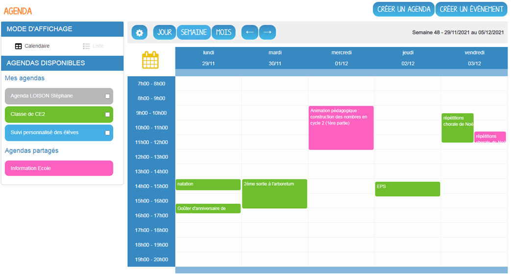

Par défaut, vous disposez d'un agenda **Agenda NOM Prénom** dans lequel vous pourrez retrouver tous les événements qui ont été partagés avec vous, hors agenda partagé. Vous pouvez utiliser cet agenda pour créer vos événements et les partager à votre tour à d'autres utilisateurs.

Depuis ce module vous pouvez :

* Créer des agendas et les partager

* Créer des événements et les partager

* Créer des agendas partagés et restreindre à l'intérieur l'affichage d'événements à un petit groupe d'utilisateurs

## Créer un agenda

Pour créer un agenda, cliquez sur le **bouton « Créer un agenda » en haut à droite**.
Il faut ensuite saisir un titre pour l’agenda et éventuellement choisir une couleur avant de valider l’enregistrement.

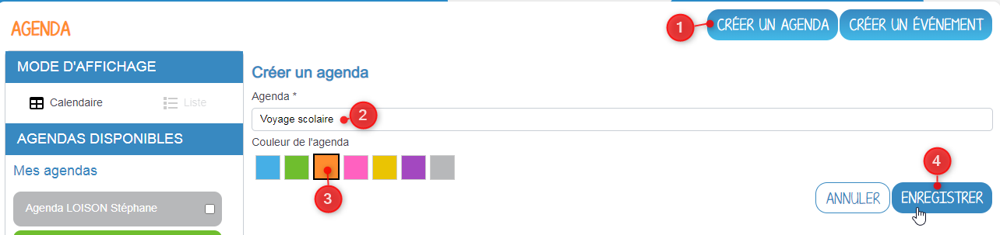

Une fois créé, l’agenda apparaît dans la liste des agendas de l’utilisateur.

Depuis cette liste il est possible d’accéder aux opérations sur l’agenda en le sélectionnant à l’aide de la case à cocher. Un menu apparaît alors en bas de l’écran proposant les actions supplémentaires suivantes.

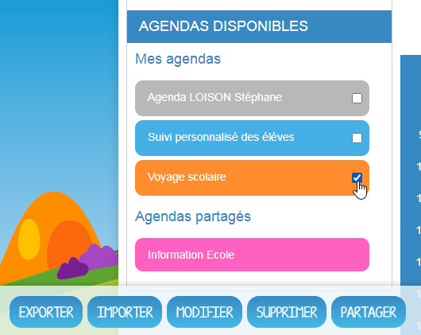

Description des actions :

* **Exporter** : télécharge l’agenda sélectionné au format .ics ;

* **Importer** : permet l’import des événements d’un calendrier au format .ics dans l’agenda sélectionné ;

* **Modifier** : permet de modifier le titre ou la couleur associée à l’agenda sélectionné ;

* **Supprimer** : permet la suppression de l’agenda sélectionné après confirmation ;

* **Partager** : permet le partage de l’agenda sélectionné avec d’autres utilisateurs.

Attention, si la barre de couleur de l'agenda est pâle, c'est que l'agenda n'est pas sélectionné. Les événements de cet agenda ne seront donc pas visibles dans la vue calendaire. Afin d'afficher un agenda, il faut cliquer sur la barre de couleur associée.

## Créer un événement

Pour créer un événement, plusieurs options s’offrent à l’utilisateur, il est possible de **cliquer dans le calendrier au créneau horaire souhaité** ou d’utiliser le **bouton "Créer un événement" en haut à droite** :

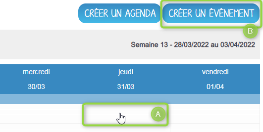

La fenêtre de création d’événement apparait en popup. Elle se décompose en trois onglets.

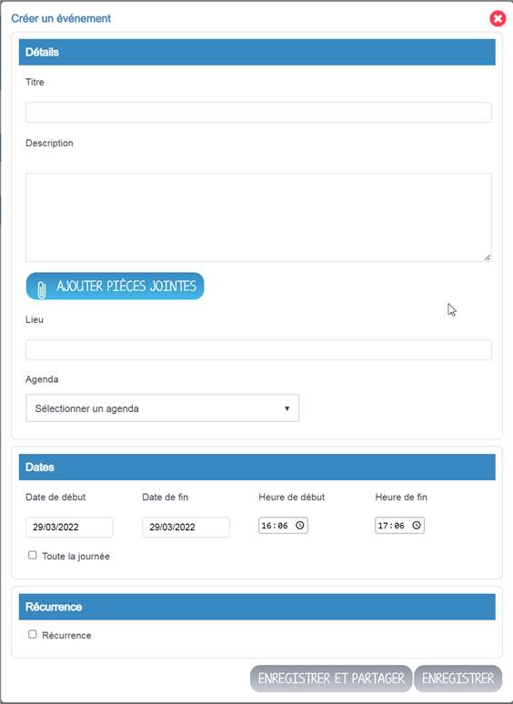

**Onglet Détails**

Cette première rubrique comporte les informations générales de l’événement à créer :

* le ou les agendas auxquels il appartient (à sélectionner parmi la liste des calendriers que l’utilisateur peut modifier, par défaut c’est l’agenda personnel qui est sélectionné),

* le titre de l’événement,

* la description,

* le lieu.

* une ou des pièces jointes, à charger depuis son appareil ou à importer depuis son espace documentaire.

**Onglet Dates**

Ce second onglet permet la sélection de la plage horaire de l’événement.

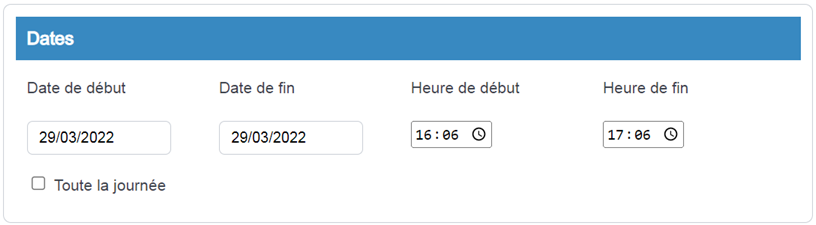

Il est possible de changer les dates et heures de début et de fin. La case à cocher « Toute la journée » permet de définir un événement sans heure de début ou de fin.

**Onglet Récurrence**

Enfin le troisième onglet appelé **"Récurrence"** permet de définir la récurrence de l’événement si nécessaire.

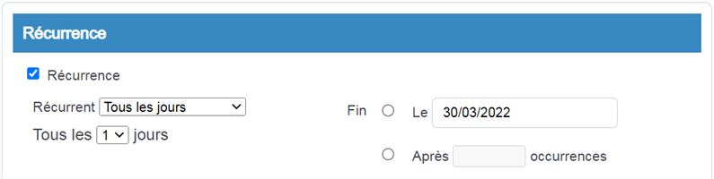										
Pour cela, il faut cocher la case « Récurrence » pour pouvoir accéder à la sélection du paramétrage de la récurrence. Ensuite, il est possible de modifier :

1. le type de récurrence (Tous les jours ou Toutes les semaines)

2. la fréquence de la récurrence (Tous les X jours ou Y semaines)

3. La fin de la série d’événements récurrents. Cette fin peut être paramétrée après un nombre d’occurrences ou à une date donnée.

**Si le type de récurrence est « Toutes les semaines », la liste des jours de la semaine apparaît afin de choisir le ou les jours sur lesquels se produira la récurrence.**

Une fois la récurrence créée, on peut choisir de modifier seulement un évènement de la récurrence, ou l'ensemble des occurrences de l'évènement.
## Partager un agenda

Afin de partager un agenda, il faut **le sélectionner** dans le menu à gauche puis **choisir "Partager"** dans le menu en bas.

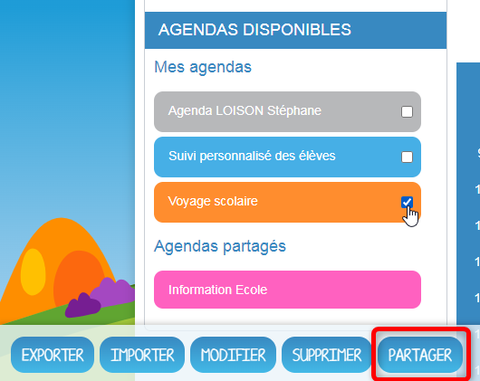

Dans la fenêtre, vous pouvez donner aux utilisateurs différents droits d’accès à votre agenda. Pour cela, suivez les étapes suivantes :

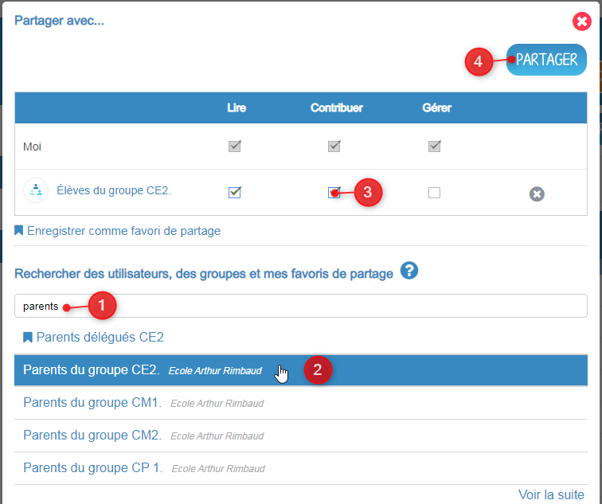

1. Saisissez les premières lettres du nom de l’utilisateur ou du groupe d’utilisateurs que vous recherchez.

2. Sélectionnez le résultat.

3. Cochez les cases correspondantes aux droits que vous souhaitez leur attribuer.

4. Cliquez sur le bouton "Partager" en haut à droite.

Les droits de partage que vous pouvez attribuer aux autres utilisateurs sont les suivants :

* **Lire** : l’utilisateur peut afficher les événements de l'agenda (à l'exception de ceux qui ont été restreints)

* **Contribuer** : l’utilisateur peut contribuer à votre agenda en y créant des évènements. Il pourra également modifier, supprimer et restreindre les événements qu'il a créés dans cet agenda.

* **Gérer** : l’utilisateur peut modifier les propriétés, supprimer ou partager l’agenda. Il peut également éditer tous les événements de l'agenda.

## Partager un événement

Cette fonctionnalité permet de :

* partager un événement depuis votre agenda personnel

* restreindre l'accès à un événement dans un agenda partagé

*Cas de figure 1 :*

Vous souhaitez **partager de temps en temps des événements** à différents groupes de personnes. Dans ce cas, pas besoin de créer x agendas partagés. Il suffit au moment de la création d'un événement de cliquer sur **"Enregistrer et partager"**. Une fenêtre de partage s'ouvre automatiquement après enregistrement et vous pouvez choisir les groupes de personnes à qui partager l'événement ainsi que les droits à leur donner.

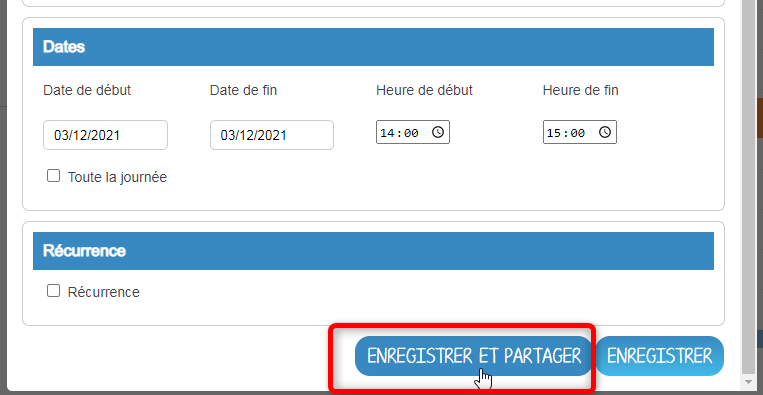

Cet événement sera automatiquement disponible dans leur agenda personnel. Ils pourront seulement le lire, le repartager ou le supprimer en fonction des droits octroyés.

*Cas de figure 2:*

Vous souhaitez **partager un agenda à un groupe** de personnes, mais **de temps en temps vous souhaitez restreindre l'accès à un événement** à un groupe de personnes. Par exemple, il y a l'agenda partagé "Etablissement-Parents" mais quand il s'agit des rencontres parents-enseignants, vous ne souhaitez pas que tous les parents accèdent à toutes les réunions. Dans ce cas, à la création de l'événement, cliquer sur **"Enregistrer et restreindre"**. La fenêtre de partage s'ouvre et vous pouvez choisir le groupe restreint à qui partager l'événement.

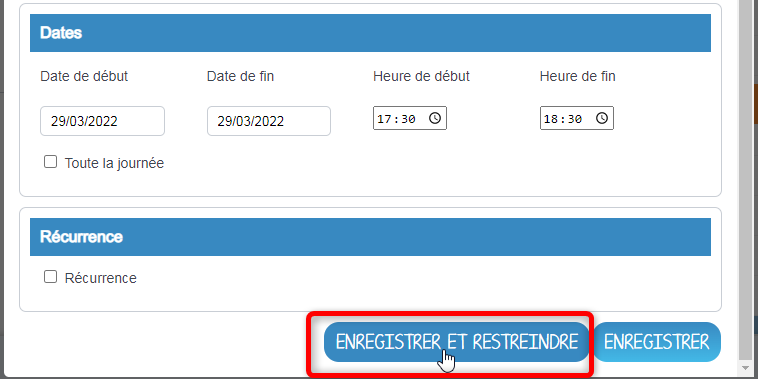

Si la personne à qui vous partagez l'événement dispose de l'agenda partagé, l'événement sera dans l'agenda partagé, mais visible uniquement pour elle.

Si la personne à qui vous partagez l'événement ne dispose pas de l'agenda partagé, l'événement sera dans son agenda personnel.

Attention, dans le cadre d'un partage d'événement à l'intérieur d'un agenda partagé, **les droits de l'agenda l'emportent sur les droits de l'événement**.

## Visualiser les événements d’un agenda

Les événements créés sont affichés sur la vue calendrier avec comme couleur de fond celle de l’agenda auquel ils appartiennent.

Il est possible de choisir les agendas affichés sur le calendrier en cliquant dessus dans la partie de gauche. Les agendas non sélectionnés ont la même couleur, mais plus pâle.

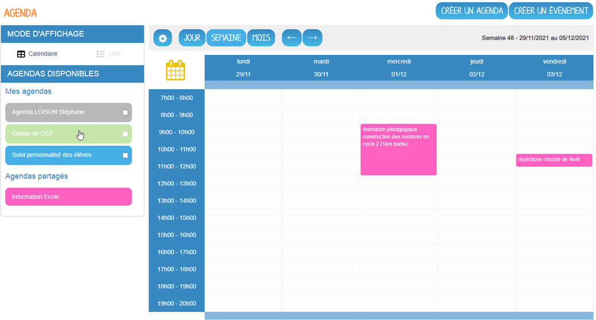

La seconde façon de visualiser les événements est la vue liste accessible par l’icône 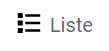 disponible en haut du menu latéral de gauche.

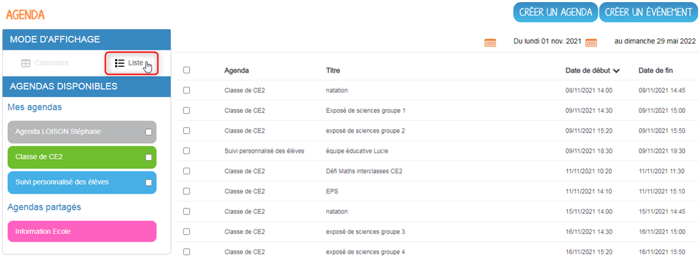

Elle synthétise les informations des événements des différents agendas affichés, sur la période (modifiable) indiquée en haut à droite.
