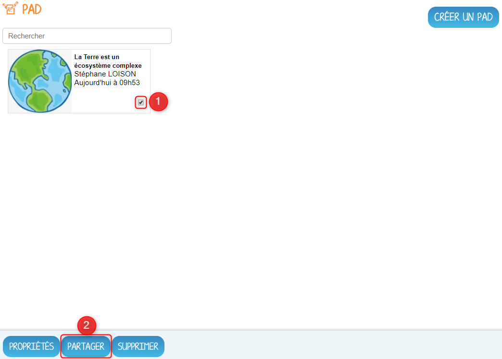

# Pad Collaboratif

Écrire à plusieurs mains en temps réel ! Le **Pad collaboratif** permet à tous les membres de votre groupe de co-rédiger le devoir en ligne. Travaillez ensemble sur le même texte, où que vous soyez et en même temps.

## Présentation

Le Pad est un éditeur de texte en ligne fonctionnant en mode collaboratif temps réel. Il vous permet de partager l'élaboration simultanée d’un texte, et d’en discuter en parallèle, via une messagerie instantanée. Il promeut des usages pédagogiques, notamment pour l’apprentissage collaboratif.

## Créer un Pad

Retrouvez l'appli Pad collaboratif depuis la page Mes applis.

Pour créer un Pad, cliquez sur le bouton « Créer un Pad » dans la page d’accueil de l’appli.

Ensuite, saisissez un nom \(1\) et enregistrez si vous le souhaitez une image d’illustration du Pad \(sinon c’est l’icône par défaut qui est affichée\) \(2\). Vous pouvez ensuite ajouter une description \(3\). Cliquez enfin sur « Enregistrer » \(4\).

## Partager un Pad

Pour partager un Pad avec d’autres utilisateurs, cliquez sur la case à cocher correspondant à votre Pad \(1\) puis sur le bouton « Partager » \(2\).

Dans la fenêtre, vous pouvez donner aux utilisateurs différents droits d’accès à votre Pad. Pour cela, suivez les étapes suivantes :

1. Saisissez les premières lettres du nom de l’utilisateur ou du groupe d’utilisateurs que vous recherchez.
2. Sélectionnez le résultat.
3. Cochez les cases correspondant aux droits que vous souhaitez leur attribuer.
4. Cliquez sur "Partager" pour valider

\]Les droits de partage que vous pouvez attribuer aux autres utilisateurs sont les suivants :

* **Lecteur** : l’utilisateur peut lire le contenu
* **Contributeur** : l’utilisateur peut contribuer à votre Pad
* **Gestionnaire** : l’utilisateur peut modifier, supprimer ou partager le Pad

## Travailler avec un Pad

Pour travailler avec un Pad partagé, il vous suffit de saisir le texte qui sera transmis automatiquement à tous les collaborateurs en ligne sur ce même Pad.

1. Saisissez du texte dans votre Pad.
2. Dès lors qu’un collaborateur contribue, sa contribution s’affiche en temps réel dans une couleur différente.
3. Vous pouvez utiliser la fonctionnalité de chat pour échanger sur vos travaux.
4. Une barre d’outils vous offre un ensemble de fonctionnalités :
   * La partie gauche concerne des outils de saisie de texte classique \(gras, italique, souligné, etc.\)
   * La partie droite offre certaines fonctionnalités complémentaires :

* Importer/exporter un Pad dans divers formats ;
* Accéder à l’historique dynamique. Cette fonctionnalité présente une cinématique des différentes versions du contenu du Pad ;
* Forcer l’enregistrement d’une révision \(une version\) ;
* Modifier le paramétrage de votre Pad ;
* Visualiser l’identité des participants avec leur couleur de saisie.

