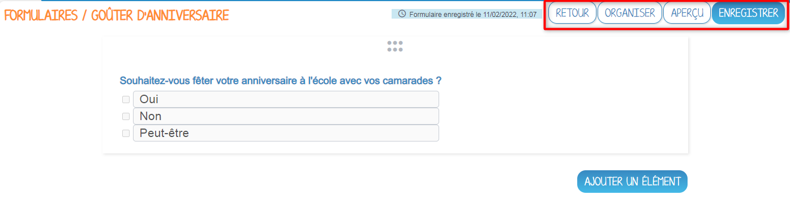

# Formulaire

À l’aide de l’application **Formulaire**, lancez-vous facilement dans la création de formulaires afin de sonder les autres utilisateurs sur différents sujets. Créez des sondages et des formulaires afin de recueillir l’avis des autres membres de l’ENT.

## Présentation

Ce module vous permet de **créer des formulaires** en y intégrant différents types de questions :

* une réponse unique,

* des choix multiples,

* une demande de date,

* une demande d'heure,

* une demande de réponse courte,

* une demande de réponse longue.

## Créer un formulaire

Dans l’application formulaire, lorsque vous êtes dans l’onglet **« Mes formulaires »** cliquez sur le bouton **« Créer un formulaire »** présent en haut à droite de la page.

Vous accédez à l’interface de création du formulaire :

1. Indiquez le **titre** de votre formulaire.

2. Ajoutez une **vignette d’illustration** du formulaire (si vous ne modifiez pas l’image, c’est la vignette par défaut qui s’affichera).

3. Choisissez si vous voulez une **date de fermeture** (à partir de cette date, il ne sera plus possible de répondre au formulaire).

4. Choisissez si vous voulez permettre **plusieurs réponses** d’un même utilisateur.

5. Choisissez si vous voulez **anonymiser** les réponses.

Cliquez sur **« Enregistrer »** pour valider la création du formulaire.

## Construire un formulaire

Une fois le formulaire créé, vous pouvez y ajouter des questions. Pour cela, cliquez sur **« Ajouter un élément »**.

Vous avez le choix entre plusieurs types de questions, choisissez celui que vous voulez.

Une fois le type de section choisi, la page d’édition de la question s’ouvre.

L’outil de création de la section s’affiche dans la page :

1. Saisissez le **titre**.

2. Rédigez les **réponses possibles** (pour les choix multiples et réponse unique).

3. Choisissez de rendre la réponse à cette question **obligatoire** : 

4. **Dupliquer** la section (avec la question et les réponses possibles) : 

5. **Supprimer** la question : 

6. **Annuler** les récentes modifications : 

Une fois la saisie des différentes questions terminée, vous avez différents **boutons d'action** :

* **Retour :** le formulaire s’enregistre et la page d’accueil de Formulaire s’ouvre.

* **Organiser :** il est possible de réorganiser l’ordre des questions grâce aux flèches ou aux 3 petits points permettant le glisser-déposer.

* **Aperçu :** le formulaire s'affiche tel qu'il apparaitra pour les répondants.

* **Enregistrer :** le formulaire s’enregistre.

## Partager un formulaire

Le formulaire a été créé, mais n’est pas encore visible par les autres utilisateurs. Pour partager un formulaire avec d’autres utilisateurs, suivez les étapes suivantes :

1. Cliquez sur le formulaire à partager.

2.  Cliquez sur le bouton **« Partager »**.

    
    
3. Une pop-up « Partager avec... » s'affiche. Saisissez les premières lettres du nom de l’utilisateur ou du groupe d’utilisateurs que vous recherchez.

4. Sélectionnez le résultat.

5.  Cochez les cases correspondant aux droits que vous souhaitez leur attribuer. Pour valider, cliquez sur le bouton **« Partager »**.

    

Les différents droits que vous pouvez attribuer aux autres utilisateurs sont les suivants :

* **Contribuer :** l’utilisateur peut ajouter de nouvelles questions au formulaire.

* **Gérer :** l’utilisateur peut gérer le formulaire, c’est-à-dire le modifier, le partager ou le supprimer.

* **Répondre :** l’utilisateur peut répondre aux questions.

## Vignettes

Sur les vignettes de formulaire, des icônes vous permettent de connaître facilement vos opérations/droits sur les contenus :

*  : le formulaire a été partagé en mode réponse à des utilisateurs

*  : vous avez partagé le formulaire en mode gestion ou contribution à des utilisateurs ou le formulaire a été partagé en mode gestion ou contribution avec vous

*  : un rappel de demande de réponse a été envoyé aux utilisateurs dont vous avez partagé le formulaire en mode réponse

## Envoyer un rappel

Le formulaire a été créé et partagé en réponse à des utilisateurs, mais vous n’avez pas encore toutes les réponses que vous souhaitez. Il est possible d’envoyer un rappel aux utilisateurs. Pour cela, suivez les étapes ci-dessous :

1.  Cliquez sur le formulaire avec le rappel à envoyer.

2.  Cliquez sur le bouton **« Suivi »**.

    

3.  Une pop-up s’ouvre vous indiquant le nombre de répondants au formulaire. Cliquer sur le bouton **« Envoyer un rappel »**.

    

4.  La page suivante s’ouvre : l’objet et le contenu du rappel sont déjà préremplis et vous avez la possibilité de les modifier.

    Cliquez sur **« Confirmer »**, le rappel est envoyé :

    -   À ceux qui n’ont pas répondu au formulaire, si plusieurs réponses d’un même utilisateur ne sont pas possibles.

    -   À tout le monde si plusieurs réponses d’un même utilisateur sont possibles.

    
    

## Voir les résultats d'un formulaire

Le formulaire a été créé et partagé en réponse à des utilisateurs, vous souhaitez maintenant voir les réponses que vous avez obtenues. Pour cela, suivez les étapes ci-dessous :

1. Cliquez sur le formulaire dont vous voulez voir les réponses.

2.  Cliquez sur le bouton **« Résultats »**.

    
    
3. Naviguez dans les réponses grâce aux boutons **« Précédent »** et **« Résultats »**.

4. Vous pouvez télécharger toutes les réponses dans un fichier Excel en cliquant sur **« Télécharger tous les résultats (CSV) »**.

5.  Vous pouvez télécharger toutes les réponses dans un fichier PDF en cliquant sur **« Télécharger tous les résultats (PDF) »**.

    
    
6. Pour les dépôts de fichier, il est possible de :

    * télécharger tous les fichiers dans un zip,
    
    * télécharger un seul des fichiers en cliquant dessus.

       

## Organiser ses formulaires

1. Vous disposez de 5 filtres pour afficher vos formulaires :

    * **Date de création :** pour trier par ordre chronologique ou antéchronologique les formulaires selon leur date de création.
    
    * **Date de modification :** pour trier par ordre chronologique ou antéchronologique les formulaires selon leur date de modification.
    
    * **Titre :** pour trier par ordre alphabétique ou alphabétique inverse les formulaires selon leur titre.
    
    * **Partagés :** pour afficher/masquer les formulaires que vous avez partagés.
    
    * **Envoyés :** pour afficher/masquer les formulaires que vous avez envoyés en mode réponse.

2. Une barre de recherche vous permet de trouver rapidement un formulaire en saisissant son titre.

3. Afin d'organiser vos formulaires, vous disposez de l'arborescence suivante :

    * **Mes formulaires :** qui est le dossier principal, dans lequel vous pourrez créer tous vos formulaires.

    * **Formulaires partagés avec moi :** qui est le dossier, dans lequel vous trouverez tous les formulaires qui vous ont été partagés.

    * **Corbeille :** où vous retrouverez les formulaires que vous avez supprimés, pour éviter toute suppression définitive involontaire

## Répondre à un formulaire

Lorsque vous êtes dans l’onglet **« Mes réponses »**, la liste des formulaires auxquels vous devez répondre s’affiche. Pour pouvoir y répondre, suivez les étapes suivantes :

1. Cliquez sur le formulaire à répondre.

2.  Cliquez sur **« Ouvrir »**.

    
    
3. Vous pouvez naviguer dans les questions auxquelles répondre grâce à **« Précédent »** et **« Suivant »**.

4.  À tout moment, vous pouvez décider d’arrêter de répondre au formulaire pour continuer à y répondre plus tard en cliquant sur **« Enregistrer et quitter »**.

    

5.  Lorsque vous arrivez à la dernière question, cliquez sur **« Terminer et envoyer »** pour que vos réponses soient prises en compte.

    

## Organiser ses formulaires pour le répondant

1. Vous disposez de 5 filtres pour afficher vos formulaires :
    * **Date d’envoi :** pour trier par ordre chronologique ou antéchronologique les formulaires selon leur date d’envoi.
    
    * **Titre :** pour trier par ordre alphabétique ou alphabétique inverse les formulaires selon leur titre.
    
    * **À faire :** pour afficher/masquer les formulaires auxquels vous n’avez pas encore commencé à répondre.
    
    * **À finir :** pour afficher/masquer les formulaires auxquels vous avez commencé à répondre puis cliquer sur **« Enregistrer et quitter »**.
    
    * **Terminé :** pour afficher/masquer les formulaires auxquels vous avez répondu.
    
2. Une barre de recherche vous permet de trouver rapidement un formulaire en saisissant son nom.

3. Un affichage différent en fonction du statut :

    * **Répondu le jj/mm/aaaa , hh :mm :** Une seule réponse autorisée et vous l’avez déjà envoyée.
    
    * **En attente de réponse :** Une seule réponse autorisée et vous ne l’avez pas encore envoyée.
    
    * **Réponses : x :** Plusieurs réponses autorisées et vous en avez envoyées x.
    
    * **Réponses : 0 :** Plusieurs réponses autorisées et vous n’en avez pas encore envoyées.

