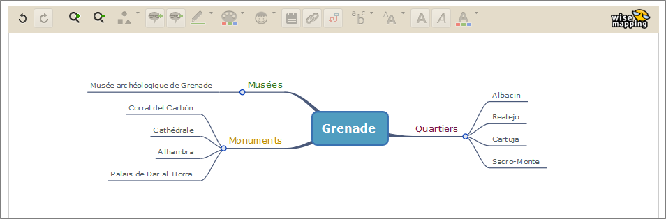
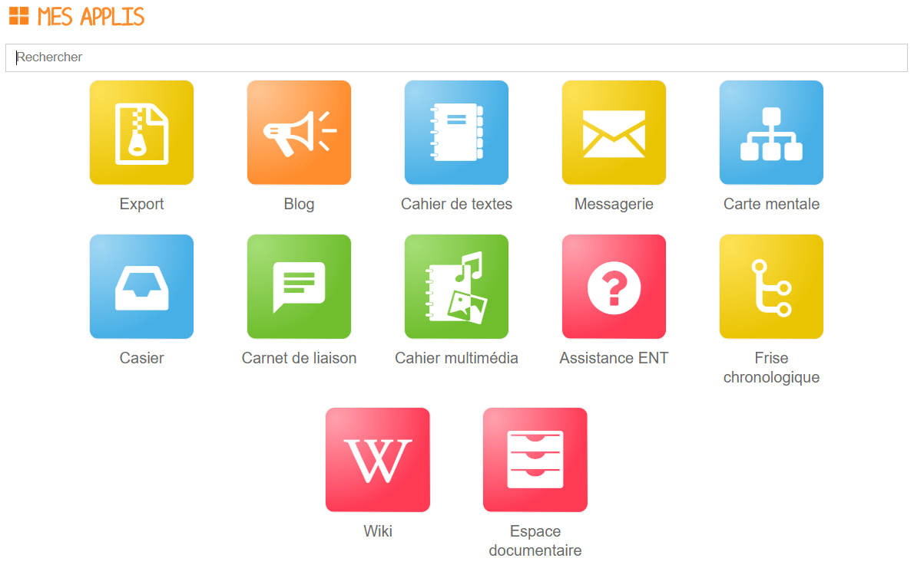
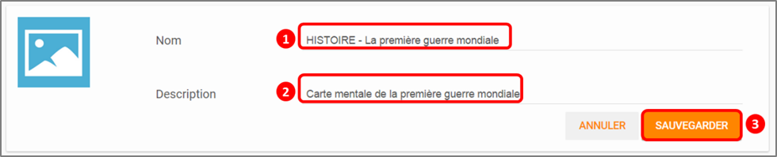
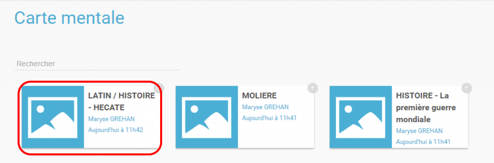
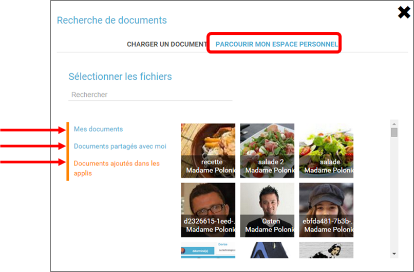
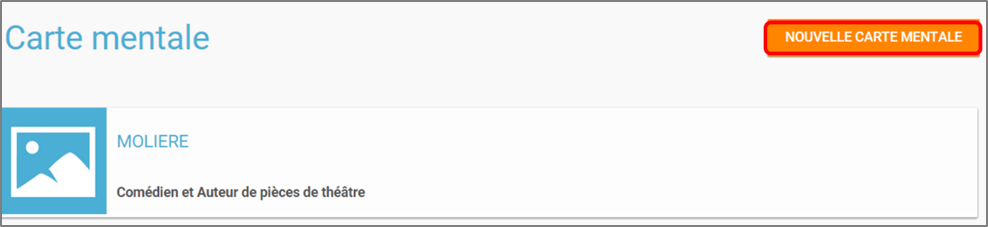
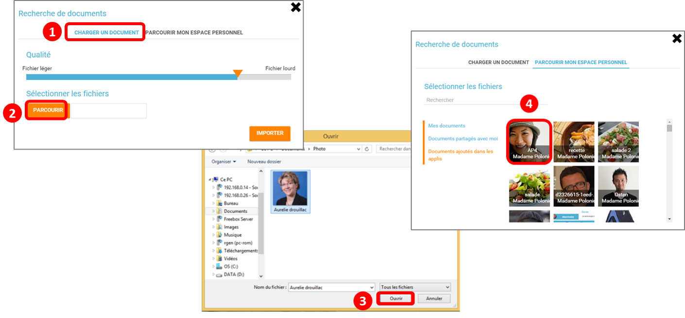
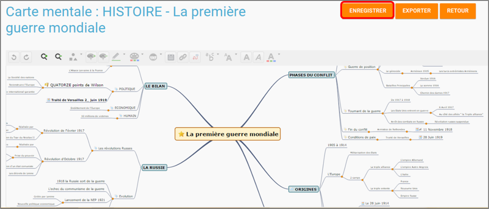
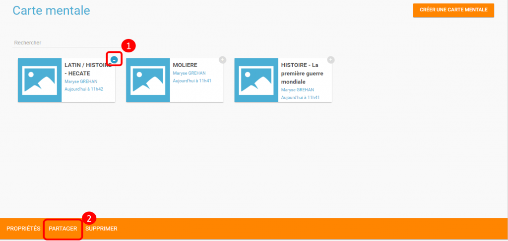
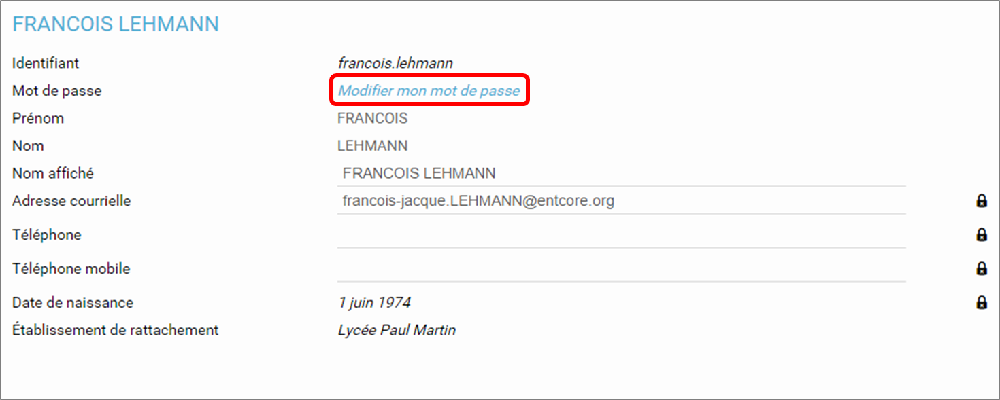

# Carte mentale

L’appli **Carte Mentale** permet **d’organiser des idées, des concepts, des prises de notes sous forme d’un schéma** permettant de représenter le fonctionnement de la pensée.

## Présentation

L’appli Carte Mentale permet de **représenter visuellement une arborescence** en créant des liens entre différentes idées. Le schéma se construit autour d’une idée principale, sous forme d’image ou de texte, à partir de laquelle plusieurs chemins se créent.

La carte mentale peut être faite de manière collective ou personnelle, selon les souhaits du créateur de la carte.

## Créer une Carte Mentale

Pour accéder à l’appli Carte mentale, cliquez sur l’icône correspondante dans la page « Mes applis ».

Cliquez sur « Créer une carte mentale ».

1. Saisissez un nom de carte
2. Renseignez une description
3. Cliquez sur « Sauvegarder »

  
Cliquez sur le nom de votre carte pour la créer.

  

L’éditeur de texte vous permet de créer facilement une carte mentale.

 

Lorsque la carte mentale est terminée, cliquez sur « Enregistrer ».

Votre carte est maintenant créée !

## Partager une Carte Mentale

Pour partager une carte mentale avec d’autres utilisateurs, cliquez sur le + \(1\) située à côté de la carte puis sur « Partager » \(2\).

Dans la fenêtre de partage, vous pouvez donner des droits de lecture, de contribution et de gestion à d’autres personnes sur votre carte. Pour cela, saisissez les premières lettres du nom de l’utilisateur ou du groupe d’utilisateurs que vous recherchez \(1\), sélectionnez le résultat \(2\) et cochez les cases correspondant aux droits que vous souhaitez leur attribuer \(3\).

Les différents droits que vous pouvez attribuer sont les suivants :

* Lecture : l’utilisateur peut visualiser la carte
* Contribution : l’utilisateur peut apporter des modifications à la carte
* Gestion : l’utilisateur peut modifier, supprimer et attribuer des droits de partage sur la carte

## Note de version

A chaque nouvelle version de l’application, les nouveautés seront présentées dans cette section.

