# Paramétrage de la classe

Devenez un maître de la gestion ! Grâce à l’appli **Paramétrage de la classe**, gérez votre classe comme vous l’entendez !

## Présentation

Cette application permet notamment de créer et gérer de nouveaux comptes \(élèves, parents, personnels, enseignants\), d’exporter les identifiants et code d’activation, de renouveler le mot de passe des utilisateurs de la classe, d’activer de nouveaux services pour la classe, modifier le nom de la classe, etc.

Pour accéder à l’application Paramétrage de la classe, cliquez sur l’icône correspondante dans la page « Mes applis ».

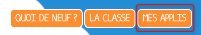

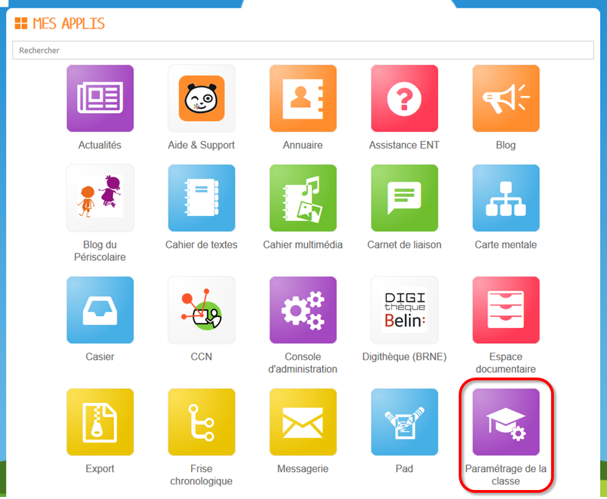

## Créer des utilisateurs dans la classe

Vous accédez à la page de gestion de votre classe, qui vous permet de consulter les utilisateurs de votre classe, modifier le nom de votre classe et d’administrer les utilisateurs \(élèves et parents\).

Il est alors possible d’ajouter des élèves, des parents, des enseignants et des personnels en cliquant sur le bouton "Ajouter des utilisateurs" \(1\) pour la classe sélectionnée \(2\).

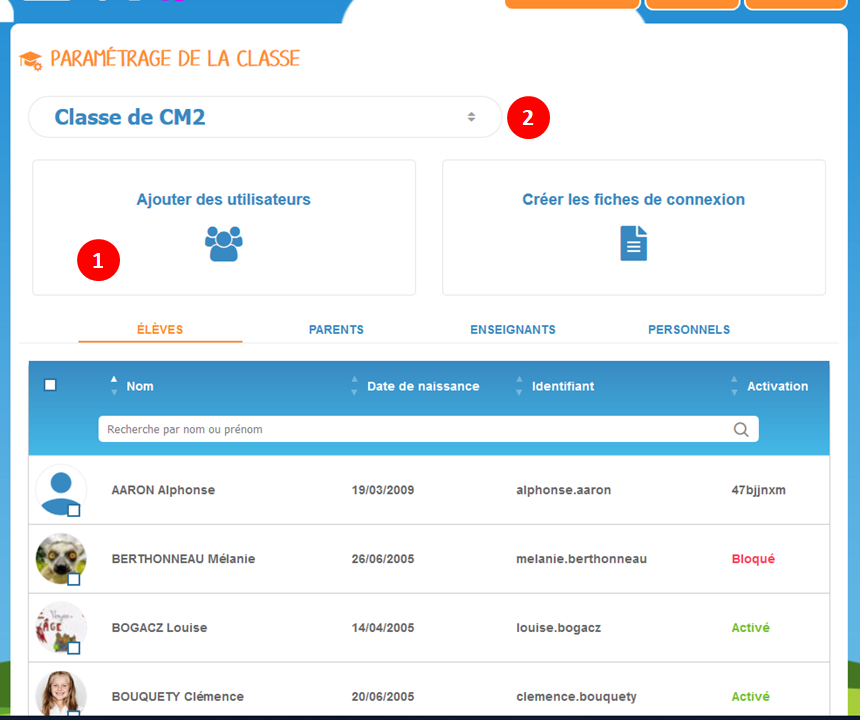

Une interface propose trois options pour ajouter des utilisateurs à votre classe :

* Créer des utilisateurs \(1\) : vous permet de créer manuellement des utilisateurs
* Importer un fichier \(2\) : vous permet d'importer votre fichier ONDE classe pour créer tous vos élèves, ou d'importer un fichier en se basant sur les modèles fournis
* Rechercher des utilisateurs \(3\) : vous permet de rechercher des utilisateurs déjà présents sur l'école

    1.Si vous souhaitez **créer manuellement des utilisateurs**, une interface vous propose de créer l'utilisateur de votre choix en renseignant plusieurs informations, obligatoires ou non, en fonction du profil :

* Profil \(1\)
* Nom \(obligatoire\) \(2\)
* Prénom \(obligatoire\) \(3\)
* Date de naissance \(obligatoire uniquement pour les élèves\) \(4\)
* Courriel \(5\)
* Rechercher un élève \(6\) : uniquement pour les responsables légaux, afin de relier l'élève au responsable créé manuellement

Si vous avez créé un **utilisateur existant déjà sur votre école**, une interface de détection du doublon de compte vous propose trois actions :

* Déplacer dans ma classe \(1\) : le compte sera détaché de son ancienne classe et rattaché à sa nouvelle classe
* Rattacher aux deux classes \(2\) : le compte sera rattaché à la classe et conservera son rattachement à l'autre classe
* Créer l'utilisateur \(3\) : le compte sera créé dans la classe

    2.Si vous souhaitez **importer des utilisateurs** à partir d'un fichier, vous avez la possibilité d'exporter votre fichier ONDE pour votre classe afin de l'importer depuis l'interface prévue à cet effet.

Si vous n'avez pas de fichier d'export depuis ONDE, vous pouvez utiliser les fichiers modèles fournis sur les liens ci-après :

* Fichier élève : [http://one1d.fr/wp-content/uploads/2014/04/Import\_ELEVES.csv](http://one1d.fr/wp-content/uploads/2014/04/Import_ELEVES.csv)
* Fichier responsable légal : [http://one1d.fr/wp-content/uploads/2014/08/Import\_RESPONSABLES\_2014.csv](http://one1d.fr/wp-content/uploads/2014/08/Import_RESPONSABLES_2014.csv)

Pour que les élèves soient bien rattachés aux parents, vérifiez que le nom et prénom de l’élève soient correctement saisis dans le fichier des parents.

Attention : pour le bon fonctionnement de ces manipulations, les élèves doivent être créés avant les parents.

Pour créer un compte enseignant ou un compte personnel, il n'est pas possible de fonctionner par import de fichier. Vous devrez créer ces comptes de manière manuelle, comme vu précédemment.

    3.Si les comptes utilisateurs que vous devez rattacher à votre classe sont déjà présents sur votre établissement, vous pouvez accéder à une interface qui vous permet de rechercher les utilisateurs.

* Classe sélectionnée \(1\) : Vous pouvez y voir les classes auxquelles vous êtes rattaché et le groupe des utilisateurs qui ne sont rattachés à aucune classe. 
* Barre de recherche \(2\)
* Filtres de profil \(3\)
* Liste des utilisateurs rattachés à la classe sélectionnée \(4\)
* Liste des utilisateurs que vous voulez rattacher à votre classe \(5\)

Après avoir complété la liste des utilisateurs que vous voulez rattacher à votre classe, cliquez sur "Ajouter à ma classe" \(6\) pour que l'action soit confirmée.

## Créer des fiches de connexion

Dans l'interface de l'application, vous disposez d'un bouton pour vous permettre de créer des fiches de connexion \(1\) sur la classe sélectionnée \(2\). Ces fiches de connexion peuvent être effectuées pour un compte déjà activé, en lui rappelant la procédure pour renouveler son mot de passe, ou pour un compte non activé, en lui indiquant la démarche de première connexion.

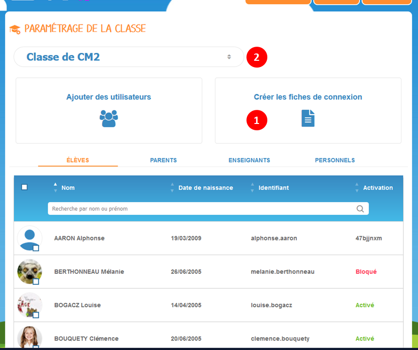

Une nouvelle fenêtre s'ouvre où vous pourrez sélectionner un ou plusieurs profils afin de créer leur fiche de connexion.

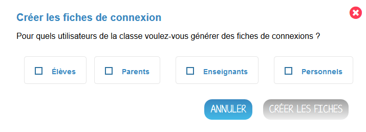

Une fois le ou les profils sélectionnés, vous disposez de plusieurs options pour récupérer et transmettre des fiches de connexion :

* Fiches de connexions détaillées .PDF \(1\)
* Fiches de connexions simplifiées .PDF \(2\)
* Fiches de connexions détaillées par mail \(3\)
* Exporter les codes d'activations en .CSV \(4\)

Vous pouvez également créer une ou plusieurs fiches de connexions détaillées pour un ou plusieurs comptes, en sélectionnant le ou les comptes \(1\), puis en cliquant sur "Fiches de connexions" \(2\).

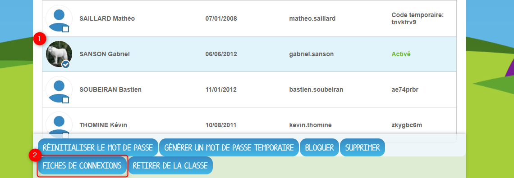

En allant consulter la fiche utilisateur d'un élève \(voir partie "Consulter et modifier les informations utilisateurs"\), vous pouvez récupérer des fiches de connexions simplifiées en PDF pour l'élève et son ou ses responsables légaux, en cliquant sur le lien "Fiches de connexion" \(1\)

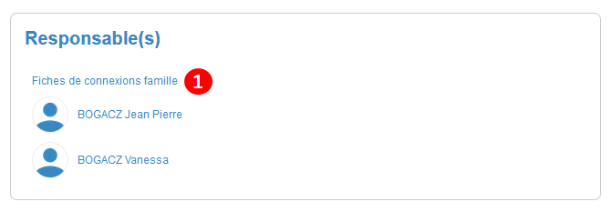

## Renouveler un mot de passe

Dans l’onglet correspondant, **uniquement pour les utilisateurs activés**, sélectionnez l’utilisateur dont vous souhaitez renouveler le mot de passe \(1\) et cliquez sur « Réinitialiser le mot de passe » \(2\).

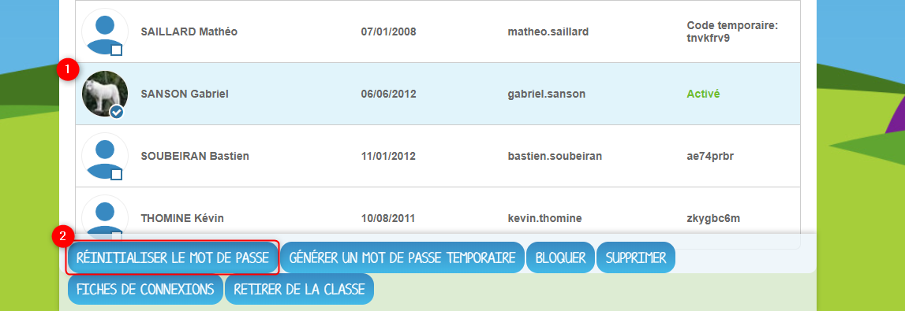

L'email suivant est alors envoyé sur l’adresse email que vous avez renseigné dans la rubrique Mon compte :

_Bonjour,_

_Vous avez demandé la réinitialisation d’un mot de passe.  
Pour procéder à cette réinitialisation, veuillez cliquer sur le lien ci-dessous.  
\[lien\]  
Votre identifiant : \[identifiant\]_

_Si vous n’êtes pas à l’origine de cette demande, vous pouvez ignorer cet email._

_Cordialement,  
L’équipe ENT_

Vous pouvez aussi sélectionner l'utilisateur en question \(1\) et cliquez sur "Générer un mot de passe temporaire" \(2\).

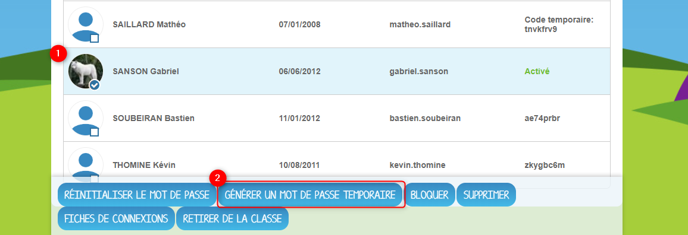

Une nouvelle fenêtre s'ouvre où vous verrez l'utilisateur sélectionné, son identifiant et le mot de passe temporaire généré automatiquement.

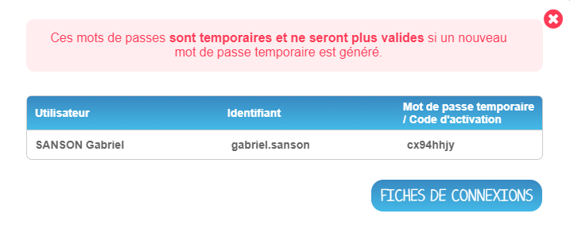

Vous avez alors la possibilité de transmettre l'email de réinitialisation / le mot de passe temporaire à l’utilisateur concerné pour qu’il renouvelle lui-même son mot de passe \(par exemple s’il s’agit d’un parent\), ou vous pouvez également effectuer vous-même la manipulation. 

Si vous avez choisi l'e-mail de réinitialisation, il faudra cliquer sur le lien contenu dans le corps du message. 

Si vous avez choisi la génération d'un mot de passe temporaire, il faudra aller sur la page d'authentification à l'ENT et vous connecter en utilisant l'identifiant et le mot de passe temporaire.

Dans les deux cas, vous accédez ensuite à l’interface de réinitialisation du mot de passe.

Renseignez l’identifiant de l’utilisateur dans le premier champ \(1\). Saisissez ensuite le nouveau mot de passe \(2\), puis confirmez-le dans le dernier champ \(3\) et cliquez sur « Réinitialiser ».

La réinitialisation du mot de passe est effective. L’utilisateur peut alors se connecter avec son nouveau mot de passe.

## Consulter et modifier les informations utilisateurs

En cliquant sur le nom de l'utilisateur présent dans la liste, vous pouvez accéder à sa fiche utilisateur et l'éditer si besoin, pour ajouter une image de profil ou modifier sa devise en cas de problème par exemple.

Une fois la fiche utilisateur affichée, vous pouvez naviguer d'une fiche à l'autre en cliquant sur "utilisateur précédent" \(1\) ou "utilisateur suivant" \(2\).

## Bloquer un compte

En cas de débordement, vous avez la possibilité de bloquer la connexion d'un utilisateur. Sélectionnez l'utilisateur que vous souhaitez bloquer dans la liste \(1\) puis cliquez sur le bouton d'action "Bloquer" \(2\) pour bloquer la connexion de l'utilisateur. Une fois l'action effectuée, l'utilisateur ne pourra donc plus se connecter.

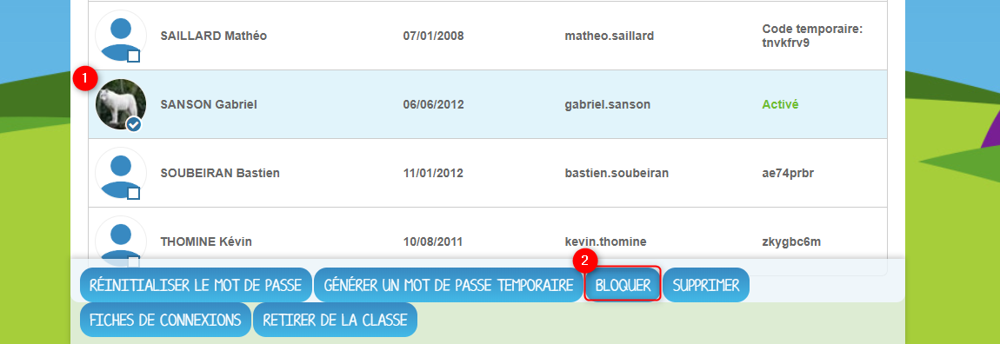

## Retirer un utilisateur de la classe

En fin d'année, pour faciliter la transition d'année, vous pouvez retirer de la classe les élèves qui ne seront plus dans votre classe, afin que les autres enseignants puissent, via la recherche d'utilisateurs \(voir la section "Créer des utilisateurs dans la classe"\), rattacher leurs comptes à leur classe.

Sélectionnez l'utilisateur concerné \(1\) puis cliquer sur l'option "Retirer de la classe". Un message de confirmation vous demandera de vérifier si vous souhaitez bien faire votre action.

En cas d'erreur, vous pourrez \(si l'utilisateur n'est rattaché à aucune autre classe\) aller dans la recherche d'utilisateur, et rattacher l'utilisateur à votre classe.

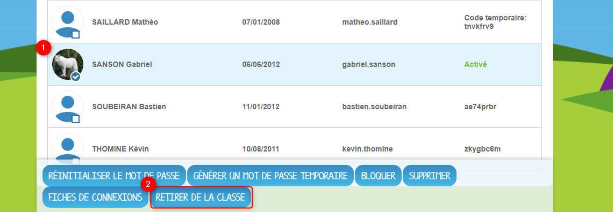

## Supprimer un utilisateur

Dans l’onglet correspondant, sélectionnez l’utilisateur que vous souhaitez supprimer \(1\) et cliquez sur « Supprimer » \(2\).

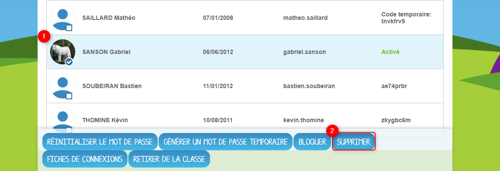

Une personne dont le compte est supprimé pourra encore se connecter et récupérer un export de ses documents \(appli Export\). En revanche, elle ne pourra plus accéder aux autres applis \(espace documentaire, blog, cahier multimédia, etc.\).

Au bout de trois mois, un compte supprimé est complètement effacé et l’utilisateur n’a plus accès à la plateforme. Aucune information le concernant n’est conservée.

Par contre, si l'utilisateur n'a jamais activé son compte, il sera définitivement supprimé immédiatement et sans délai.

