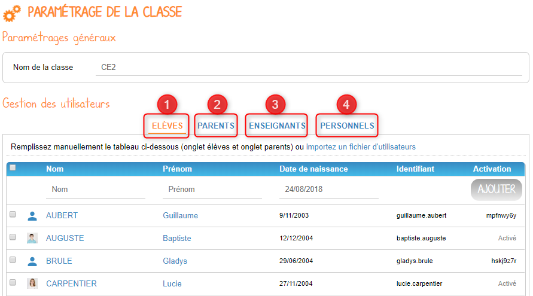

# Paramétrage de la classe

Devenez un maître de la gestion ! Grâce à l’appli **Paramétrage de la classe**, gérez votre classe comme vous l’entendez !

## Présentation

Cette appli permet notamment de créer de nouveaux comptes \(élèves, parents, personnels, enseignants\), d’exporter les identifiants et code d’activation, de renouveler le mot de passe des utilisateurs de la classe, d’activer de nouveaux services pour la classe, modifier le nom de la classe, etc.

## Créer des utilisateurs dans la classe

Pour accéder à l’appli Paramétrage de la classe, cliquez sur l’icône correspondante dans la page « Mes applis ».

Vous accédez à la page de gestion de votre classe, qui vous permet de modifier le nom de votre classe et d’administrer les utilisateurs \(élèves et parents\).

Il est alors possible d’ajouter des élèves \(1\), des parents \(2\), des enseignants \(3\) et des personnels \(4\).

Pour ajouter des élèves, assurez-vous tout d'abord que vous êtes bien dans l'onglet "Elèves" \(1\). Vous avez ensuite deux options :

* Saisir manuellement les informations et cliquer sur "Ajouter" \(2\),
* Importer un fichier CSV sur le modèle suivant \(3\) : [http://one1d.fr/wp-content/uploads/2014/04/Import\_ELEVES.csv](http://one1d.fr/wp-content/uploads/2014/04/Import_ELEVES.csv).
* Pour modifier les informations déjà saisies pour un utilisateur de votre classe, cliquez sur le nom de l’utilisateur en question \(4\).

La création de compte parent s’effectue de la même manière, en sélectionnant l'onglet « Parents ». Si vous optez pour l'import d'un fichier d'utilisateurs parents, vous pouvez utiliser le modèle suivant : [http://one1d.fr/wp-content/uploads/2014/08/Import\_RESPONSABLES\_2014.csv](http://one1d.fr/wp-content/uploads/2014/08/Import_RESPONSABLES_2014.csv)


Pour que les élèves soient bien rattachés aux parents, vérifiez que le nom et prénom de l’élève soient correctement saisis dans le fichier des parents.



Attention : pour le bon fonctionnement de ces manipulations, les élèves doivent être créés avant les parents.


Pour créer un compte enseignant ou un compte personnel, il suffit de renseigner le nom et le prénom de l’utilisateur dans l’onglet correspondant. Il n'est pas possible de fonctionner par import de fichier concernant ces deux profils d'utilisateur.

## Renouveler un mot de passe

Dans l’onglet correspondant, sélectionnez l’utilisateur dont vous souhaitez renouveler le mot de passe \(1\) et cliquez sur « Réinitialiser le mot de passe » \(2\).

L'email suivant est alors envoyé sur l’adresse email que vous avez renseigné dans la rubrique Mon compte :

_Bonjour,_

_Vous avez demandé la réinitialisation d’un mot de passe.  
Pour procéder à cette réinitialisation, veuillez cliquer sur le lien ci-dessous.  
\[lien\]  
Votre identifiant : \[identifiant\]_

_Si vous n’êtes pas à l’origine de cette demande, vous pouvez ignorer cet email._

_Cordialement,  
L’équipe ENT_

Vous avez la possibilité de transmettre ce message à l’utilisateur concerné pour qu’il renouvelle lui-même son mot de passe \(par exemple s’il s’agit d’un parent\).

Vous pouvez également effectuer vous-même la manipulation. Pour cela, cliquez sur le lien contenu dans le corps du message. Vous accédez à l’interface de réinitialisation du mot de passe.

Renseignez l’identifiant de l’utilisateur dans le premier champ \(1\). Saisissez ensuite le nouveau mot de passe \(2\), puis confirmez-le dans le dernier champ \(3\) et cliquez sur « Réinitialiser ».

La réinitialisation du mot de passe est effective. L’utilisateur peut alors se connecter avec son nouveau mot de passe.

## Exporter les identifiants et codes d’activation

Placez-vous sur l’onglet « Elèves » ou « Parents » en fonction du profil des utilisateurs pour lesquels vous souhaitez récupérer les informations de connexion. En bas de la liste d’utilisateurs, cliquez sur « Exporter les codes d’activation ».

Un fichier CSV est généré, contenant les identifiants et codes d’activation des utilisateurs sélectionnés, que vous pouvez ouvrir ou enregistrer sur votre ordinateur. Ce fichier vous permettra de distribuer les informations de connexion aux utilisateurs de votre classe.

## Supprimer un utilisateur

Dans l’onglet correspondant, sélectionnez l’utilisateur que vous souhaitez supprimer et cliquez sur « Supprimer ».

Une personne dont le compte est supprimé pourra encore se connecter et récupérer un export de ses documents \(appli Export\). En revanche, elle ne pourra plus accéder aux autres applis \(espace documentaire, blog, cahier multimédia, etc.\).

Au bout de trois mois, un compte supprimé est complètement effacé et l’utilisateur n’a plus accès à la plateforme. Aucune information le concernant n’est conservée.

