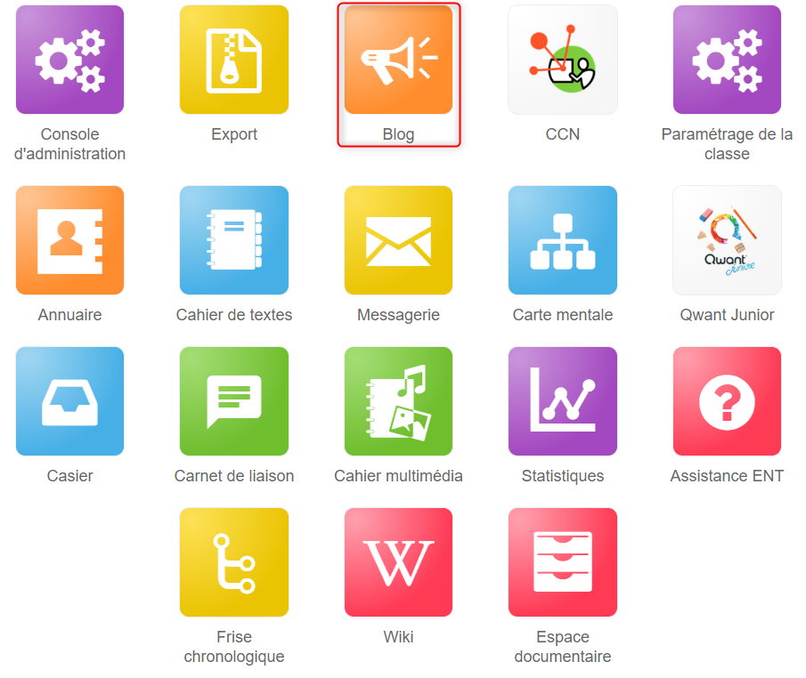

# Mes applis

## Accéder à mes applis

Pour accéder à vos applis, cliquez sur l’icône correspondante dans le bandeau de navigation.

Vous accédez aux services pour lesquels vous avez des droits d’accès : applications, connecteurs aux outils de vie scolaire, sites web internes au réseau ou publics … Pour accéder à une appli, cliquez sur l’icône correspondante.

La page d’accueil de l’appli apparaît.

