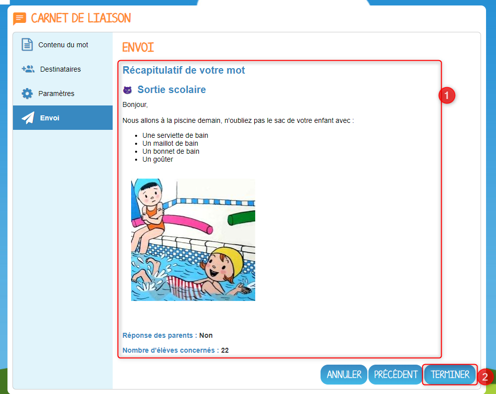
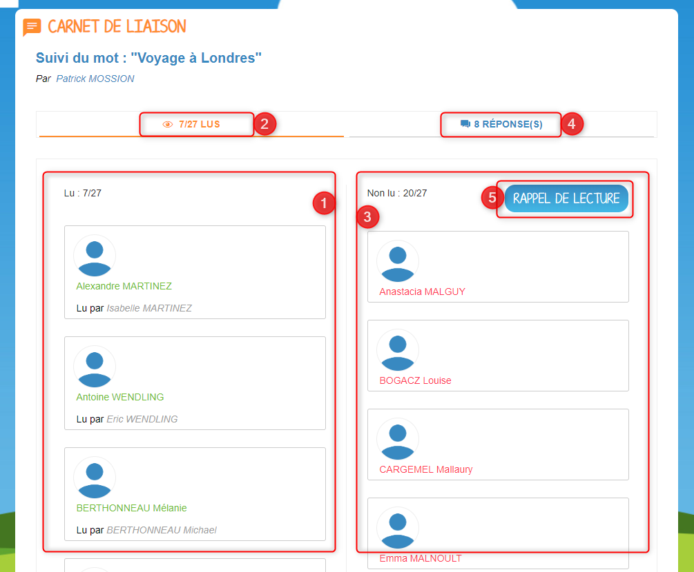
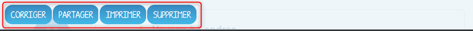
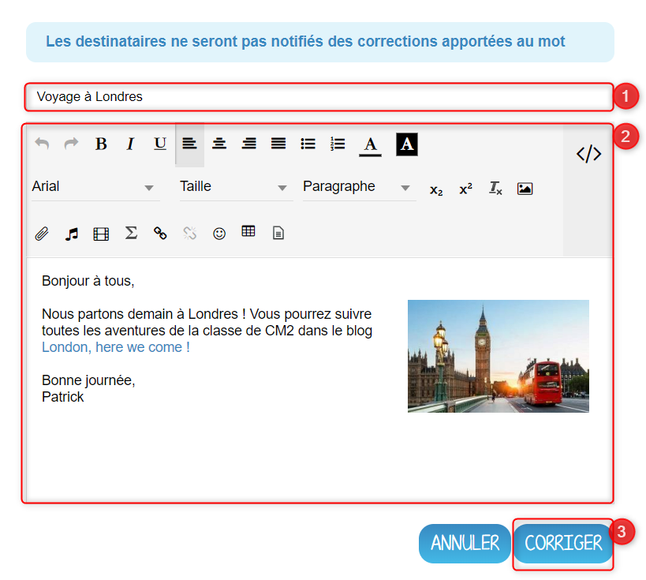
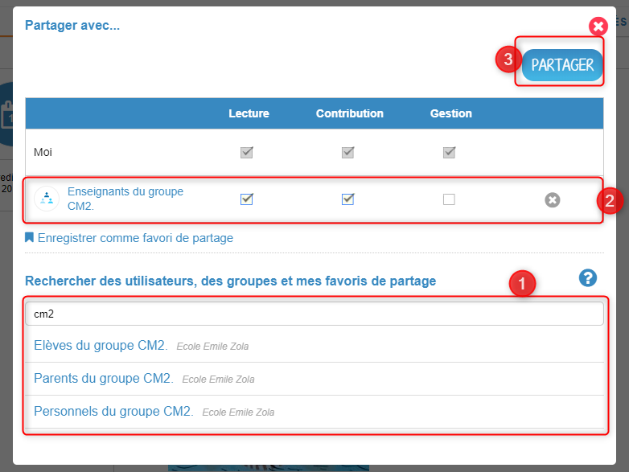

# Carnet de liaison

Besoin de communiquer un mot aux parents d’élèves ? Mais comment savoir s’ils en ont pris connaissance ? Envoyez-le via le **carnet de liaison** !

## Présentation

L’application carnet de liaison permet à l’enseignant d’envoyer des mots aux parents d’élèves et d’accéder au suivi des lectures. En activant l’option « réponse », les parents pourront réagir au mot. La possibilité d’imprimer les mots en coupons assure la complémentarité entre le numérique et le papier !

## Vue Enseignant - Créez et envoyez un mot

Cliquez d’abord sur le bouton « Créer un mot ».

**L’assistant de création d’un mot s’ouvre, il permet d’envoyer un mot en 4 étapes :**

Renseignez un titre à votre mot \(1\), puis rédigez un texte en ajoutant du contenu multimédia grâce à l'éditeur de texte \(2\). Cliquez maintenant sur le bouton “Suivant” \(3\).

**Vous allez ensuite pouvoir choisir vos destinataires :**

Dans la fenêtre "Destinataires", vous pouvez choisir les utilisateurs avec lesquels vous souhaitez partager votre message. Un message vous indique que les destinataires seront des élèves ou des groupes d’élèves. **Le mot sera envoyé aux responsables des élèves en question. Les élèves auront un droit de lecture sur le mot \(1\).** Effectuez votre recherche \(2\) et sélectionnez les élèves avec lesquels vous souhaitez partager le mot. Les groupes et utilisateurs ajoutés apparaissent sous la barre de recherche \(3\). Vous pouvez retrouver vos favoris de partage dans la recherche d'utilisateurs. Il vous est possible de consulter la fiche d'un utilisateur sélectionné dans la liste des destinataires en cliquant sur son nom \(4\). Le message sera transmis aux responsables de ces élèves. Vous pouvez cocher sur la croix pour les supprimer de votre sélection. Cliquez sur "Suivant" pour valider \(5\).

**Il ne vous restera plus qu'à définir les paramètres du mot :**

Cette fenêtre vous permet de choisir d’autoriser ou non les responsables à répondre au mot \(1\). Sélectionnez une icône thème pour le mot qui s’affichera à gauche du titre \(2\) et cliquez sur « Suivant » \(3\).

**Vous pourrez à présent envoyer le mot :**

Un récapitulatif du mot apparaît avec comme indication : le titre et le contenu du mot, l’activation ou non de l’option « Réponse » et le nombre d’élèves concernés par l’envoi \(1\). Cliquez sur « Terminer » pour envoyer le mot aux élèves et parents d’élèves. \(2\).

Le mot est envoyé, les parents et leurs enfants recevront une notification sur leur fil de nouveautés et par courriel \(s’ils ont bien une adresse mail renseignée sur leur page Mon compte\).

## Vue Enseignant - Accédez au suivi du mot

L’enseignant accède au suivi des accusés de lecture et éventuellement des réponses en cliquant sur le bouton « Accéder au suivi » du mot en question.

La fenêtre « Suivi du mot » s’ouvre avec deux colonnes :

* La colonne de gauche \(1\) indique les élèves auxquels les responsables ont lu le mot. Une indication au dessus de la colonne informe du nombre de lu sur le total des destinataires \(2\).
* La colonne de droite \(3\) indique les utilisateurs qui ont répondu au mot. 
* Une indication au dessus de la colonne informe du nombre de réponse\(s\) reçue\(s\) \(4\).
* Il est possible d'envoyer un rappel de lecture aux utilisateurs qui n'ont pas encore répondu \(5\).

En cliquant sur l’onglet « Réponse » en haut de la colonne \(1\), vous pouvez consulter les réponses des responsables. Cette option est disponible seulement si elle a été activée lors de la création du mot. Les réponses s’affichent par ordre ante chronologique. A droite, vous voyez apparaître la réponse du responsable \(3\), et à gauche, vous retrouvez l'élève correspondant \(2\). Chaque parent peut répondre une seule fois au mot de son enfant.

Si un parent modifie sa réponse après l’avoir envoyée, l’enseignant est informé par une notification sur son fil de nouveautés.

## Vue Enseignant - Corrigez, imprimez ou supprimez un mot

L’icône « + » \(1\) sur chaque mot envoyé permet d’accéder aux actions secondaires \(2\) :

* Corriger
* Partager
* Imprimer
* Supprimer

**Corriger un mot :**

Il est possible de corriger le contenu d’un mot. Attention, aucune notification ne sera envoyée aux parents. En cliquant sur l’icône “corriger”, l’éditeur de texte s’ouvre. Il est possible de :

* Modifier le titre \(1\)
* Le contenu du mot \(2\)
* Pour valider les corrections, cliquer sur l’icône « Corriger » \(3\)

**Imprimer un mot :**

En cliquant sur l’icône “imprimer”, une fenêtre s’ouvre permettant de choisir le nombre de coupons à imprimer \(par défaut, le nombre d’élèves concernés par l’envoi du mot\). Vous pouvez changer le nombre de coupons \(1\) puis cliquer sur "Imprimer" \(2\)

**Supprimer un mot :**

En cliquant sur l’icône “supprimer”, une fenêtre s’ouvre, cliquer sur « Supprimer » pour confirmer la suppression du mot. Les utilisateurs à qui le mot avait été envoyé n’y auront plus accès.

## Vue Enseignant - Partagez un mot

Vous pouvez partager un mot afin d'attribuer à d'autres utilisateurs des droits de :

* Lecture
* Contribution
* Gestion

Pour cela, sélectionnez les utilisateurs avec qui vous souhaitez partager le mot \(1\), puis accordez les droits que vous souhaitez \(2\) et cliquez sur "Partager" \(3\). Cette fonctionnalité est très utile si vous souhaitez déléguer le suivi du mot à l'un de vos collègues par exemple.

## Vue Parent - Attestez de la lecture et répondre

Le parent peut attester la lecture de chaque mot qui lui a été envoyé sur la carnet de liaison. Il doit pour cela cliquer sur le bouton « Confirmer la lecture » qui apparaît sur le mot.

Il suffit de la lecture d’un parent pour que le mot soit considéré comme lu pour l’élève, le deuxième parent pourra également attester la lecture de son côté.

**Si vous souhaitez répondre à un mot :**

Si l’enseignant a activé l’option « réponse » lors de l’envoi du mot :

* Un deuxième bouton « Répondre » apparaît sur le mot. \(1\)
* En cliquant sur le bouton « Répondre », une barre d’édition simple s’affiche permettant au parent d’écrire une réponse. \(2\)
* En cliquant sur « Envoyer », la réponse est transmise à l’enseignant et le mot est considéré comme « lu ». \(3\)
* Si l’autre parent a répondu au mot, sa réponse apparaîtra en dessous

## Vue Parent - Filtrez par enfant

Les photos de profils sous le titre « Carnet de liaison » permet au parent de filtrer les mots selon les enfants dont il est responsable. S’il est rattaché à un seul enfant, la fonction filtre n’apparaît pas.

## Vue Élève - Lecture d'un mot

Les élèves ont un droit de lecture sur chaque mot qui est envoyé à leurs parents. Ils peuvent ainsi :

* Voir si le mot a été lu par un parent \(1\)
* Voir les réponses éventuelles de ses parents \(2\)

