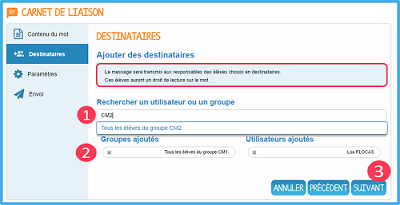
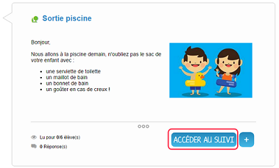
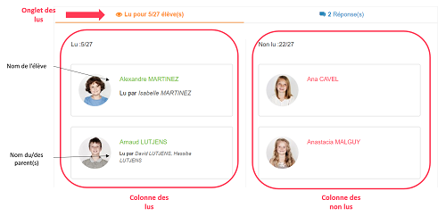
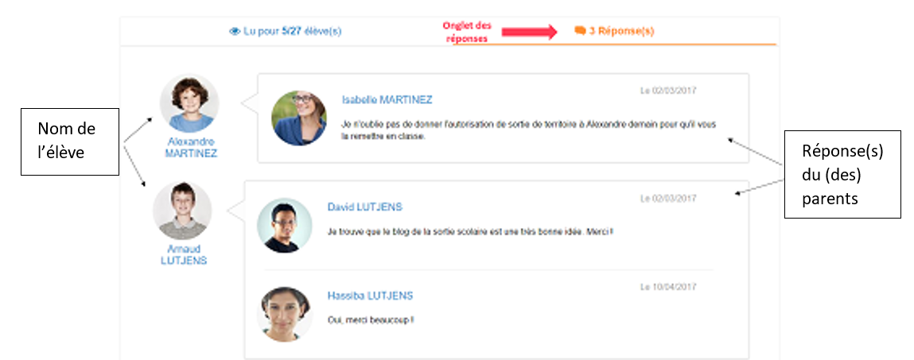
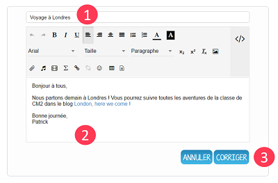
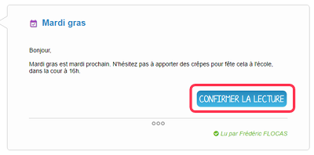
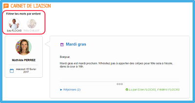
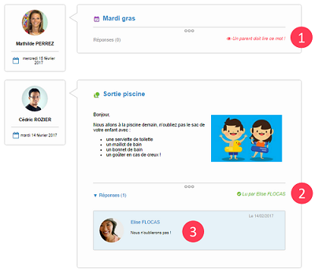

Besoin de communiquer un mot aux parents d’élèves ? Mais comment savoir s’ils en ont pris connaissance ? Envoyez-le via le **carnet de liaison** !

L’application carnet de liaison permet à l’enseignant d’envoyer des mots aux parents d’élèves et d’accéder au suivi des lectures. En activant l’option « réponse », les parents pourront réagir au mot.

La possibilité d’imprimer les mots en coupons assure la complémentarité entre le numérique et le papier !

Créer et envoyer un mot
=======================

Cliquez d’abord sur le bouton « Créer un mot ».

L’assistant de création d’un mot s’ouvre, il permet d’envoyer un mot en 4 étapes :

1ère étape : Contenu du mot
---------------------------

Entrez un titre au mot (1), puis rédiger un texte en ajoutant du contenu multimédia (2). Cliquez maintenant sur le bouton “Suivant” (3).

2e étape : Destinataires
------------------------

Dans cette fenêtre, vous pouvez choisir les destinataires de votre message. Pour cela, entrez puis sélectionnez le nom d’un élève ou d’un groupe d’élève dans la barre de recherche (1). Le message sera ensuite transmis aux responsables de ces élèves.

Les destinataires sélectionnés s’affichent dans la rubrique « Groupes ajoutés » et « Utilisateurs ajoutés » (2).

**Dans le service Carnet de liaison les destinataires doivent être des élèves ou des groupes d’élèves.**

3e étape : Paramètres
---------------------

Cette fenêtre vous permet de choisir d’autoriser ou non les responsables à répondre au mot (1). Sélectionnez une icône thème pour le mot qui s’affichera à gauche sur titre (2). Cliquez sur « Suivant » (3).

4e étape : Envoi
----------------

Un récapitulatif du mot apparaît avec comme indication : le titre et le contenu du mot, l’activation ou non de l’option « Réponse » et le nombre d’élèves concernés par l’envoi (1). Cliquez sur « Terminer » pour envoyer le mot aux élèves et parents d’élèves. (2).

Le mot est envoyé, les parents et leurs enfants recevront une notification sur leur fil de nouveautés et par courriel (s’ils ont bien une adresse mail renseignée pour leur compte).

Accéder au suivi du mot
=======================

L’enseignant accède au suivi des accusés de lecture et éventuellement des réponses en cliquant sur le bouton « Accéder au suivi » du mot en question.

La fenêtre « Suivi du mot » s’ouvre avec deux onglets :

-   L’onglet « Lu pour 5/27 élève(s) » indique pour chaque élève si le mot a été lu par un de ses responsables

-   L’onglet « réponses » affiche les réactions des parents d’élève

L’onglet s’affiche si l’option « Réponse » a été activée lors de la création du mot. Les réponses s’affichent par ordre ante chronologique. Chaque parent peut répondre une seule fois au mot de son enfant.

Si un parent modifie sa réponse après l’avoir envoyée, l’enseignant est informé par une notification sur son fil de nouveautés.

Corriger, imprimer ou supprimer un mot de liaison
=================================================

L’icône « + » (1) sur chaque mot envoyé permet d’accéder aux actions secondaires (2) :

-   Corriger

-   Imprimer

-   Supprimer

Corriger un mot
---------------

Il est possible de corriger le contenu d’un mot. Attention, aucune notification ne sera envoyée aux parents. En cliquant sur l’icône “corriger”, l’éditeur de texte s’ouvre. Il est possible de :

-   Modifier le titre (1)

-   Le contenu du mot (2)

-   Pour valider les corrections, cliquer sur l’icône « Corriger » (3)

Imprimer un mot
---------------

En cliquant sur l’icône “imprimer”, une fenêtre s’ouvre permettant de choisir le nombre de coupons à imprimer (par défaut, le nombre d’élèves concernés par l’envoi du mot).

Supprimer un mot
----------------

En cliquant sur l’icône “supprimer”, une fenêtre s’ouvre, cliquer sur « Supprimer » pour confirmer la suppression du mot. Les utilisateurs à qui le mot avait été envoyé n’y auront plus accès.

La vue du carnet de liaison par les parents et les élèves
=========================================================

Le carnet de liaison pour les parents
-------------------------------------

**Attester de la lecture d’un mot.**

Le parent peut attester la lecture de chaque mot qui lui a été envoyé sur la carnet de liaison. Il doit pour cela cliquer sur le bouton « Confirmer la lecture » qui apparaît sur le mot.

Il suffit de la lecture d’un parent pour que le mot soit considéré comme lu pour l’élève, le deuxième parent pourra également attester la lecture de son côté.

Dans l’exemple ci-dessus, il est indiqué que l’autre parent (Frédéric FLOCAS) a déjà lu le mot. Le mot est donc considéré comme lu par l’élève, cependant le parent peut confirmer la lecture avec son compte PCN.

**Répondre à un mot**

Si l’enseignant a activé l’option « réponse » lors de l’envoi du mot :

-   Un deuxième bouton « Répondre » apparaît sur le mot. (1)

-   En cliquant sur le bouton « Répondre », une barre d’édition simple s’affiche permettant au parent d’écrire une réponse. (2)

-   En cliquant sur « Envoyer », la réponse est transmise à l’enseignant et le mot est considéré comme « lu ». (3)

-   Si l’autre parent a répondu au mot, sa réponse apparaît également. (4)

**Filtrer par enfant**

Les photos de profils sous le titre « Carnet de liaison » permet au parent de filtrer les mots selon les enfants dont il est responsable. S’il est rattaché à un seul enfant dans PCN, la fonction filtre n’apparaît pas.

Le carnet de liaison pour les élèves
------------------------------------

Les élèves ont un droit de lecture sur chaque mot qui est envoyé à leurs parents. Ils peuvent ainsi :

-   Voir si le mot a été lu par un parent (1)

-   Savoir quel(s) parent(s) a/ont lu le mot (2)

-   Voir les réponses éventuelles d’un parent (3)

