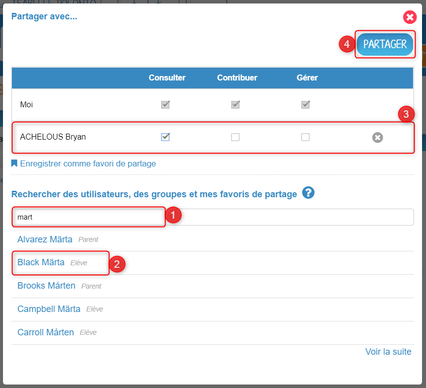
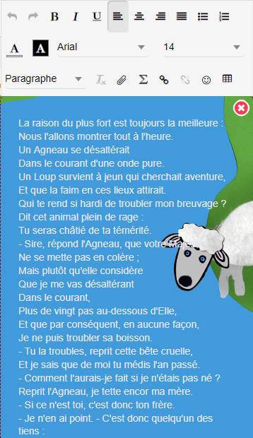
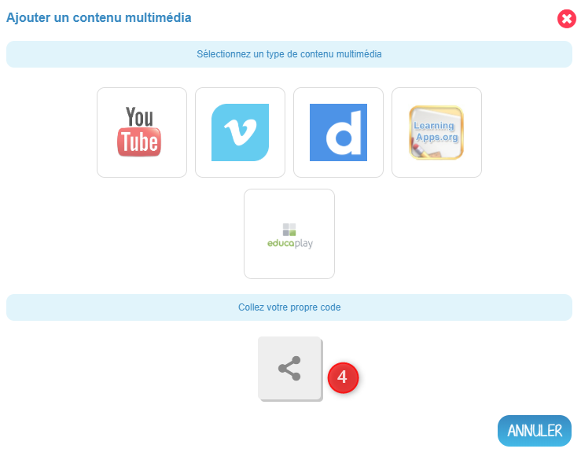
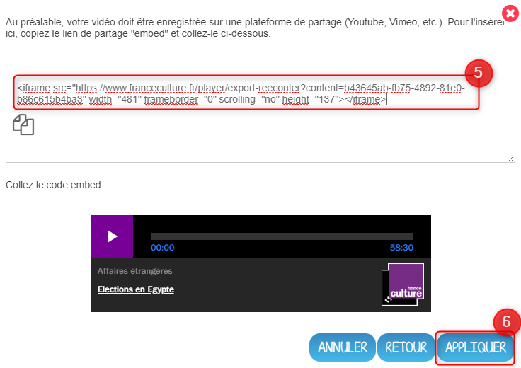
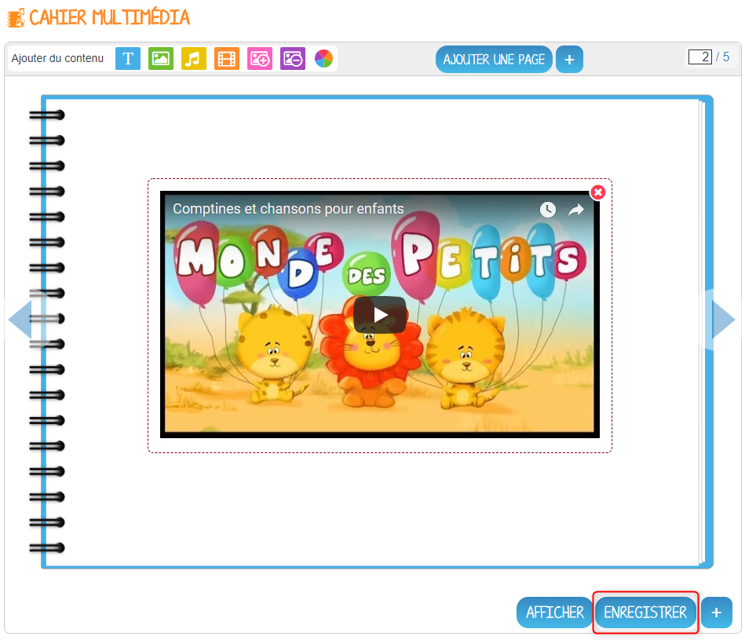

# Cahier multimédia

Avec le **Cahier multimédia**, votre banal exposé sur les fables de La Fontaine devient tout de suite plus passionnant. Mise en page personnalisée, illustrations, vidéos, sons, votre cahier prend vie sous les clics de vos lecteurs.

## Présentation

Les cahiers créés peuvent être utilisés comme des **supports de restitution** de travaux ou encore comme **outil de communication** avec d’autres utilisateurs puisque chaque cahier peut être partagé avec un utilisateur ou un groupe d’utilisateurs.

Les utilisateurs ayant des droits de contribution dans le cahier choisissent le nombre de pages du cahier et la mise en forme qu’ils souhaitent appliquer à chaque page.

## Créer et partager un cahier multimédia

Pour accéder à l’appli Cahier multimédia, cliquez sur l’icône correspondante dans la page « Mes applis ».

Dans le service Cahier multimédia, cliquez sur le bouton « Créer » en haut de la page.

Vous accédez à l’interface de création du cahier.

1. Indiquez le « titre » de votre cahier dans le champ correspondant
2. Vous pouvez renseigner un sous-titre pour votre cahier
3. Ajoutez une vignette d’illustration du cahier \(qui apparaît en miniature sur la page d’accueil et comme couverture du cahier\) en cliquant sur « Changer l’image ». Si vous ne modifiez pas l’image, c’est la vignette par défaut qui s’affichera.
4. Choisissez une couleur de couverture
5. Cliquez sur « Valider »

Votre cahier est désormais créé mais n’est pas encore visible. Pour le partager avec d’autres utilisateurs, sélectionnez le cahier que vous souhaitez partager \(1\) puis sur cliquez sur « Partager » \(2\).

Dans la fenêtre, vous pouvez donner des droits de consultation, de contribution et de gestion sur votre cahier. Pour cela, saisissez les premières lettres du nom de l’utilisateur ou du groupe d’utilisateurs que vous recherchez \(1\), sélectionnez le résultat \(2\) et cochez les cases correspondant aux droits que vous souhaitez leur attribuer \(3\). Cliquez sur "Partager" \(4\) pour valider.

## Editer les pages du cahier multimédia

Une fois votre cahier créé et partagé, vous pouvez publier des pages. Rendez vous sur le cahier que vous souhaitez éditer, et cliquez sur « Modifier ».

Pour ajouter de nouvelles pages, cliquez sur « Ajouter une page » \(1\) ou sur la flèche à droite du cahier \(2\).

Vous pouvez ajouter les contenus suivants dans vos cahiers :

1. Texte
2. Image
3. Son / enregistrement audio
4. Vidéo / contenu multimédia
5. Ajouter une image de fond
6. Supprimer une image de fond
7. Modifier la couleur de fond

Il est possible de modifier une zone de texte. Pour cela, cliquez sur la zone : une barre d’édition s’affiche. L’éditeur offre de nombreuses possibilités pour mettre le texte en forme.

Pour tous les types de contenus, il est aussi possible de modifier la position et la taille de la zone.

Pour déplacer un contenu, survolez la zone et cliquez dessus quand le curseur prend la forme d’une flèche à quatre côtés. Maintenez le clic enfoncé et déplacez le contenu.

Pour modifier la taille du contenu, survolez le contour de la zone et cliquez dessus quand le curseur prend la forme d’une double flèche.

Pour visualiser votre cahier, cliquez sur « Afficher ». N’oubliez pas d’enregistrer vos travaux avant de quitter la page en cliquant sur « Enregistrer ».

## Publier une vidéo dans un cahier multimédia

Il est possible d’ajouter dans vos cahiers multimédia des vidéos stockées sur des plateformes d’hébergement comme Youtube, Dailymotion, Libcast, Vimeo, Wat.tv, … Ouvrez le cahier multimédia dans lequel vous souhaitez ajouter cette vidéo et cliquez sur l’icône d’ajout de vidéo.

Dans la fenêtre qui s’ouvre, selectionnez un type de contenu de média \(vidéos hébergées sur Youtube, Viméo, Dailymotion, Learningaps.org et educaplay\) \(1\)

Puis collez l’URL de la vidéo \(2\) et cliquez sur « Appliquer » \(3\).

Pour une vidéo hébergée ailleurs , appuyez sur la vignette "Collez votre propre code" \(4\),

puis collez le lien Iframe \(5\) et cliquez sur "Appliquer" \(6\)

Positionnez ensuite la vidéo dans la page et sauvegardez votre travail.

Votre cahier est complété et la vidéo prête à être regardée !

