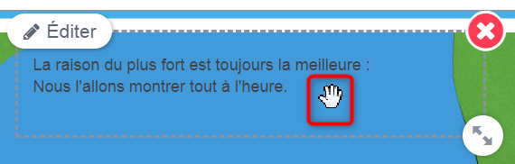
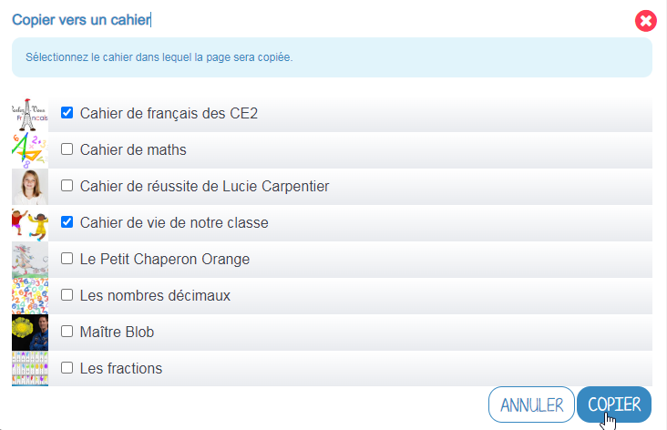

# Cahier multimédia

Avec le **Cahier multimédia**, votre banal exposé sur les fables de La Fontaine devient tout de suite plus passionnant. Mise en page personnalisée, illustrations, vidéos, sons, votre cahier prend vie sous les clics de vos lecteurs.

## Présentation

Les cahiers créés peuvent être utilisés comme des **supports de restitution** de travaux ou encore comme **outil de communication** avec d’autres utilisateurs puisque chaque cahier peut être partagé avec un utilisateur ou un groupe d’utilisateurs.

Les utilisateurs ayant des droits de contribution dans le cahier choisissent le nombre de pages du cahier et la mise en forme qu’ils souhaitent appliquer à chaque page. Ils peuvent éditer à plusieurs et en même temps un cahier multimédia, en se positionnant sur des pages différentes.

## Créer et partager un cahier multimédia

Pour accéder à l’appli Cahier multimédia, cliquez sur l’icône correspondante dans la page « Mes applis ».

Dans le service Cahier multimédia, cliquez sur le bouton « Créer » en haut de la page.

Vous accédez à l’interface de création du cahier.

1. Indiquez le « titre » de votre cahier dans le champ correspondant
2. Vous pouvez renseigner un sous-titre pour votre cahier
3. Ajoutez une vignette d’illustration du cahier \(qui apparaît en miniature sur la page d’accueil et comme couverture du cahier\) en cliquant sur « Changer l’image ». Si vous ne modifiez pas l’image, c’est la vignette par défaut qui s’affichera.
4. Choisissez une couleur de couverture
5. Cliquez sur « Enregistrer »

Votre cahier est désormais créé, mais n’est pas encore visible. Pour le partager avec d’autres utilisateurs :

1. Sélectionnez le cahier que vous souhaitez partager.
2. Cliquez sur **Partager**.

Dans la fenêtre, vous pouvez donner des droits de consultation, de contribution et de gestion sur votre cahier. Pour cela :

1. Saisissez les premières lettres du nom de l’utilisateur ou du groupe d’utilisateurs que vous recherchez.
2. Sélectionnez le résultat
3. Cochez les cases correspondant aux droits que vous souhaitez leur attribuer.
4. Cliquez sur **Partager** pour valider.

Les différents droits que vous pouvez attribuer sont les suivants :

* **Lecture** : l’utilisateur peut visualiser le cahier
* **Contribution** : l’utilisateur peut modifier le cahier
* **Gestion** : l’utilisateur peut partager, modifier et supprimer le cahier

Pour les cahiers vous appartenant, vous pourrez voir quels sont les cahiers que vous aurez déjà partagés, car ils auront cette icône : 

## Organiser ses cahiers multimédias

Vous avez à votre disposition différents outils pour trier les cahiers multimédias auxquels vous avez accès :

1. Deux filtres vous permettent d'afficher :
* **Mes cahiers,** pour afficher/masquer les cahiers multimédia dont vous êtes le propriétaire
* **Les cahiers partagés avec moi,** pour afficher/masquer les cahiers multimédia qui vous ont été partagés
2. Vous pouvez organiser vos cahiers grâce à l'arborescence suivante :
* **Mes cahiers**, qui est le dossier principal, dans lequel vous pourrez créer tous vos sous-dossiers \(grâce au bouton "Créer un dossier"\)
* **Corbeille** où vous retrouverez les cahiers multimédias que vous aurez supprimés, pour éviter toute suppression définitive involontaire.

**Déplacer un cahier multimédia**

Après avoir créé vos différents dossiers :

1. **Sélectionnez** le ou les cahiers que vous voulez mettre dans vos dossiers
2. Cliquez sur le bouton **Déplacer**.

Une fenêtre s'ouvrira, vous permettant de déplacer le cahier sélectionné dans un dossier existant ou d'en créer un nouveau. Vous pouvez également déplacer et organiser vos dossiers de la même manière.

**Dupliquer un cahier multimédia**

Cliquez sur le cahier multimédia que vous souhaitez dupliquer, puis cliquez sur **Dupliquer** dans le menu ouvert en bas de la page

Votre cahier est dupliqué, vous pouvez ensuite le renommer, le déplacer dans un autre dossier et le modifier, etc.

## Editer les pages du cahier multimédia

Une fois votre cahier multimédia créé, vous pouvez publier des pages. Lorsque le cahier est affiché à l’écran, cliquez sur **Modifier**.

Pour modifier plus facilement le cahier multimédia, vous disposez de l'option **Afficher en plein écran**.

Pour ajouter de nouvelles pages :
1. Cliquez sur **Ajouter une page**
2. Ou sur la **flèche à droite** du cahier.

Vous pouvez ajouter les contenus suivants dans vos cahiers :

1. Texte
2. Image
3. Son / enregistrement audio
4. Vidéo / contenu multimédia
5. Ajouter une image de fond
6. Supprimer une image de fond
7. Modifier la couleur de fond

Il est possible de modifier une zone de texte. Pour cela, cliquez sur la zone puis cliquer sur le bouton **Editer** :

L'éditeur de texte riche s'affiche.

Pour tous les types de contenus, il est aussi possible de modifier la position et la taille de la zone. Pour déplacer un contenu : cliquez dessus, maintenez le clic enfoncé et déplacez le contenu.

Pour modifier la taille du contenu, cliquez sur le contenu puis cliquez sur l'icône **flèches** situé en bas à droite du contenu.

Il est possible de **collaborer à plusieurs en simultané** sur un cahier multimédia. En effet, plusieurs utilisateurs peuvent éditer en même temps **des pages différentes** d'un même cahier multimédia.

Lorsque vous éditez une page, celle-ci est verrouillée. Les autres utilisateurs pourront toujours consulter le contenu de cette page, mais ils ne pourront pas la modifier.

_Rq : Ce verrou est maintenu tant que vous êtes en cours d'édition de la page, et est automatiquement levé en cas d’absence d’activité pendant 10min, ou après enregistrement. Ainsi, si vous perdez la connexion, vous aurez 10 min pour vous reconnecter et continuer de modifier la page en cours d’édition._

Si vous tentez de modifier une page éditée par un autre utilisateur, vous obtiendrez le message suivant :

Lorsque vous changez de page après l’avoir éditée, le changement de page entraîne une sauvegarde automatique de la page que vous quittez. 

La page quittée est de nouveau disponible pour modification par un autre utilisateur.

Pour visualiser votre cahier, cliquez sur « Quitter l'édition ». N’oubliez pas d’enregistrer vos travaux avant de quitter la page en cliquant sur « Enregistrer ».

## Organiser les pages du cahier multimédia

Différentes options sont à votre disposition pour organiser les pages de votre cahier multimédia. Dans le mode édition du cahier multimédia, cliquez sur le bouton "+".

1. Vous pouvez modifier l'ordre des pages en cliquant sur le bouton "**Réorganiser les pages**". Une fenêtre s'ouvrira pour accéder à toutes les pages de votre cahier multimédia. Par un simple glisser-déposer, vous pourrez ordonner vos pages comme vous le souhaitez.

2. Vous pouvez dupliquer la page en cours, en cliquant sur "**Dupliquer la page**". La page dupliquée se retrouvera avant la page sélectionnée.

3. Vous pouvez dupliquer la page en cours dans un autre cahier multimédia en cliquant sur le bouton "**Copier vers un cahier**". Vous pourrez choisir le ou les cahiers multimédias de destination puis cliquer sur "Copier".

4. Vous pouvez également supprimer la page en cours, en cliquant sur le bouton "**Supprimer la page**".

5. Et enfin, vous pouvez ajouter une nouvelle page juste après celle sur laquelle vous êtes positionnée en cliquant sur le bouton "**Ajouter une page à la suite**"

## Publier une vidéo dans un cahier multimédia

Vous pouvez intégrer des contenus multimédias comme des exercices interactifs, des vidéos, des murs collaboratifs, etc. Pour cela, ouvrez le cahier multimédia dans lequel vous souhaitez ajouter cette vidéo, cliquer sur le bouton MODIFIER, positionnez-vous sur la page de votre choix puis cliquez sur l’icône d’ajout de vidéo :

**Intégrer un lien à partir d'une URL**

Il est possible d’ajouter dans vos cahiers multimédias des vidéos stockées sur des plateformes d’hébergement comme Youtube, Dailymotion, Libcast, Vimeo, LearningApps, educaplay…

Dans la fenêtre qui s’ouvre : 

1. Sélectionnez un type de contenu de média (plateforme d'hébergement de la vidéo)

2. **Collez l’URL** de la vidéo
3. Cliquez sur **Appliquer**.

**Intégrer un contenu multimédia à partir de code d'intégration**

Il existe de nombreuses ressources internet que vous pouvez intégrer sur votre réseau éducatif si le code d’intégration lié est proposé. Ce code se trouve souvent derrière le symbole : **&lt;/&gt;** mais on peut le trouver également derrière un bouton "Partager" ou des icônes de partage.

4. Pour ces ressources, copiez le code d'intégration depuis le site externe, puis, dans la fenêtre d'ajout de contenu du cahier multimédia, cliquez sur la vignette **Collez votre propre code**.

5. Collez le **lien Iframe**
6. Cliquez sur **Appliquer**

Positionnez ensuite la vidéo dans la page et sauvegardez votre travail.

Votre cahier est complété et la vidéo prête à être regardée !

## Publier dans la Bibliothèque

La Bibliothèque est un espace de partage et d’inspiration entre enseignants.

Si vous souhaitez publier votre cahier multimédia dans la bibliothèque pour inspirer d’autres enseignants, il vous suffit de cliquer sur le contenu que vous voulez publier. Le bandeau orange en bas de l’écran s’affiche. Cliquez sur le bouton « Publier dans la Bibliothèque ».

Vous devez ensuite renseigner les caractéristiques de votre contenu pour expliquer votre usage :

* Titre : le plus explicatif possible
* Vignette : carrée au format JPG ou PNG
* Description et contexte pédagogique : Décrivez l’activité, son contexte, vos intentions pédagogiques, les résultats obtenus… Dites-nous tout ! 
* Type d’activité : activité en classe, à la maison, individuelle, en groupe ? 
* Discipline : Quelle est la discipline concernée par l’activité
* Langue : Dans quelle langue est l’activité ? 
* Âge des élèves : Quel est la tranche d’âge des élèves concernés par l’activité ? 
* Mots-clés : Quels sont les mots-clés qui caractérisent le mieux votre activité ? 

Lorsque votre cahier multimédia est publié, vous pouvez le visualiser en cliquant sur “Voir dans la Bibliothèque”.

Vous aurez ensuite la possibilité de modifier les champs saisis ou de supprimer la publication de votre cahier multimédia en cliquant sur “Modifier” depuis la page de votre activité.

## Imprimer le cahier multimédia

Il vous est possible d'imprimer votre cahier multimédia. Vous pouvez le faire depuis la page d'accueil de l'application Cahier multimédia en :

1. Sélectionnant le cahier que vous voulez imprimer
2. Cliquant sur **Imprimer**.

Vous pouvez également ouvrir le cahier multimédia souhaité puis :

1. Cliquer sur le **+**
2. Cliquer sur **Imprimer**.

## Exporter un cahier multimédia

**Exporter un cahier multimédia en HTML**

Vous pouvez désormais exporter un cahier multimédia en HTML, pour conserver les outils interactifs audio et vidéo, même hors de votre ENT !

Pour cela, sélectionnez le cahier multimédia que vous souhaitez exporter, puis cliquez sur **Exporter** en bas de page, et dans la fenêtre qui s'ouvre.

Le cahier est téléchargé **au format ZIP** sur votre ordinateur. Choisissez le fichier "**Index**" dans le dossier qui s'ouvre.

Sur Windows, assurez-vous d'ouvrir le dossier ZIP en choisissant "**extraire tout**" en faisant un clic droit sur le dossier zippé.

**Exporter un cahier multimédia en PDF**

Si vous souhaitez exporter votre cahier multimédia sous la forme d'un fichier PDF, il vous faut suivre les mêmes démarches que pour imprimer. Ensuite selon le navigateur utilisé :

* Pour Chrome :

Dans le champ "Destination", choisissez l'option Enregistrer au format PDF

* Pour Internet Explorer, Microsoft Edge et Mozilla Firefox :

Dans le champ "Nom", choisissez l'option "Microsoft Print to PDF"

* Pour Safari :

Cliquez sur la flèche vers le bas situé à côté du PDF puis choisissez l'option "Enregistrer au format PDF"

