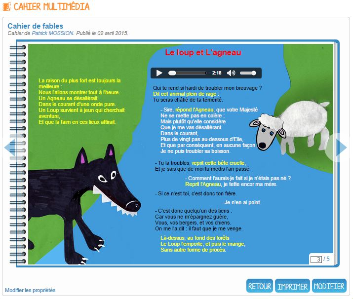
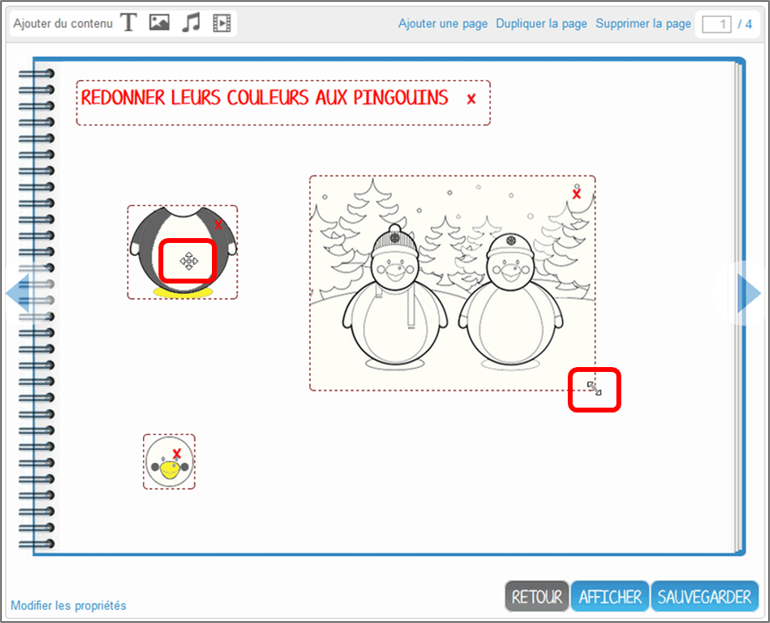

# Cahier multimédia

L’appli **Cahier multimédia** est un outil de création et publication de contenus multimédia \(son, image, texte, vidéo…\) offrant une grande souplesse de mise en page.

## Présentation

Les cahiers créés peuvent être utilisés comme des **supports de restitution** de travaux ou encore comme **outil de communication** avec d’autres utilisateurs puisque chaque cahier peut être partagé avec un utilisateur ou un groupe d’utilisateurs.

Les utilisateurs ayant des droits de contribution dans le cahier choisissent le nombre de pages du cahier et la mise en forme qu’ils souhaitent appliquer à chaque page.

## Créer et partager un cahier multimédia

Pour accéder à l’appli Cahier multimédia, cliquez sur l’icône correspondante dans la page « Mes applis ».

  

Dans le service Cahier multimédia, cliquez sur le bouton « Créer » en haut de la page.

Vous accédez à l’interface de création du cahier.

1. Indiquez le « titre » de votre cahier dans le champ correspondant
2. Vous pouvez ajouter une vignette d’illustration du cahier \(qui apparaît en miniature sur la page d’accueil et comme couverture du cahier\) en cliquant sur « Changer l’image ». Si vous ne modifiez pas l’image, c’est la vignette par défaut qui s’affichera.
3. Une fois le titre ajouté et l’image importée, cliquez sur « Valider »

  
Votre cahier est désormais créé mais n’est pas encore visible. Pour le partager avec d’autres utilisateurs, cliquez sur la case à cocher \(1\) située à côté du cahier puis sur « Partager » \(2\).

  
Dans la fenêtre, vous pouvez donner des droits de consultation, de contribution et de gestion sur votre cahier. Pour cela, saisissez les premières lettres du nom de l’utilisateur ou du groupe d’utilisateurs que vous recherchez \(1\), sélectionnez le résultat \(2\) et cochez les cases correspondant aux droits que vous souhaitez leur attribuer \(3\).

## Editer les pages du cahier multimédia

Une fois [votre cahier multimédia créé](http://one1d.fr/aide-support/aide-support/7-cahier-multimedia/creer-et-partager-un-cahier-multimedia/), vous pouvez publier des pages. Pour cela, cliquez sur le titre du cahier dans la page d’accueil.

Lorsque le cahier est affiché à l’écran, cliquez sur « Modifier ».

Pour ajouter de nouvelles pages, cliquez sur « Ajouter une page » \(1\) ou sur la flèche à droite du cahier \(2\).

Vous pouvez ajouter les contenus suivants dans vos cahiers :

Il est possible de modifier une zone de texte. Pour cela, cliquez sur la zone : une barre d’édition s’affiche. L’éditeur offre de nombreuses possibilités pour mettre le texte en forme.

Pour tous les types de contenus, il est aussi possible de modifier la position et la taille de la zone.

Pour déplacer un contenu, survolez la zone et cliquez dessus quand le curseur prend la forme d’une flèche à quatre côtés. Maintenez le clic enfoncé et déplacez le contenu.

Pour modifier la taille du contenu, survolez le contour de la zone et cliquez dessus quand le curseur prend la forme d’une double flèche.

Pour visualiser votre cahier, cliquez sur « Afficher ».

N’oubliez pas d’enregistrer vos travaux avant de quitter la page en cliquant sur « Sauvegarder ».

## Publier une vidéo dans un cahier multimédia

Il est possible d’ajouter dans vos cahiers multimédia des vidéos stockées sur des plateformes d’hébergement comme Youtube, Dailymotion, Libcast, Vimeo, Wat.tv, …

Pour cela, rendez-vous sur la plateforme et récupérez le code permettant d’intégrer la vidéo à un site web.

Voici un exemple de procédure pour le site Youtube :

1. Sous la vidéo, cliquer sur « Partager »
2. Cliquez sur « Intégrer »
3. Copiez le lien qui est indiqué dans la barre

Ouvrez le cahier multimédia dans lequel vous souhaitez ajouter cette vidéo et cliquez sur l’icône d’ajout de vidéo.

Dans la fenêtre qui s’ouvre, collez le lien précédemment copié depuis le site hébergeant la vidéo \(1\) puis cliquez sur « Ajouter » \(2\).

Positionnez ensuite la vidéo dans la page et sauvegardez votre travail.

Votre cahier est complété et la vidéo prête à être regardée !

## Note de version

A chaque nouvelle version de l’application, les nouveautés seront présentées dans cette section.

