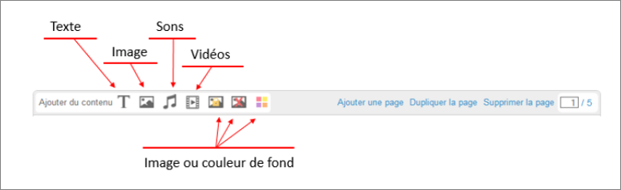

[[cahier-multimedia]]
= Cahier multimédia

“Pimp” ton exposé en version 2.0 ! Avec le *Cahier multimédia*, votre banal exposé sur la faune amazonienne devient tout de suite plus passionnant. Mise en page personnalisée, illustrations, vidéos, sons, votre cahier prend vie sous les clics de vos lecteurs.

* link:index.html?iframe=true#presentation[Présentation]
* link:index.html?iframe=true#cas-d-usage-1[Créer et partager un cahier
multimédia]
* link:index.html?iframe=true#cas-d-usage-2[Editer les pages du cahier
multimédia]
* link:index.html?iframe=true#cas-d-usage-3[Publier une vidéo dans un
cahier multimédia]

link:../../wp-content/uploads/2015/03/copyright.jpg[image:../../wp-content/uploads/2015/03/copyright.jpg[copyright,width=86,height=37]]

[[presentation]]
== Présentation

Les cahiers créés peuvent être utilisés comme des *supports de
restitution* de travaux ou encore comme *outil de communication* avec
d’autres utilisateurs puisque chaque cahier peut être partagé avec un
utilisateur ou un groupe d'utilisateurs.

Les utilisateurs ayant des droits de contribution dans le cahier
choisissent le nombre de pages du cahier et la mise en forme qu'ils
souhaitent appliquer à chaque page.

image:../../wp-content/uploads/2015/04/Cahier-multimédia.jpg[Cahier
multimédia,width=451,height=383] 

[[cas-d-usage-1]]
== Créer et partager un cahier multimédia

Pour accéder à l’appli Cahier multimédia, cliquez sur l’icône
correspondante dans la page « Mes
applis ».

image:../../wp-content/uploads/2015/06/p14.png[p1,width=268,height=49] +
image:../../wp-content/uploads/2015/06/m17.png[m1,width=439,height=214]

Dans le service Cahier multimédia, cliquez sur le bouton « Créer » en
haut de la page.

image:../../wp-content/uploads/2015/06/m24.png[m2,width=464,height=228]

Vous accédez à l’interface de création du cahier.

1.  Indiquez le « titre » de votre cahier dans le champ correspondant
2.  Vous pouvez ajouter une vignette d’illustration du cahier (qui
apparaît en miniature sur la page d’accueil et comme couverture du
cahier) en cliquant sur « Changer l’image ». Si vous ne modifiez pas
l’image, c’est la vignette par défaut qui s’affichera.
3.  Une fois le titre ajouté et l’image importée, cliquez sur « Valider
»

image:../../wp-content/uploads/2015/06/m32.png[m3,width=457,height=163] +
Votre cahier est désormais créé mais n’est pas encore visible. Pour le
partager avec d’autres utilisateurs, cliquez sur la case à cocher (1)
située à côté du cahier puis sur « Partager » (2).

image:../../wp-content/uploads/2015/06/m42.png[m4,width=456,height=275] +
Dans la fenêtre, vous pouvez donner des droits de consultation, de
contribution et de gestion sur votre cahier. Pour cela, saisissez les
premières lettres du nom de l’utilisateur ou du groupe d’utilisateurs
que vous recherchez (1), sélectionnez le résultat (2) et cochez les
cases correspondant aux droits que vous souhaitez leur attribuer (3).

image:../../wp-content/uploads/2015/06/m53.png[m5,width=366,height=311]

[[cas-d-usage-2]]
== Editer les pages du cahier multimédia

Une fois http://one1d.fr/aide-support/aide-support/7-cahier-multimedia/creer-et-partager-un-cahier-multimedia/[votre
cahier multimédia créé], vous pouvez publier des pages. Pour cela,
cliquez sur le titre du cahier dans la page d’accueil.

image:../../wp-content/uploads/2015/06/m18.png[m1,width=467,height=243]

Lorsque le cahier est affiché à l’écran, cliquez sur « Modifier ».

link:../../wp-content/uploads/2015/06/m43.png[image:../../wp-content/uploads/2015/06/m43.png[m4,width=470,height=382] +
]

Pour ajouter de nouvelles pages, cliquez sur « Ajouter une page » (1) ou
sur la flèche à droite du cahier (2).

image:../../wp-content/uploads/2015/06/m54.png[m5,width=476,height=385]

Vous pouvez ajouter les contenus suivants dans vos cahiers :

Il est possible de modifier une zone de texte. Pour cela, cliquez sur la
zone : une barre d’édition s’affiche. L’éditeur offre de nombreuses
possibilités pour mettre le texte en forme.

image:../../wp-content/uploads/2015/06/m73.png[m7,width=482,height=361]

 

Pour tous les types de contenus, il est aussi possible de modifier la
position et la taille de la zone.

Pour déplacer un contenu, survolez la zone et cliquez dessus quand le
curseur prend la forme d’une flèche à quatre côtés. Maintenez le clic
enfoncé et déplacez le contenu.

Pour modifier la taille du contenu, survolez le contour de la zone et
cliquez dessus quand le curseur prend la forme d’une double
flèche.image:../../wp-content/uploads/2015/06/m81.png[m8,width=513,height=415]

 

Pour visualiser votre cahier, cliquez sur « Afficher ».

N’oubliez pas d’enregistrer vos travaux avant de quitter la page en
cliquant sur « Sauvegarder ».

[[cas-d-usage-3]]
== Publier une vidéo dans un cahier multimédia

Il est possible d’ajouter dans vos cahiers multimédia des vidéos stockées sur des plateformes d’hébergement comme Youtube, Dailymotion, Libcast, Vimeo, Wat.tv, …
Ouvrez le cahier multimédia dans lequel vous souhaitez ajouter cette vidéo et cliquez sur l’icône d’ajout de vidéo.
image:/assets/CMA 3.png[alt=""]

Dans la fenêtre qui s’ouvre, selectionnez un type de contenu de média (vidéos hébergées sur Youtube, Viméo, Dailymotion, Learningaps.org et educaplay) (1) 

image:/assets/CMA 4.png[alt=""]

Puis collez l’URL de la vidéo (2) et cliquez sur « Appliquer » (3). 
image:/assets/CMA 5.png[alt=""]

Pour une vidéo hébergée ailleurs , appuyez sur la vignette "Collez votre propre code" (4), 
image:/assets/CMA 6.png[alt=""]

puis collez le lien Iframe (5) et cliquez sur "Appliquer" (6) 
image:/assets/CMA 7.png[alt=""]

Positionnez ensuite la vidéo dans la page et sauvegardez votre travail. 

image:/assets/CMA 8.png[alt=""]

Votre cahier est complété et la vidéo prête à être regardée !

