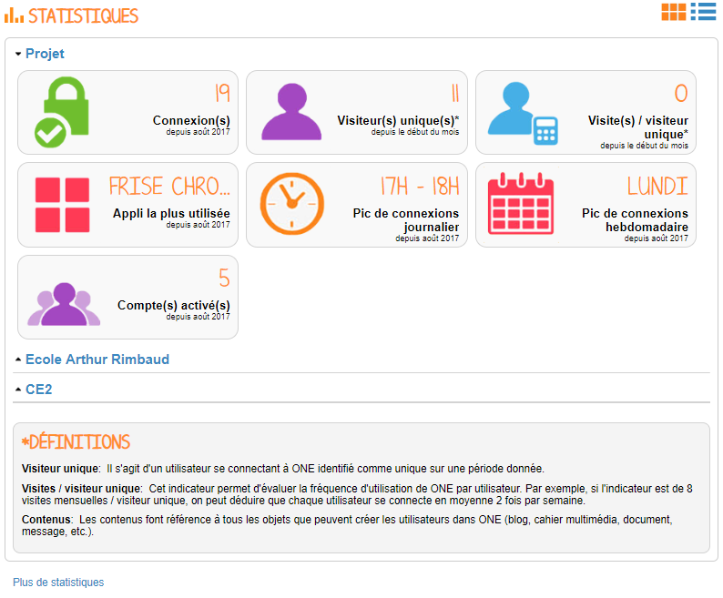
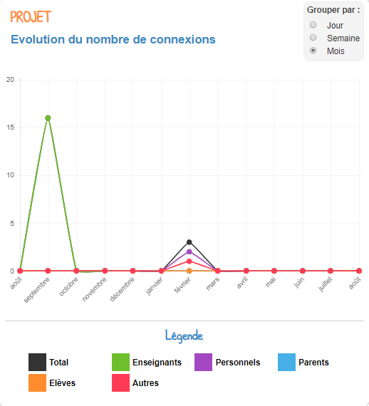

# Statistiques

Devenez un mathématicien en herbes ! Grâce à l’appli **Statistiques** suivez sur une période donnée la fréquentation de la plateforme.

## Présentation

L’appli Statistiques vous propose de suivre **sept indicateurs** calculés sur **une période donnée** \(soit sur le mois écoulé, soit depuis le 1er septembre\):

• **Connexions** : calcule le nombre de visites depuis le 1er septembre  
• **Visiteurs uniques** : calcule le nombre d’utilisateurs identifiés comme uniques depuis le début du mois en cours  
• **Visites par visiteur unique** : calcule une fréquence de visite par utilisateur identifié depuis le début du mois en cours  
• **Appli la plus utilisée** : indique l’appli recueillant le plus de visites depuis le 1er septembre  
• **Pic de connexion journalier** : indique le créneau horaire auquel la plateforme est le plus consulté depuis le 1er septembre  
• **Pic de connexion hebdomadaire** : indique le jour de la semaine recueillant le plus de visites depuis le 1er septembre  
• **Comptes activés** : calcule le nombre de comptes activés depuis le 1er septembre.

## Comprendre les données disponibles

Pour accéder à l’appli Statistiques, cliquez sur l’icône correspondante dans la page « Mes applis ».

Un récapitulatif des statistiques de fréquentation de la plateforme s’affiche.

Pour plus de détails, cliquez sur la vignette de l’indicateur. Un graphe s’affiche.

L’encart situé en haut à droite permet de choisir la période d’affichage des résultats.

En positionnant le curseur de la souris sur le graphe, vous pouvez consulter le détail de l’indicateur par profil. Par exemple dans l’écran ci-dessous, on constate pour le mois de janvier 76 visites tout profil confondu dont 47 visites pour le profil Enseignant.

