# Statistiques

Devenez un mathématicien en herbes ! Grâce à l’appli **Statistiques** suivez sur une période donnée la fréquentation de la plateforme.

## Présentation

L’appli Statistiques vous propose de suivre **neuf indicateurs** calculés sur **une période donnée** \(soit sur le mois écoulé, soit depuis les 12 derniers mois en fonction des données disponibles\) :

* **Connexions** : calcule le nombre de visites depuis un an. 
* **Visiteurs uniques** : calcule le nombre d’utilisateurs identifiés comme uniques depuis le début du mois en cours.
* **Visites par visiteur unique** : calcule une fréquence de visite par utilisateur identifié comme unique depuis le début du mois en cours. 
* **Appli la plus utilisée** : indique les visites des applications depuis un an. Le détail des visites est disponible par application. 
* **Connecteur le plus utilisé** : indique les visites des connecteurs depuis une période donnée. Le détail des visites est disponible par connecteur.
* **Support le plus utilisé** : indique les connexions par type de supports \(ordinateur, app mobile…\) depuis un an. 
* **Pic de connexion journalier** : indique le créneau horaire auquel la plateforme est le plus consulté depuis un an.
* **Pic de connexion hebdomadaire** : indique le jour de la semaine recueillant le plus de visites depuis un an. 
* **Comptes activés** : calcule le nombre de comptes activés depuis un an.

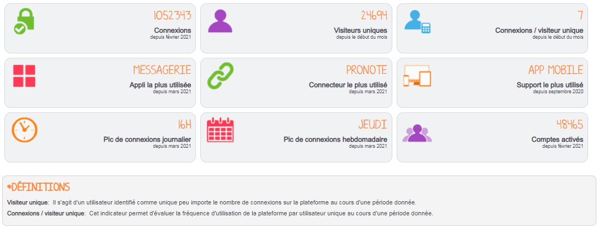

Un graphique détaillé est disponible pour chacun de ces indicateurs :

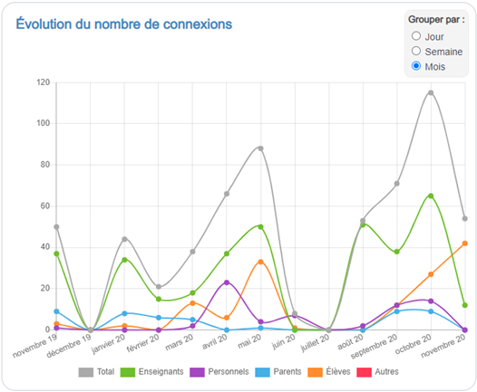

## Naviguer dans l'application Statistiques

Pour accéder à l’appli Statistiques, cliquez sur l’icône correspondante dans la page « Mes applis ».

Un récapitulatif des statistiques de fréquentation de votre principale structure ou classe de rattachement s’affiche.

Si vous êtes un ADML rattaché à plusieurs établissements ou plusieurs classes, vous pouvez naviguer facilement entre les structures ou d'une classe à l'autre en cliquant sur le nom en haut à gauche.

Si vous êtes enseignant, vous avez accès aux statistiques des classes auxquelles vous êtes rattaché.

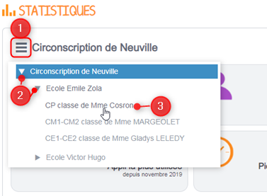

Pour plus de détails sur un indicateur, cliquez sur sa vignette. Un graphe s’affiche.

Vous pouvez naviguer d'un indicateur à l'autre en choisissant les statistiques souhaitées dans la colonne de gauche :

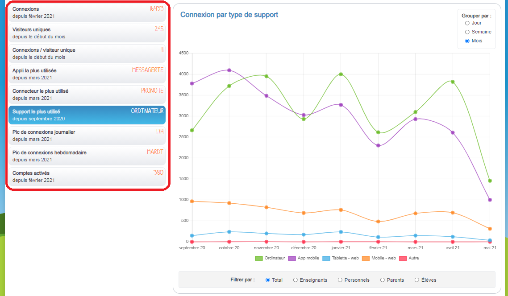

Deux boutons en haut à droite vous permettent de passer de la vue récapitulative des indicateurs à la vue détaillée.

## Comprendre les données disponibles

L’encart situé en haut à droite permet de choisir la période d’affichage des résultats.

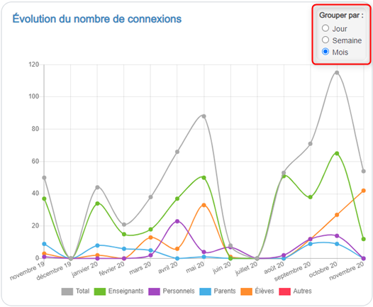

Par défaut, tous les profils d'utilisateurs s'affichent. Vous pouvez isoler certains profil d'utilisateur en cliquant en dessous du graphiques sur le nom ou la couleur des profils dont vous ne souhaitez pas afficher les résultats.

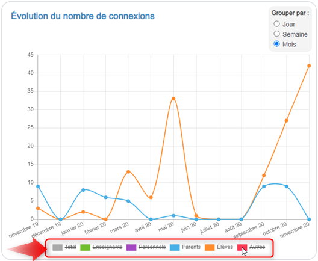

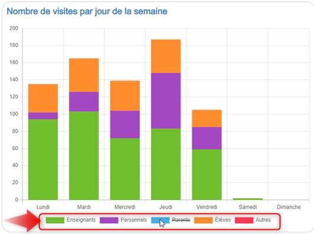

Pour les indicateurs "Appli la plus utilisée", "Connecteur le plus utilisé", "Connexions par type de support" et "Comptes activés" vous pouvez choisir d'avoir les résultats pour l'ensemble des profils \(valeur par défaut\) ou pour un profil en particulier en sélectionnant ce profil parmi les boutons radio. Dans l'exemple ci-dessous, on choisit par exemple de n'afficher que les comptes activés \(B\) pour les utilisateurs de profil Personnel \(A\).

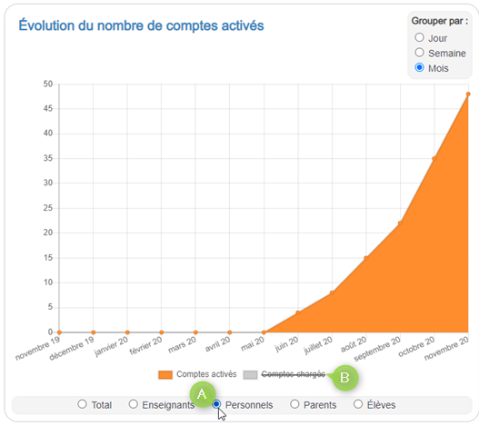

En positionnant le curseur de la souris sur un point des graphiques en courbes \(ou sur une barre des graphiques à barres\), vous pouvez consulter le détail de l’indicateur par profil. Par exemple dans l’écran ci-dessous, on constate qu'en octobre 2020, il y a eu 115 connexions pour l'école dont 65 pour le profil Enseignant.

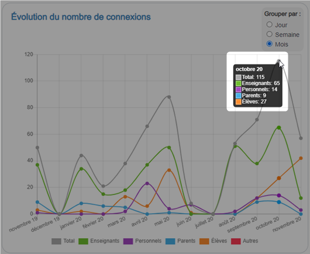

Pour les indicateurs "Appli la plus utilisée" et "Connecteur le plus utilisé" vous pouvez voir le détail par application / par connecteur en le sélectionnant dans la liste déroulante.

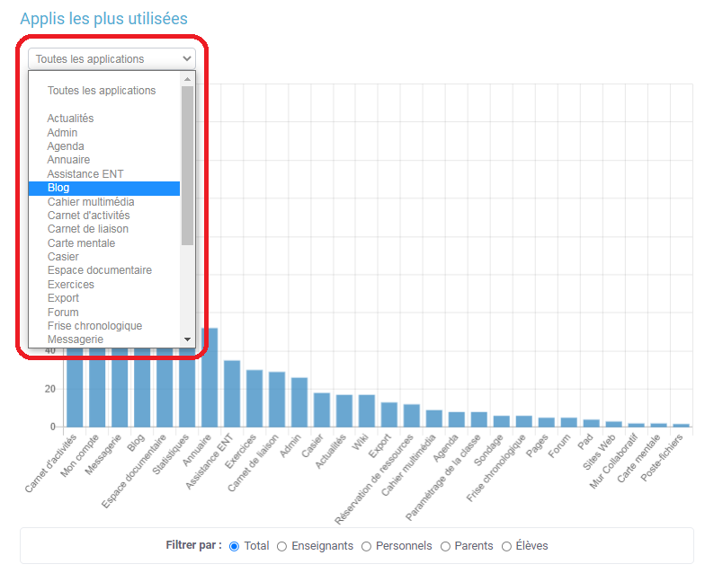

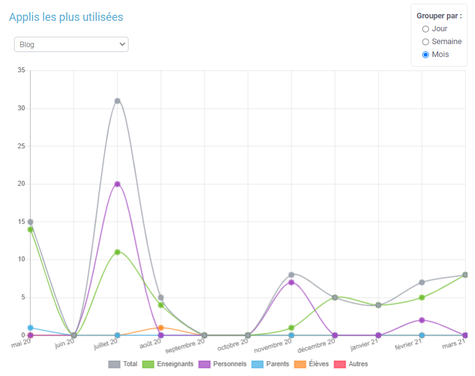

## Exporter les données pour un indicateur

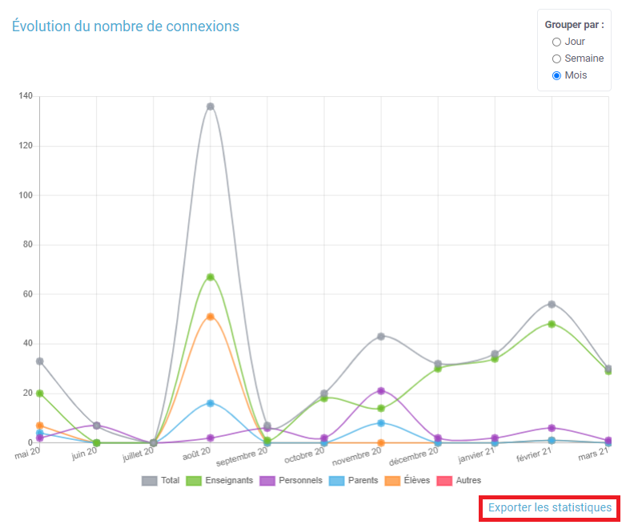

Pour exporter les statistiques relatives à un indicateur, positionnez-vous sur la vue détaillée de l'indicateur désiré. En cliquant sur le lien "Exporter les statistiques" en bas à droite de votre écran, vous générez un fichier .csv que vous pouvez enregistrer sur votre appareil.

En tant qu’ADML, il est possible d’exporter les données de vos différentes structures de rattachement, de façon consolidée ou détaillée. Au niveau des établissements scolaires, vous pouvez également choisir d'exporter les statistiques par classes.

En tant qu’enseignant, vous pouvez exporter les données des classes auxquelles vous êtes rattachées.

Ce fichier contient les informations relatives à l'indicateur sur lequel vous étiez positionné lorsque vous avez cliqué sur le lien, ainsi que la granularité \(mois, semaine, jour\) sélectionnée.

Il y a quatre exports différents : 1. Un export contenant les connexions, les visiteurs uniques et les comptes chargés et activés. 2. Un export contenant les statistiques des applications. 3. Un export contenant les statistiques des connecteurs. 4. Un export contenant les statistiques de connexions par type de support.

