# Premiers pas

## La page Quoi de neuf ?

La page "Quoi de neuf ?" est la première page affichée après vous être connecté avec votre identifiant et mot de passe. Elle vous permet d’accéder à différentes fonctions et contenus, comme le fil de nouveautés, les widgets, le bandeau de navigation \(présents sur chaque page de la plateforme\) mais aussi de changer de thème.

## Le fil de nouveautés

Le fil de nouveautés affiche les dernières informations et contenus qui vous concernent.

Il est composé des éléments suivants :

* Le menu dépliant "Filtrer sur" en haut de la page qui permet de paramétrer l’affichage des notifications par service ;
* Le lien vers le profil de la personne qui vous a partagé l’information ou le contenu ;
* Le lien vers l’information ou le contenu.
* Une indication sur l’application concernée par la notification

Pour filtrer les notifications reçues, déplier le menu "Filtrer les nouveautés" et cliquez sur les applications dont vous souhaitez visualiser les notifications ou non.

Pour accéder à une information ou un contenu qui vous a été partagé, cliquez sur le lien présent dans la nouveauté.

Le contenu s’affiche.

Pour accéder au profil de l’utilisateur qui vous a partagé le contenu ou l’information, cliquez sur son identifiant.

Le profil de l’utilisateur s’affiche.

## Suppression et signalement des notifications

Sur le fil de nouveauté, vous avez la possibilité de ne plus voir la notification reçue et/ou de signaler à l’administrateur de votre établissement une notification inappropriée. Au survol de la notification, vous accédez à une flèche d’action à droite.

Lorsque vous cliquez sur la flèche, les actions concernant la notification sélectionnée s’affichent. Vous pouvez :

* Supprimer l’affichage de la notification de votre fil de nouveauté
* Signaler la notification comme inappropriée à votre référent ENT

Vous avez également la possibilité de gérer vos notifications et choisir de ne pas envoyer de notification lors d'une mise à jour ou du partage d'un contenu à votre réseau.  
Depuis votre espace "Mon compte", vous retrouverez toutes les notifications que vous avez émises en cliquant sur l’onglet "Historique"

Comme précédemment, en survolant la notification avec la souris, vous verrez apparaître une flèche sur la droite de la notification. En cliquant sur cette flèche, une action apparaît vous permettant de supprimer définitivement la notification de la plateforme.

## Les widgets

Les widgets se situent à gauche du fil de nouveautés. Ils sont composés des notes personnelles, du calendrier, des actualités, du flux RSS, du dictaphone et des signets.

* Le widget **Notes** \(pense-bêtes\) permet à l’utilisateur de saisir des notes personnelles conservées à chaque déconnexion/reconnexion :

* Le widget **Calendrier** affiche le mois en cours et la date du jour :

* Le widget **Actualités** affiche les cinq dernières actualités partagées avec soi :

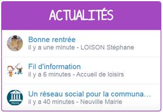

* Le widget **Humeur** permet de choisir son humeur du moment :

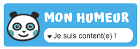

* Le widget **Dictaphone** permet d’enregistrer des sons depuis le micro de son ordinateur. Les sons seront enregistrés dans l’espace documentaire de l’utilisateur.

Vous pouvez changer l’ordre d’apparition des widgets sur la page d’accueil de la plateforme en sélectionnant le widget puis en le déplaçant sur la page.

## Le bandeau de navigation

Le bandeau de navigation situé en haut de la page permet d’accéder à différents services, quelle que soit l’appli dans laquelle vous naviguez.

Les différents services disponibles depuis le bandeau sont les suivants :

* Le bouton de notification de nouveaux messages reçus dans la plateforme et d’accès à la messagerie 
* L’accès à votre compte 
* Le bouton de déconnexion du portail 

Trois vues sont également disponibles depuis n’importe quel endroit de la plateforme:

* La vue Quoi De Neuf qui est aussi la page d’accueil 
* La vue La Classe qui présente la listes des élèves de la classe 
* La vue d’accès aux applis 

## L’éditeur de texte

L’éditeur de texte permet de rédiger des contenus et de les mettre en forme : type de police, taille de l'écriture, couleur de texte, etc.

L’éditeur permet également d’intégrer différents types de contenus :

1. Une image
2. Un fichier audio
3. Une vidéo
4. Une formule Latex
5. Un lien

L'éditeur permet désormais d’ajouter plus simplement des pièces jointes dans un contenu.

Lorsque l’on clique sur l’icône d’ajout de pièces jointes, on peut choisir un document de sa bibliothèque multimédia \(1\) ou charger un document depuis son poste \(2\).

La ou les pièces jointes sélectionnées apparaissent dans la zone d'édition dans un cadre dédié.

Pour modifier les pièces jointes, faire un clic droit dans la zone grisée et cliquer sur "Modifier les fichiers" \(3\).

## L’éditeur d'images

L’éditeur d’images permet de modifier une image en cours d’import ou déjà importée. Vous pouvez y accéder directement en cliquant sur une image depuis l'éditeur :

Depuis la fenêtre d’import d’images, après avoir sélectionné l'image :

Ou encore depuis l’espace documentaire :

L’éditeur d’images permet de :

1. Pivoter une image
2. Rogner
3. Flouter des visages ou une partie de l'image
4. Redimensionner
5. Changer le titre, ajouter un texte alternatif pour les mal-voyants ou une légende

## Intégrer un contenu multimédia

Dans les différentes applications \(blog, actualités, messagerie, cahier de textes, wiki …\), vous pouvez intégrer des contenus multimédia comme des exercices interactifs, des vidéos, des murs collaboratifs, etc. Pour cela, rendez-vous sur une application, cliquez sur le bouton “Créer” et accédez à l’éditeur de texte. Cliquez sur l’icône multimédia présente dans la barre d’édition.

**Intégrer un lien à l'aide d'une URL**

Différentes ressources sont proposées par défaut sur votre réseau éducatif \(LearningApps, Educaplay, YouTube, Dailymotion, Vimeo, Libcast...\) et peuvent être intégrées à un service en recopiant leur adresse internet \(ex : [https://learningapps.org/1459550](https://learningapps.org/1459550)\).

a\) Copiez d’abord l’adresse URL du contenu

b\) Intégrez la ressource dans une application Cliquez sur l’icône du type de contenu à insérer, LearningApps par exemple.

Une nouvelle fenêtre s’ouvre, dans laquelle vous pouvez coller l’adresse de la ressource en question \(1\). Une prévisualisation du contenu s’affiche \(2\), si vous souhaitez l’intégrer, cliquez sur le bouton “Appliquer” \(3\).

**Ajouter une ressource dont le type n’est pas proposé par défaut**

Si le type de la ressource à intégrer n’est pas proposé par défaut, il faudra coller le code d’intégration.

_**a\) Exemples de contenus à intégrer via le code d'intégration \(embed ou iframe\)**_

Il existe de nombreuses ressources internet que vous pouvez intégrer sur votre réseau éducatif, si le code d’intégration lié est proposé.

Voici quelques exemple de sites qui proposent des ressources intéressantes que vous pouvez intégrer sur les contenus partagés :

* Les vidéos du site [Les Fondamentau](https://www.reseau-canope.fr/lesfondamentaux/accueil.html)x ;
* [Padlet ](https://padlet.com/my/dashboard)qui propose des murs collaboratifs ;
* [Scratch ](https://scratch.mit.edu/)pour l’apprentissage des élèves au codage informatique.

_**b\) Collez le code d’intégration pour intégrer la ressource sur votre réseau éducatif**_

Une fois le code d’intégration copié, vous pouvez insérer la ressource dans toutes les applications dotées de l’éditeur de texte en cliquant sur l’icône d’intégration ci-contre.

Une fenêtre s’ouvre, vous pouvez alors :

1. Coller le lien d’intégration de la ressource ;
2. Voir un aperçu du contenu à intégrer ;
3. Cliquer sur le bouton « Appliquer » pour intégrer la ressource au contenu.

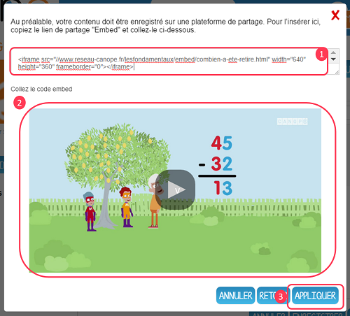

La ressource est maintenant intégrée à votre contenu !

## Utiliser le dictaphone

Le dictaphone vous permet de créer une bande son à partir du micro de votre ordinateur, tablette ou smartphone. Vous pouvez ensuite enregistrer la bande son dans l’espace documentaire, ou l’intégrer directement à l’un de vos contenus sur votre réseau éducatif.

**1. Accéder au dictaphone**

a\) A partir de la page "Quoi de neuf?"

Le module Dictaphone apparaît sur la partie gauche de la page d’accueil.

Si ce n’est pas le cas, il faut activer ce widget. Pour cela, ouvrez la fenêtre de personnalisation en cliquant sur l’icône en haut à droite du fil de nouveautés \(1\).

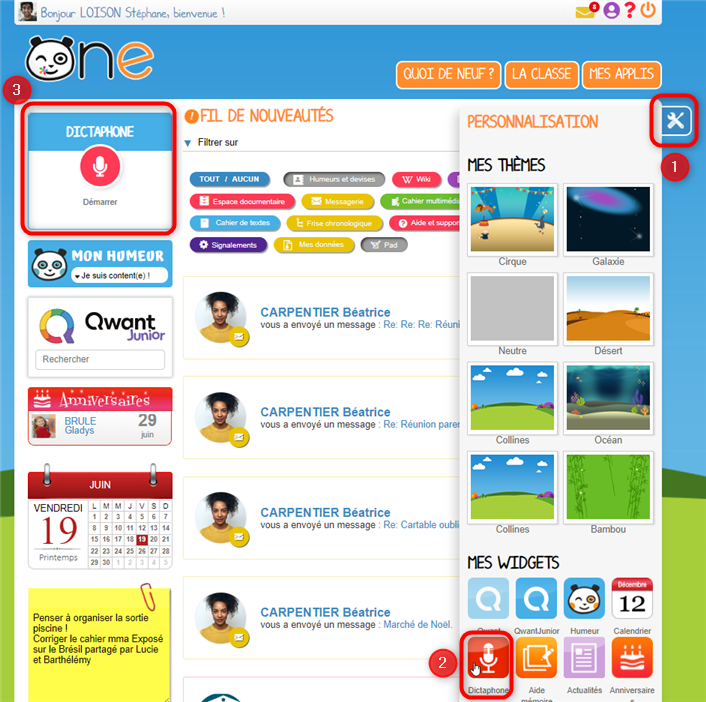

La fenêtre de personnalisation s’ouvre, elle contient deux rubriques :

* “Mes thèmes” vous permet de choisir votre fond d’écran
* “Mes widgets” vous permet de choisir d’afficher ou non les widgets sur le fil de nouveautés

Ici, assurez-vous que l’icône Dictaphone est colorée, sinon cliquez sur cette icône pour afficher le widget \(2\).

Le module dictaphone apparaît alors en haut à gauche de la page d’accueil, vous pouvez maintenant l’utiliser \(3\).

b\) A partir des applications via l'éditeur de texte

Vous pouvez créer un son grâce au dictaphone accessible directement depuis le blog, le cahier de textes, le cahier multimédia, la frise chronologique, le wiki ou la messagerie. Pour cela, lors de la création de contenu sur l’éditeur de texte, cliquez sur l’icône “Ajouter un fichier audio”. Vous accéderez ainsi au module Dictaphone.

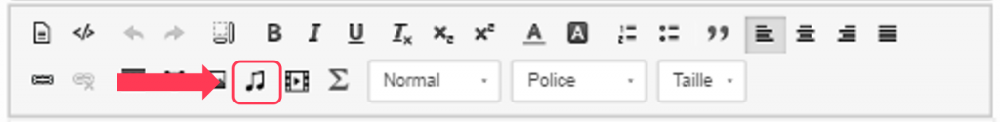

**2. Enregistrer la bande son**

Cliquer sur Démarrer ou sur l’icone en forme de micro pour lancer l’enregistrement.

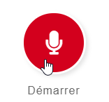

Lorsque l’enregistrement est en cours, vous pouvez cliquer sur le bouton de pause pour l’interrompre.

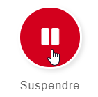

Vous avez alors la possibilité de Reprendre l’enregistrement \(1\), de le lire \(2\) de le recommencer \(3\), de personnaliser le nom de l’enregistrement \(4\) et de le sauvegarder dans l’espace documentaire \(5\)

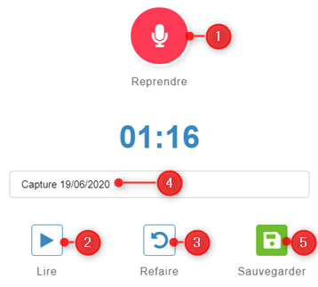

**3. Utiliser la bande son dans les applications de votre réseau**

a\) Enregistrement réalisé dans une application via l’éditeur de texte

Si vous enregistrez votre bande son à partir d’une application \(blog, cahier multimédia, cahier de textes…\), le fichier MP3 sera sauvegardé dans le dossier “Documents ajoutés dans les applis” \(1\) de l’espace documentaire.

Depuis la fenêtre d'import de son où vous avez effectué l'enregistrement, passez sur l'onglet PARCOURIR MON ESPACE PERSONNEL,

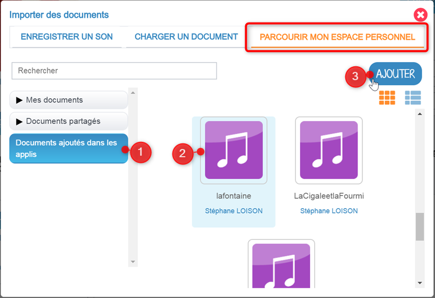

Choisissez la section “Documents ajoutés dans les applis” \(1\) dans la colonne de gauche, puis la vignette du son que vous venez d'enregistrer \(2\), dans la partie centrale. Cliquez ensuite sur le bouton "Ajouter", en haut à droite, pour importer votre son dans votre contenu.

b\) Enregistrement réalisé à partir du widget Dictaphone de la page « Quoi de neuf ? »

Rendez-vous sur l’application « Espace documentaire » \(1\) puis cliquez sur la rubrique “Documents ajoutés dans les applis” \(2\). Vous trouverez votre enregistrement sous le nom de “Capture jour/mois/année” si vous ne l'avez pas renommé. En sélectionnant la vignette \(3\), vous accéderez à différentes actions possibles \(4\), vous pourrez notamment renommer la bande son \(en cliquant sur le bouton Propriétés\) ou la partager avec vos élèves.

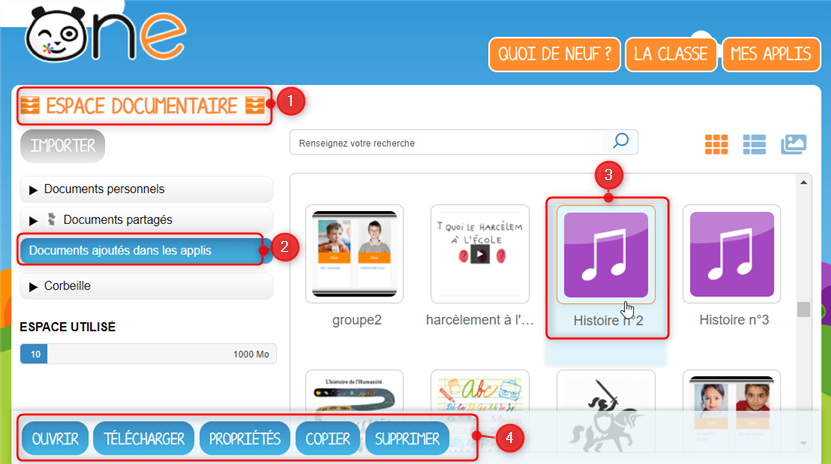

## La gestion des paramètres

La gestion des paramètres vous permet de modifier votre thème d’apparence mais également de choisir l’affichage de ses widgets.

Pour y accéder, cliquez sur le bouton à droite de votre fil de nouveautés.

L’onglet de gestion de vos paramètres apparaît.

Pour changer l’apparence de votre thème, cliquez sur celui de votre choix.

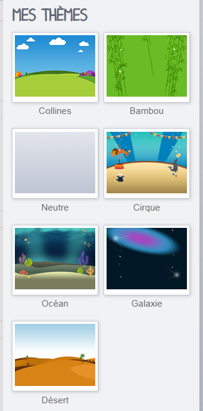

Pour décider d’afficher seulement certains widgets, désélectionnez ceux que vous ne souhaitez pas voir apparaître sur votre page d’accueil. Les vignettes désélectionnées apparaîtront avec une couleur de fond plus claire dans la gestion de vos paramètres. Les widgets correspondants ne s'afficheront plus à gauche du fil de nouveauté.

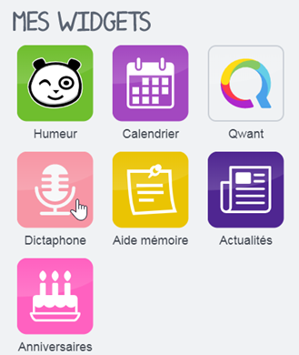

## Notifications externes

La plateforme est doté d’un système de notification par mail qui permet aux utilisateurs de recevoir sur leur adresse personnelle les nouveautés de la plateforme qui les concernent.  
Chaque utilisateur peut paramétrer les notifications qu’il souhaite recevoir et leur fréquence \(immédiate, quotidienne, hebdomadaire\).  
Pour accéder à ce paramétrage, aller dans Mon compte \(1\),

et cliquer sur le bouton "Gérer mes notifications externes" \(2\).

La page de paramétrage des notifications externes permet de modifier l’adresse de réception des mails \(3\) et de choisir la fréquence d’envoi de chaque notification \(immédiat, quotidien, hebdomadaire, jamais\) \(4\).  
Le détail des notifications disponibles par service est accessible en cliquant sur le nom du service dans la ligne correspondante \(5\). Lorsque les modifications sont terminées, cliquer sur "Enregistrer" en bas du tableau \(6\).

Une fois la notification reçue dans sa boîte mail personnelle, l’utilisateur peut cliquer sur le lien correspondant afin d’accéder au contenu. S’il n’est pas connecté à la plateforme, il devra saisir son identifiant et son mot de passe pour accéder à l’objet de la notification.

## Message Flash

Des messages d’informations à destinations de tous les utilisateurs de la plateforme s’affichent dans le fil de nouveautés via un bandeau coloré \(1\).

Après avoir pris connaissance du message, vous avez la possibilité de le supprimer en cliquant sur la croix à droite de celui-ci \(2\).

## Partage et favoris de partage

Vous retrouvez la fenêtre de partage dans la majeure partie des applications. Cette fenêtre vous permet de partager un contenu que vous avez crée ou sur lequel vous avez des droits de gestion. Le bouton "Partager" est accessible en règle générale dans le menu qui apparaît en bas de votre écran. Sélectionnez le contenu en question \(1\) puis cliquez sur "Partager" \(2\).

Vous accédez à la fenêtre de partage dans laquelle vous allez pouvoir rechercher des utilisateurs. Renseignez les premières lettres de la personne, ou du groupe que vous recherchez \(1\). Dans la liste qui vous est proposée, sélectionnez le ou les utilisateurs recherchés \(2\). Si l’utilisateur ou le groupe n’apparaît pas, cliquez sur "Voir la suite" pour dérouler la liste de propositions \(3\).

Vous avez la possibilité d’enregistrer une liste d’utilisateurs ou de groupes comme favori de partage. Une fois vos destinataires sélectionnés, cliquez sur "Enregistrer comme favori de partage" \(1\).

Il vous suffit ensuite d’inscrire le nom que vous souhaitez donner au favori \(1\) et cliquer sur OK \(2\).

Vous retrouverez ensuite ce favori de partage dans votre barre de recherche, au nom que vous avez enregistré. Vous pourrez ainsi partager plus facilement à un groupe de destinataires avec lequel vous avez l’habitude d'échanger régulièrement des contenus. Après avoir sélectionné votre favori de partage, il vous sera toujours possible de consulter la liste des membres du favori directement dans la fenêtre de partage. Cliquez sur la petite encoche à côté du nom de votre favori \(1\). Consultez les personnes ou les groupes rattachés à votre liste \(2\).

Afin que vous partage soit pris en compte, n’oubliez pas de cliquer sur le bouton "Partager".

