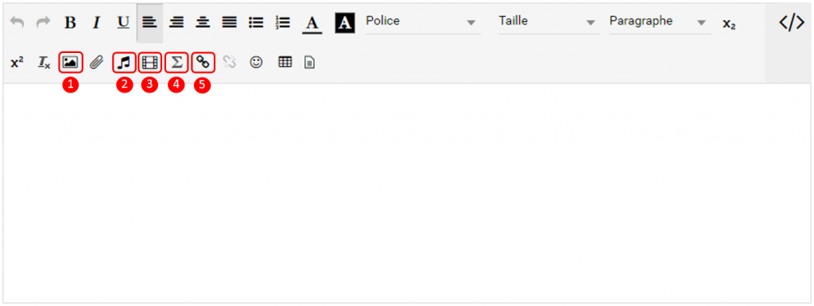

[[premiers-pas-dans-lent]]
= Premiers pas dans l'ENT

* link:index.html?iframe=true#presentation[La page d'accueil]
* link:index.html?iframe=true#cas-d-usage-1[Le fil de nouveautés]
* link:index.html?iframe=true#cas-d-usage-2[Suppression et signalement
des notifications]
* link:index.html?iframe=true#cas-d-usage-3[Les widgets]
* link:index.html?iframe=true#cas-d-usage-4[Le bandeau de navigation et les vues]
* link:index.html?iframe=true#cas-d-usage-5[L’éditeur de texte]
* link:index.html?iframe=true#cas-d-usage-6[La gestion des paramètres]
* link:index.html?iframe=true#cas-d-usage-7[Notifications externes]
* link:index.html?iframe=true#cas-d-usage-8[Message Flash]

http://creativecommons.org/licenses/by-nc-sa/3.0/fr/[image:../../wp-content/uploads/2015/03/CC-BY-NC-SA-3.0-FR-300x105.png[CC
BY-NC-SA 3.0 FR,width=100,height=35]]

[[presentation]]
== La page d'accueil

La page d’accueil est la première page affichée après vous être connecté
sur la plateforme. Elle vous permet d’accéder à différentes fonctions et
contenus, comme le fil de nouveautés, les widgets, le bandeau de
navigation (présents sur chaque page de l’ENT) mais aussi de changer de
thème.

link:/assets/Page_accueil_1D.png[image:/assets/Page_accueil_1D.png[Accueil,width=700]]

[[cas-d-usage-1]]
== Le fil de nouveautés

Le fil de nouveautés affiche les dernières informations et contenus qui
vous concernent.

Il est composé des éléments suivants :

* Le menu dépliant en haut de la page qui permet de paramétrer
l’affichage des notifications par service ;
* Le lien vers le profil de la personne qui vous a partagé l’information
ou le contenu ;
* Le lien vers l’information ou le contenu.
* Une indication sur l'application concernée par la notification

link:../../wp-content/uploads/2016/12/Fil-notif-et-filtre-2.png[image:../../wp-content/uploads/2016/12/Fil-notif-et-filtre-2.png[Fil
- notif et filtre 2,width=501,height=398]]

Pour filtrer les notifications reçues, déplier le menu "Filtrer les
nouveautés" et cliquez sur les applications dont vous souhaitez
visualiser les notifications ou non. +
link:../../wp-content/uploads/2016/12/Fil-filtre.png[image:../../wp-content/uploads/2016/12/Fil-filtre.png[Fil
- filtre,width=350,height=137]] +
Pour accéder à une information ou un contenu qui vous a été partagé,
cliquez sur le lien présent dans la nouveauté.

Le contenu s’affiche.

image:../../wp-content/uploads/2016/07/fil_2-1024x425.png[image,width=600,height=249]

Pour accéder au profil de l’utilisateur qui vous a partagé le contenu ou
l’information, cliquez sur son identifiant.

Le profil de l’utilisateur s’affiche.

[[cas-d-usage-2]]
== Suppression et signalement des notifications

Sur le fil de nouveauté, vous avez la possibilité de ne plus voir la
notification reçue et/ou de signaler à l'administrateur de votre
établissement une notification inappropriée. Une flèche d'action
s'affiche sur la notification lors du survol de celle-ci. +
link:../../wp-content/uploads/2016/12/Fil-survol1.png[image:../../wp-content/uploads/2016/12/Fil-survol1.png[Fil
- survol,width=321,height=201]]

Lorsque vous cliquez sur la flèche, les
actions concernant la notification sélectionnée s'affichent. +
Vous pouvez :

* Supprimer l'affichage de la notification de votre fil de nouveauté
* Signaler la notification comme inappropriée à votre référent ENT

link:../../wp-content/uploads/2016/12/Fil-action.png[image:../../wp-content/uploads/2016/12/Fil-action.png[Fil
- action,width=414,height=89]]

Vous avez également la possibilité de ne
pas diffuser une notification aux utilisateurs avec lesquels vous avez
des droits de communication ou vous avez partagé du contenu. +
Depuis votre espace "Mon compte", vous retrouverez toutes les
notifications que vous avez émises en cliquant sur l'onglet
"Historique" +
link:../../wp-content/uploads/2016/12/Fil-historique.png[image:../../wp-content/uploads/2016/12/Fil-historique.png[Fil
- historique,width=602,height=220]]

Comme précédemment, en survolant la
notification avec la souris, vous verrez apparaître une flèche sur la
droite de la notification. En cliquant sur cette flèche, une action
apparaît vous permettant de supprimer définitivement la notification de
l'ENT. +
link:../../wp-content/uploads/2016/12/Fil-historique-suppression.png[image:../../wp-content/uploads/2016/12/Fil-historique-suppression.png[Fil
- historique suppression,width=561,height=97]]

[[cas-d-usage-3]]
== Les widgets

Les widgets se situent à gauche du fil de nouveautés. Ils sont composés
des notes personnelles, du calendrier, des actualités, du flux RSS, du
dictaphone et des signets.

* Le widget *Notes* (pense-bêtes) permet à l'utilisateur de saisir des
notes personnelles conservées à chaque déconnexion/reconnexion

image:/assets/Page_accueil_1D_notes.png[w1,width=200,height=180]

* Le widget *Calendrier* affiche le mois en cours et la date du jour

image:/assets/Page_accueil_1D_calendrier.png[alt=""]

* Le widget *Dictaphone* permet d’enregistrer des sons depuis le micro
de son ordinateur. Les sons seront enregistrés dans l’espace
documentaire de l’utilisateur.

image:/assets/Page_accueil_1D_dictaphone.png[alt=""]

Vous pouvez changer l’ordre d’apparition des widgets sur la page
d’accueil de l’ENT en sélectionnant le widget puis en le déplaçant sur
la page.

[[cas-d-usage-4]]
== Le bandeau de navigation et les vues

Le bandeau de navigation situé en haut de la page permet d’accéder à
différents services, quelle que soit l’appli dans laquelle vous
naviguez.

link:/assets/Bandeau_1D.PNG[image:/assets/Bandeau_1D.PNG[Bandeau,width=8000]]

Les différents services disponibles depuis le bandeau sont les suivants :

* Le bouton de notification de nouveaux messages reçus dans l’ENT et
d'accès à la messagerie link:/assets/Page_accueil_1D_msg.png[image:/assets/Page_accueil_1D_msg.png[m1,width=40]]

* L’accès à votre
compte link:/assets/Page_accueil_1D_MonCompte.png[image:/assets/Page_accueil_1D_MonCompte.png[tete,width=40,height=36]]

* Le bouton de déconnexion du
portail link:/assets/Page_accueil_1D_deco.png[image:/assets/Page_accueil_1D_deco.png[d1,width=40]]

Trois vues sont également disponibles depuis n'importe quel endroit de l'ENT :

* La vue Quoi De Neuf qui est aussi la page d'accueil link:/assets/Page_accueil_1D_quoideneuf.png[image:/assets/Page_accueil_1D_quoideneuf.png[a1,width=40]]
* La vue La Classe qui présente la listes des élèves de la classe link:/assets/Page_accueil_1D_laclasse.png[image:/assets/Page_accueil_1D_laclasse.png[a1,width=40]]
* La vue d’accès aux
applis link:/assets/Page_accueil_1D_mesapplis.png[image:/assets/Page_accueil_1D_mesapplis.png[a1,width=40]]

[[cas-d-usage-5]]
== L’éditeur de texte

L’éditeur de texte permet de rédiger des contenus et de les mettre en
forme : type de police, taille de l'écriture, couleur de texte, etc.

L’éditeur permet également d’intégrer différents types de contenus :

1.  Une image
2.  Un fichier audio
3.  Une vidéo
4.  Une formule Latex
5.  Un lien

L'éditeur permet désormais d'ajouter plus simplement des pièces jointes
dans un contenu.

Lorsque l'on clique sur l'icône d'ajout de pièces jointes, on peut
choisir un document de sa bibliothèque multimédia (1) ou charger un
document depuis son poste (2).

La ou les pièces jointes sélectionnées apparaissent dans la zone
d'édition dans un cadre dédié.

Pour modifier les pièces jointes, faire un clic droit dans la zone
grisée et cliquer sur "Modifier les fichiers" (3).

[[cas-d-usage-6]]
== La gestion des paramètres

La gestion des paramètres vous permet de modifier votre thème
d’apparence mais également de choisir l’affichage de ses widgets.

Pour y accéder, cliquez sur le bouton à droite de votre fil de
nouveautés.

L’onglet de gestion de vos paramètres apparaît.

image:/assets/Page_accueil_1D_preferences.png[alt=""]

image:/assets/Page_accueil_1D_fond.png[alt=""]

Pour changer l’apparence de votre thème, cliquez sur celui de votre
choix.

Pour décider d’afficher seulement certains widgets, désélectionnez ceux
que vous ne souhaitez pas voir apparaître sur votre page d’accueil.

Ils seront grisés dans la gestion de vos paramètres.

image:/assets/Page_accueil_1D_widget.png[alt=""]

[[cas-d-usage-7]]
== Notifications externes

L'ENT est désormais doté d'un système de notification par mail qui
permet aux utilisateurs de recevoir sur leur adresse personnelle des
mails contenant les nouveautés de l'ENT qui les concernent. +
Chaque utilisateur peut modifier les notifications qu'il souhaite
recevoir et la fréquence de chacune d'elles (immédiate, quotidienne,
hebdomadaire). +
Pour accéder à ce paramétrage, aller dans Mon compte (1) et cliquer sur
le bouton "Gérer mes notifications externes" (2).

image:/assets/Page_accueil_1D_notifications.png[alt=""]

La page de paramétrage des notifications externes permet de modifier
l'adresse de réception des mails (3) et de choisir la fréquence d'envoi
de chaque notification (immédiat, quotidien, hebdomadaire, jamais)
(4). +
Le détail des notifications disponibles par service est accessible en
cliquant sur le nom du service dans la ligne correspondante (5).

Lorsque les modifications sont terminées, cliquer sur "Enregistrer" en
bas du tableau (6).

Une fois la notification reçue dans sa boîte mail personnelle,
l'utilisateur peut cliquer sur le lien correspondant afin d'accéder au
contenu. S'il n'est pas connecté à l'ENT, il devra saisir son
identifiant et son mot de passe pour accéder à l'objet de la
notification.

link:/assets/Page_accueil_1D_ex_notification.png[image:/assets/Page_accueil_1D_ex_notification.png[notiff,width=590]]

[[cas-d-usage-8]]
== Message Flash

Des messages d'informations à destinations de tous les utilisateurs de
l'ENT s'affichent dans le fil de nouveautés via un bandeau coloré (1).

Après avoir pris connaissance du message, vous avez la possibilité de le
supprimer en cliquant sur la croix à droite de celui-ci (2).

