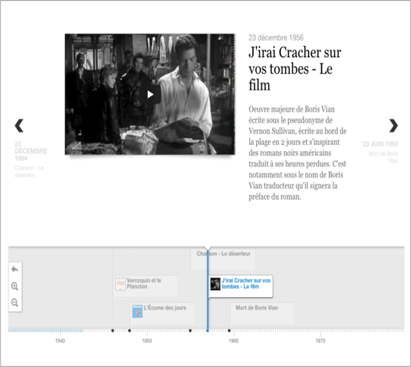
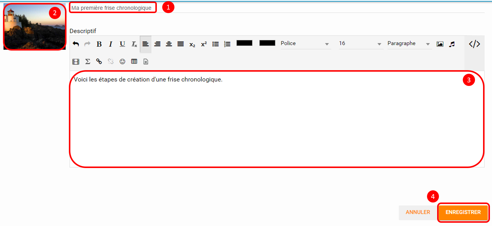
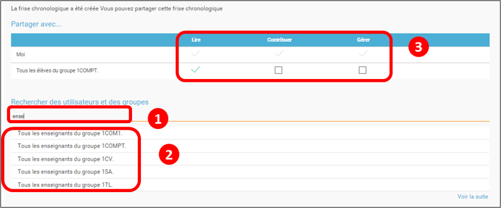
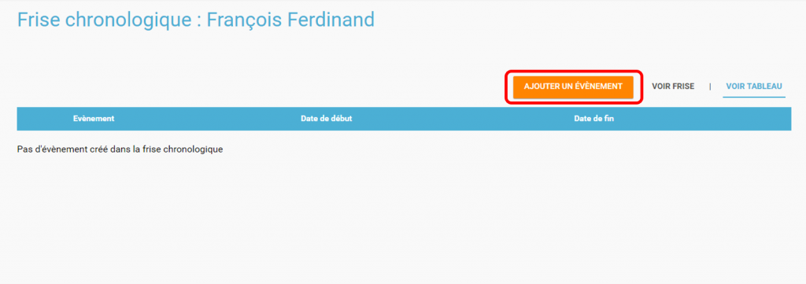
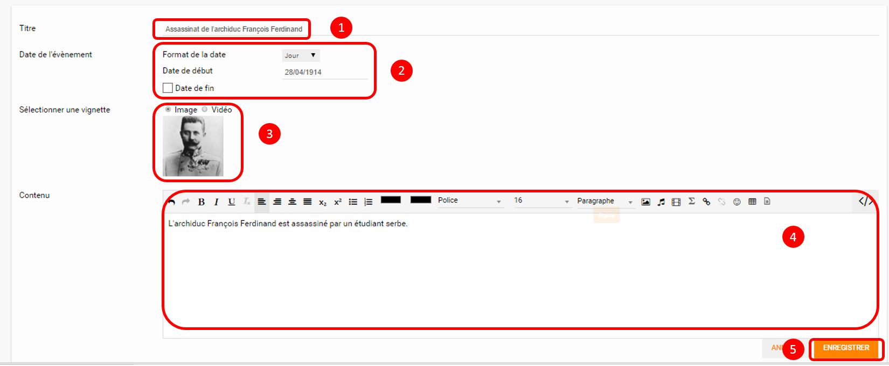
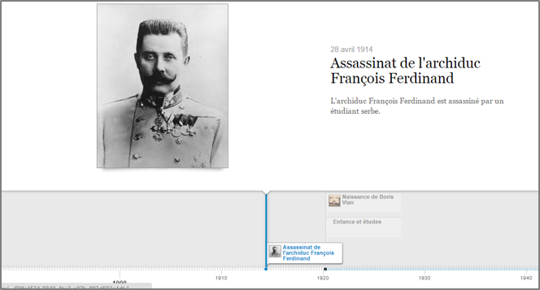

# Frise chronologique

L’appli **Frise chronologique** permet de **positionner des événements sur une ligne** représentant la flèche du temps.

## Présentation

L’appli Frise chronologique permet **d’associer des événements à leur position dans le temps** et de les représenter sous la forme d’une frise temporelle. Chaque événement est accompagné d’un encart permettant de **publier du contenu additionnel** \(texte, image, son …\). Chaque frise peut être partagée avec un utilisateur ou un groupe d’utilisateurs.

## Créer et partager une frise chronologique

Pour accéder à l’appli Frise chronologique, cliquez sur l’icône correspondante dans la page « Mes applis ».

Cliquez sur le bouton « Créer une frise ».

Suivez les étapes suivantes :

* Saisissez un titre
* Choisissez une image pour la vignette
* Renseignez le descriptif de la frise
* Cliquez sur « Sauvegarder »

La frise chronologique est maintenant créée. Pour la partager, saisissez les premières lettres du nom de l’utilisateur ou d’un groupe d’utilisateurs que vous recherchez \(1\), sélectionnez le résultat \(2\) et cochez les cases correspondant aux droits que vous souhaitez leur attribuer \(3\).

Les différents droits que vous pouvez attribuer sont les suivants :

* Lecture : l’utilisateur peut visualiser la frise
* Contribution : l’utilisateur peut créer des événements sur la frise
* Gestion : l’utilisateur peut partager, modifier et supprimer la frise

## Créer un événement dans la frise chronologique

Pour créer du contenu dans la frise, cliquez sur « Ajouter un événement ».

Vous devez renseigner plusieurs informations pour créer un évènement :

* Le titre de l’évènement
* La date de début de l’évènement
* Une image d’illustration
* Une description

* Une fois l’événement créé, il apparaît dans la frise chronologique.

## Note de version

A chaque nouvelle version de l’application, les nouveautés seront présentées dans cette section.

