# Mon compte

## Accéder à mon compte

Pour mettre à jour votre humeur, votre devise, votre photo et vos autres informations personnelles, vous disposez d’un espace dédié. Vous pouvez choisir de rendre visibles vos informations aux autres utilisateurs de la plateforme ou de les laisser invisibles.

Pour accéder à votre compte, connectez-vous à la plateforme en saisissant votre identifiant \(1\) et votre mot de passe \(2\) dans la fenêtre de connexion. Vous pouvez visualiser votre mot de passe en cliquant sur l'icône des lunettes à droite du champ "Mot de passe" \(3\). Enfin, cliquez sur « Connexion » \(4\)

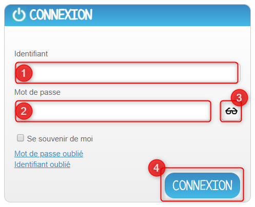

Pour vous rendre sur l'espace Mon compte, cliquez sur l’avatar en haut à droite de l'écran.

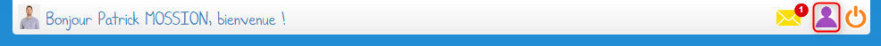

Vous accédez à votre espace personnel dans lequel vous pouvez mettre à jour vos informations : photo, coordonnées, devise, humeur, centres d’intérêt.

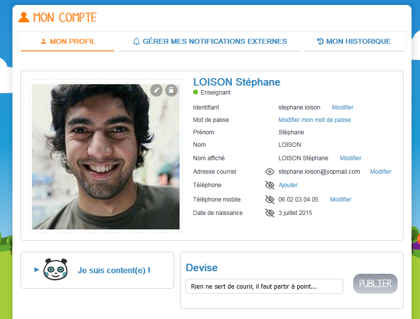

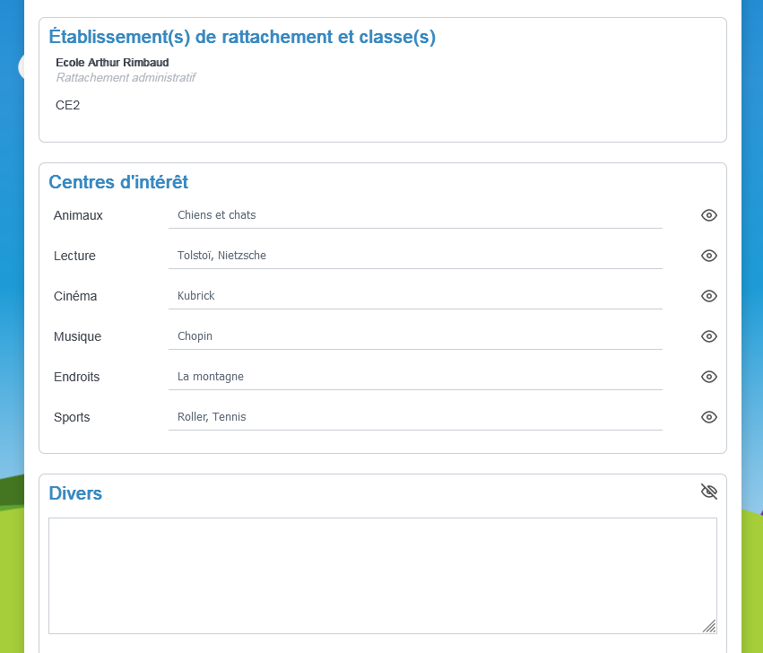

Les enseignants ont la possibilité de choisir un nom d’affichage personnalisé, visible par les autres utilisateurs de la plateforme. Par défaut, ce nom d’affichage est le prénom et le nom de l’utilisateur.

## Administrateur - Modifier mes informations personnelles

Si vous avez le rôle d’administrateur local de votre réseau éducatif, afin de modifier vos informations personnelles, vous devez, dans un premier temps, cliquer sur le bouton "déverrouiller" en haut à droite.

Une nouvelle fenêtre s'ouvre et une double authentification vous sera demandée. Un code à 6 chiffres vous sera envoyé par SMS sur votre mobile.

La réception du code peut prendre quelques instants. Une fois reçu, vous n'aurez plus qu'à indiquer ce dernier dans le champ prévu à cet effet afin d'accéder à l'application. Vos conditions de changements d'informations personnelles seront ensuite les mêmes que les autres utilisateurs, détaillées ci-dessous.

## Changer mon identifiant

Vous pouvez remplacer votre identifiant de connexion par un alias, en cliquant sur "Modifier" à côté de l'identifiant :

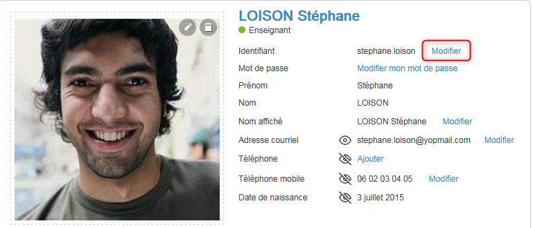

Il vous suffira ensuite de renseigner votre nouvel identifiant :

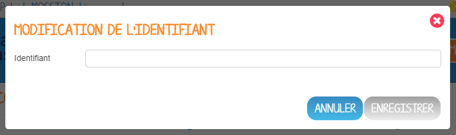

## Changer ma photo de profil

Pour changer votre photo, cliquez directement sur la photo ou sur l’avatar par défaut.

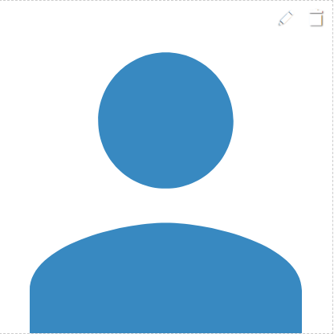

Vous pouvez choisir une photo à partir de votre espace personnel de la plateforme en la sélectionnant dans :

* « Mes documents » : documents personnels stockés dans la plateforme,
* « Documents partagés avec moi » : documents partagés par d’autres utilisateurs,
* « Documents ajoutés dans les applis » : documents insérés dans une appli.
* 
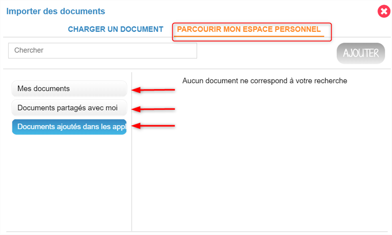

Vous pouvez aussi choisir d’importer une photo à partir de votre poste de travail.

* Cliquez sur « Charger un document ».
* Cliquez sur « Parcourir ».

Sélectionnez un fichier dans votre poste de travail et cliquez sur ouvrir. Cliquez en suite sur « Importer » pour lancer le téléchargement.

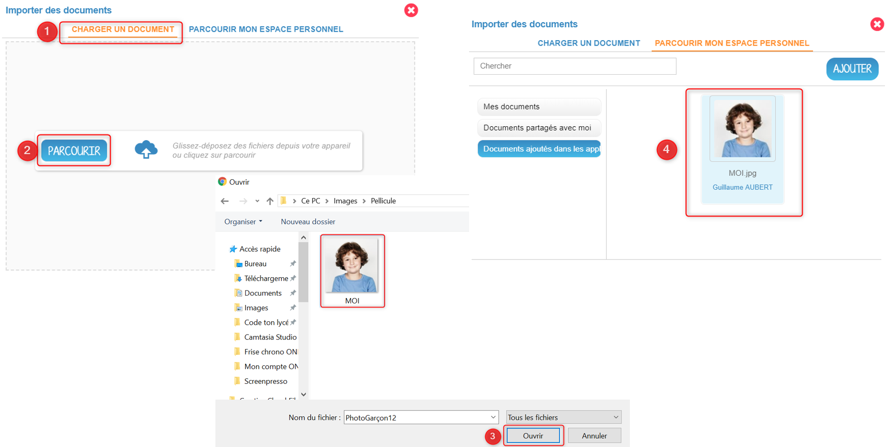

Votre photo est maintenant visible dans votre compte et par tous les utilisateurs !

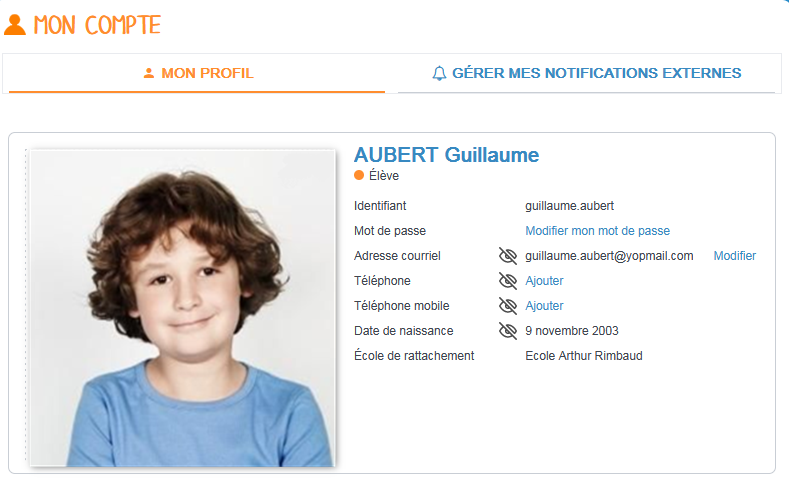

Votre photo est visible dans le fil de nouveautés des autres utilisateurs lorsque vous leur partagez un contenu mais également lorsque vous postez un message dans un forum.

## Changer de mot de passe

Pour changer votre mot de passe, cliquez sur « Modifier mon mot de passe ».

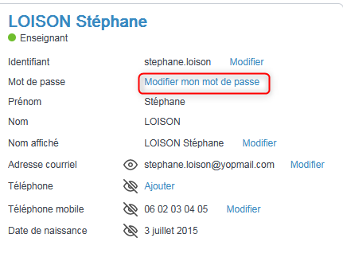

Puis suivez les étapes suivantes :

* Saisissez votre « Ancien mot de passe »
* Saisissez votre « Nouveau mot de passe »
* Saisissez la « Confirmation du mot de passe »
* Cliquez sur « Réinitialiser »

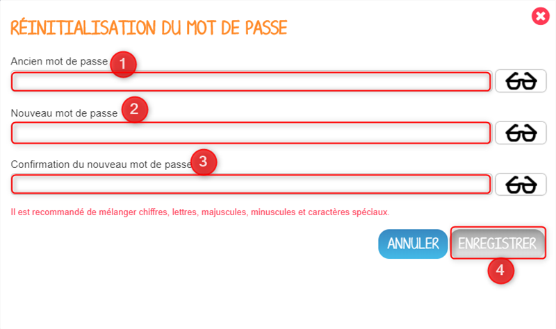

Votre mot de passe est maintenant modifié !

## Ajouter ou modifier mon adresse mail

Vous pouvez ajouter ou modifier votre adresse mail dans l’espace « Mon compte ».

Pour ajouter ou modifier votre adresse mail, saisissez votre nouvelle adresse dans le champ prévu, en face de « Adresse courriel ».

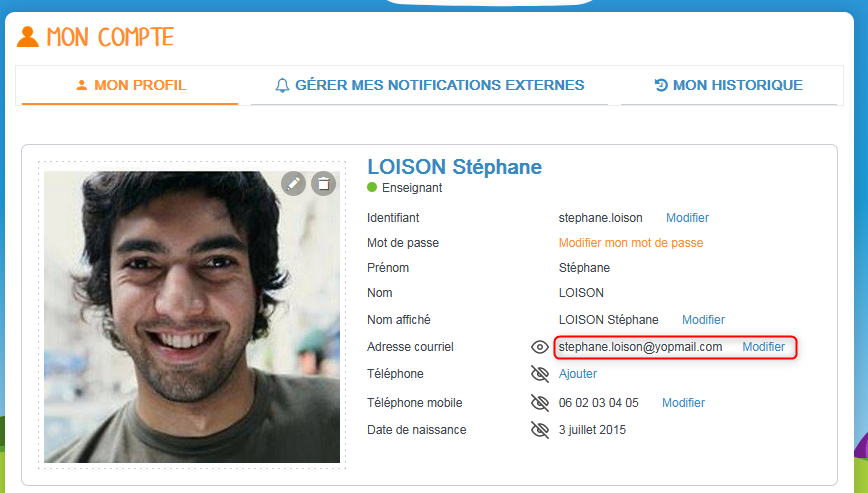

Il vous faudra ensuite vérifier la nouvelle adresse mail renseignée en saisissant le code de vérification reçu par email à cette adresse.

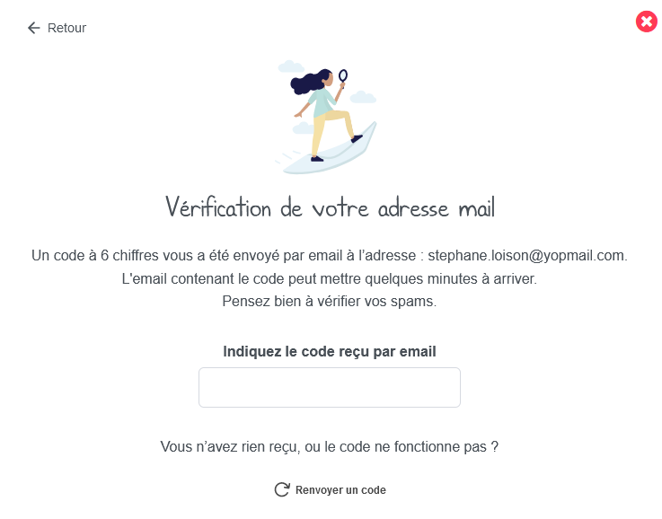

En cas d’oubli de votre mot de passe, un lien de récupération vous sera envoyé sur l’adresse mail renseignée dans votre compte.

## Modifier mes numéros de téléphone

Vous pouvez ajouter ou modifier vos numéros de téléphone fixe et mobile dans l’espace « Mon compte ». Pour ajouter ou modifier le numéro de téléphone fixe, saisissez le numéro dans le champ prévu, en face de « téléphone ».

Ajoutez ou modifiez votre numéro de téléphone fixe directement dans la fenêtre ci-dessous

Une fenêtre s'ouvrira alors pour vérifier votre numéro de téléphone. Il vous suffira de rentrer votre numéro dans un premier temps, puis de cliquer sur le bouton "vérifier mon numéro".

Vous recevrez alors un code à six chiffres qu'il faudra entrer dans une nouvelle fenêtre. Enfin, votre nouveau numéro de mobile sera enregistré dans vos informations personnelles.

## Ajouter une devise à mon compte

Vous pouvez ajouter une devise à votre compte. Pour cela, remplissez le champ « Devise » sous vos coordonnées.

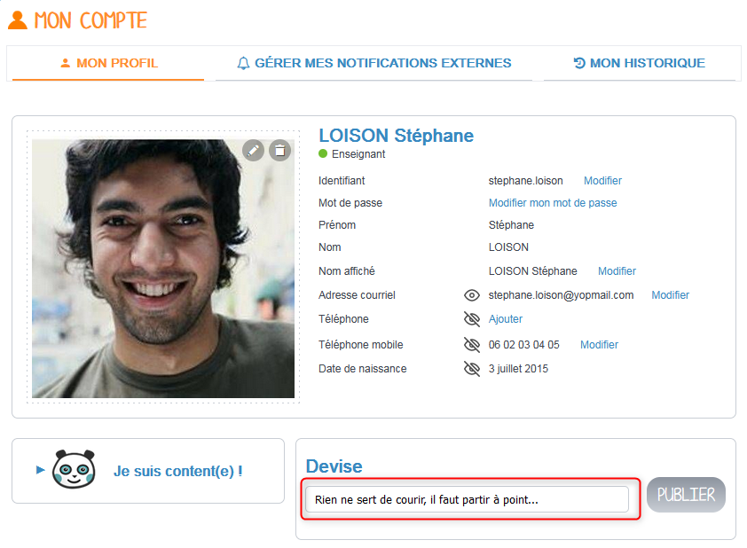

Votre devise sera visible sur votre profil et apparaitra dans le fil de nouveautés des autres utilisateurs de la plateforme lorsque vous la modifierez.

## Changer mon humeur

Pour changer votre humeur, cliquez sur l’icône en dessous de votre photo.

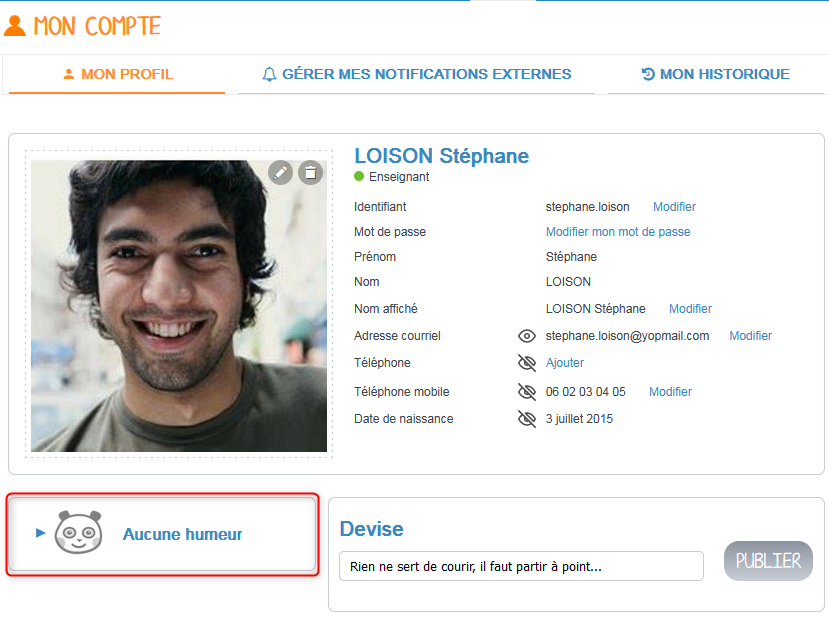

Une liste d’humeurs apparaît. Choisissez celle que vous souhaitez.

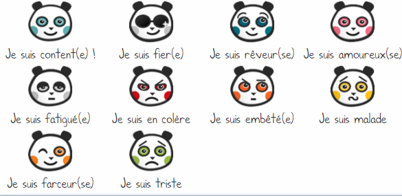

Votre nouvelle humeur apparaît sur votre compte et est maintenant visible dans le fil de nouveautés des autres utilisateurs de la plateforme avec lesquels vous avez le droit de communiquer.

## Modifier mes centres d’intérêt

Vous pouvez modifier vos centres d’intérêt : animaux, cinéma, musique, endroits et sports.

Saisissez les informations souhaitées dans les champs correspondants.

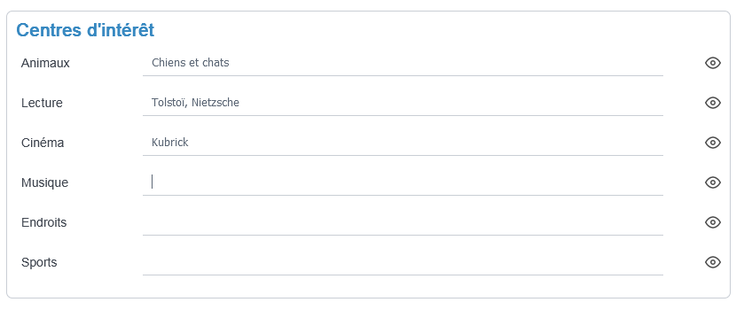

Mais aussi d’autres commentaires dans « Divers ».

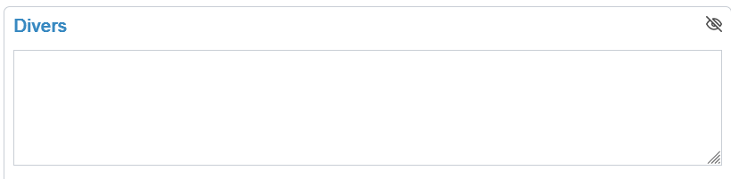

## Définir la visibilité de mes informations personnelles

Vous avez la possibilité de définir la visibilité de vos informations personnelles grâce à l’icône située au bout de chaque ligne.

En un seul clic, vous choisissez l’icône correspondant au niveau de visibilité que vous souhaitez :

* L’icône “oeil barré” signifie que l’information est privée, vous êtes le \(la\) seul\(e\) à la voir.

    

* L’icône “oeil” signifie que l’information est visible des autres utilisateurs de l’ENT, en fonction des droits de communication dont ils disposent.

    

Lorsque vous ajoutez ou modifiez le texte ou les paramètres de visibilité dans votre espace personnel, l’enregistrement est automatique.

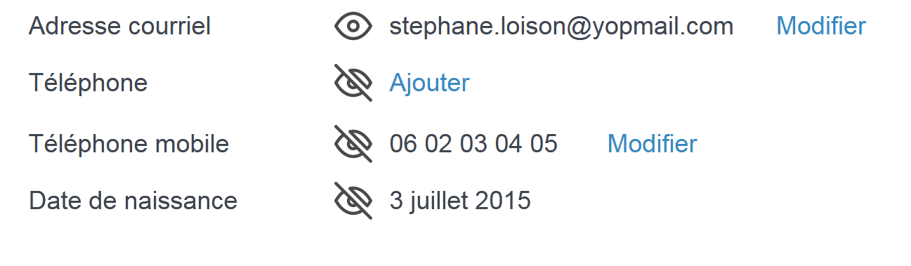

## Notifications externes

La plateforme est désormais doté d’un système de notification par mail qui permet aux utilisateurs de recevoir sur leur adresse personnelle des mails contenant les nouveautés de la plateforme qui les concernent.  
Chaque utilisateur peut modifier les notifications qu’il souhaite recevoir et la fréquence de chacune d’elles \(immédiate, quotidienne, hebdomadaire\).  
Pour accéder à ce paramétrage, aller dans Mon compte et cliquer sur le bouton "Gérer mes notifications externes"

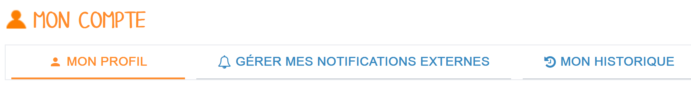

La page de paramétrage des notifications externes permet de modifier l’adresse de réception des mails \(1\). Un bouton "Enregistrer" vous permettra de valider votre adresse mail ou les modifications apportées à la fréquence d'envoi \(2\). Vous pouvez choisir, pour chaque application \(3\), la fréquence d’envoi des notifications \(immédiat, quotidien, hebdomadaire, jamais\) \(4\).

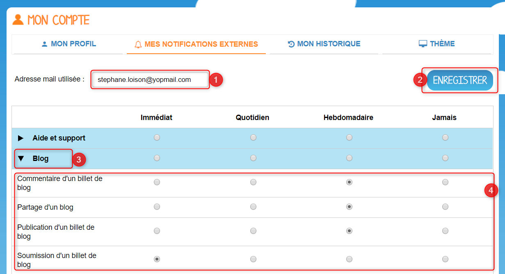

Une fois la notification reçue dans sa boîte mail personnelle, l’utilisateur peut cliquer sur le lien correspondant afin d’accéder au contenu. S’il n’est pas connecté à la plateforme, il devra saisir son identifiant et son mot de passe pour accéder à l’objet de la notification.

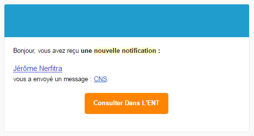

## Historique des notifications émises

Vous avez la possibilité de ne pas diffuser une notification aux utilisateurs avec lesquels vous avez des droits de communication ou vous avez partagé du contenu.  
Depuis votre espace "Mon compte", vous retrouverez toutes les notifications que vous avez émis en cliquant sur l’onglet "Historique".

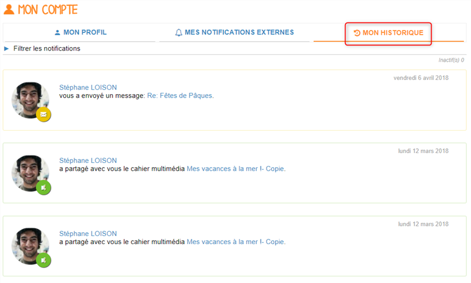

En survolant la notification avec la souris, vous verrez apparaître une flèche sur la droite de la notification. En cliquant sur cette flèche, une action apparaît vous permettant de supprimer définitivement la notification de la plateforme.

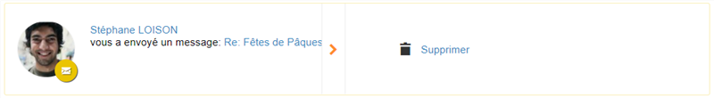
