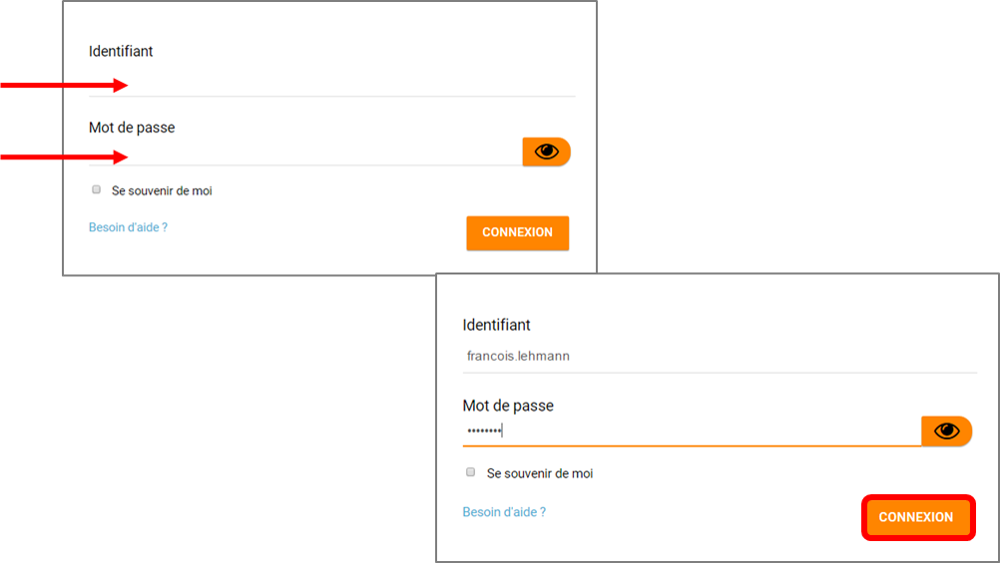
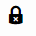
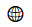

[[mon-compte]]
= Mon compte

* link:index.html?iframe=true#presentation[Accéder à mon compte]
* link:index.html?iframe=true#cas-d-usage-2[Changer ma photo de profil]
* link:index.html?iframe=true#cas-d-usage-3[Changer de mot de passe]
* link:index.html?iframe=true#cas-d-usage-4[Ajouter ou modifier mon
adresse mail]
* link:index.html?iframe=true#cas-d-usage-5[Ajouter une devise à mon
compte]
* link:index.html?iframe=true#cas-d-usage-6[Changer mon humeur]
* link:#cas-d-usage-7[Modifier mes centres d'intérêt]
* link:index.html?iframe=true#cas-d-usage-8[Définir la visibilité de mes
informations personnelles]
* link:index.html?iframe=true#cas-d-usage-9[Notifications externes]
* link:index.html?iframe=true#cas-d-usage-10[Historique des
notifications émises]
* link:index.html?iframe=true#notes-de-versions[Note de version]

http://creativecommons.org/licenses/by-nc-sa/3.0/fr/[image:../../wp-content/uploads/2015/03/CC-BY-NC-SA-3.0-FR-300x105.png[CC
BY-NC-SA 3.0 FR,width=100,height=35]]

[[presentation]]
== Accéder à mon compte

Pour mettre à jour votre humeur, votre devise, votre photo et vos autres
informations personnelles, vous disposez d’un espace dédié. Vous pouvez
choisir de rendre visibles vos informations aux autres utilisateurs de
l’ENT ou de les laisser invisibles.

Pour accéder à votre compte, connectez-vous à l’ENT en saisissant votre
identifiant et votre mot de passe dans la fenêtre de connexion.

Cliquez sur « Connexion ».

Cliquez sur l’avatar en haut à droite de l'écran.

link:/assets/Bandeau_1D.PNG[image:/assets/Bandeau_1D.PNG[Bandeau,width=8000]]

Vous accédez à votre espace personnel où vous pouvez modifier vos
informations : photo, coordonnées, devise, humeur, centres d’intérêt, en
cliquant simplement sur le champ à modifier.

image:/assets/Mon compte 1.png[alt=""]

'''''

Les enseignants ont la possibilité de choisir un nom d’affichage
personnalisé, visible par les autres utilisateurs de l'ENT. Par défaut,
ce nom d'affichage est le prénom et le nom de l'utilisateur.

'''''

 

[[cas-d-usage-2]]
== Changer ma photo de profil

Pour changer votre photo, cliquez directement sur la photo ou sur
l'avatar par défaut.
image:/assets/Mon compte 2.png[alt=""]
Vous pouvez choisir une photo à partir de votre espace personnel de
l’ENT en la sélectionnant dans :

* « Mes documents » : documents personnels stockés dans l’ENT,
* « Documents partagés avec moi » : documents partagés par d’autres
utilisateurs,
* « Documents ajoutés dans les applis » : documents insérés dans une
appli.
image:/assets/Mon compte 3.png[alt=""]

Vous pouvez aussi choisir d’importer une photo à partir de votre poste
de travail.

* Cliquez sur « Charger un document ».
* Cliquez sur « Parcourir ».

Sélectionnez un fichier dans votre poste de travail et cliquez sur
ouvrir. Cliquez en suite sur « Importer » pour lancer le téléchargement.

image:/assets/Mon compte 4.png[alt=""]

Votre photo est maintenant visible dans votre compte et par tous les
utilisateurs !

image:/assets/Mon compte 5.png[alt=""]+

Votre photo est visible dans le fil de nouveautés des autres
utilisateurs lorsque vous leur partagez un contenu mais également
lorsque vous postez un message dans un forum.

[[cas-d-usage-3]]
== Changer de mot de passe

Pour changer votre mot de passe, cliquez sur « Modifier mon mot de
passe ».
image:/assets/Mon compte 6.png[alt=""]

Puis suivez les étapes suivantes :

* Saisissez votre « Ancien mot de passe »
* Saisissez votre « Nouveau mot de passe »
* Saisissez la « Confirmation du mot de passe »
* Cliquez sur « Réinitialiser »

image:/assets/Mon compte 7.png[alt=""]

Votre mot de passe est maintenant modifié !

[[cas-d-usage-4]]
== Ajouter ou modifier mon adresse mail

Vous pouvez ajouter ou modifier votre adresse mail dans l’espace « Mon
compte ».

Pour ajouter ou modifier votre adresse mail, saisissez votre nouvelle
adresse dans le champ prévu, en face de « Adresse courrielle ».
image:/assets/Mon compte 8.png[alt=""]

En cas d’oubli de votre mot de passe, un lien de récupération vous sera
envoyé sur l’adresse mail renseignée dans votre compte.

[[cas-d-usage-5]]
== Ajouter une devise à mon compte

Vous pouvez ajouter une devise à votre compte. Pour cela, remplissez le
champ « Devise » sous vos coordonnées.

image:/assets/Mon compte 9.png[alt=""]

Votre devise sera visible sur votre profil et apparaitra dans le fil de
nouveautés des autres utilisateurs de l’ENT lorsque vous la modifierez.

[[cas-d-usage-6]]
== Changer mon humeur

Pour changer votre humeur, cliquez sur l’icône en dessous de votre
photo.

image:/assets/Mon compte 10.png[alt=""]

Une liste d’humeurs apparaît. Choisissez celle que vous souhaitez.

image:/assets/Mon compte 11.png[alt=""]
 
Votre nouvelle humeur apparaît sur votre compte et est maintenant
visible dans le fil de nouveautés des autres utilisateurs de l’ENT avec
lesquels vous avez le droit de communiquer.

[[cas-d-usage-7]]
== Modifier mes centres d'intérêt

Vous pouvez modifier vos centres d’intérêt : animaux, cinéma, musique,
endroits et sports.

image:/assets/Mon compte 12.png[alt=""]

Saisissez les informations souhaitées dans les champs correspondants.

image:/assets/Mon compte 13.png[alt=""]

Mais aussi d'autres commentaires dans « Divers ».
image:/assets/Mon compte 14.png[alt=""]

[[cas-d-usage-8]]
== Définir la visibilité de mes informations personnelles

Vous avez la possibilité de définir la visibilité de vos informations
personnelles grâce à l’icône située au bout de chaque ligne.

En un seul clic, vous choisissez l’icône correspondant au niveau de
visibilité que vous souhaitez :

* L’icône “Cadenas” signifie que l’information est privée, vous êtes le
(la) seul(e) à la voir.

* L’icône “Globe” signifie que l’information est visible des autres
utilisateurs de l’ENT, en fonction des droits de communication dont ils
disposent.

 +
Lorsque vous ajoutez ou modifiez le texte ou les paramètres de
visibilité dans votre espace personnel, l’enregistrement est
automatique.

image:/assets/Mon compte 15.png[alt=""]

[[cas-d-usage-9]]
== Notifications externes

L'ENT est désormais doté d'un système de notification par mail qui
permet aux utilisateurs de recevoir sur leur adresse personnelle des
mails contenant les nouveautés de l'ENT qui les concernent. +
Chaque utilisateur peut modifier les notifications qu'il souhaite
recevoir et la fréquence de chacune d'elles (immédiate, quotidienne,
hebdomadaire). +
Pour accéder à ce paramétrage, aller dans mon compte  et cliquer sur
le bouton "Gérer mes notifications externes" 

image:/assets/Mon compte 16.png[alt=""]

La page de paramétrage des notifications externes permet de modifier
l'adresse de réception des mails (3) et de choisir la fréquence d'envoi
de chaque notification (immédiat, quotidien, hebdomadaire, jamais)
(4). +
Le détail des notifications disponibles par service est accessible en
cliquant sur le nom du service dans la ligne correspondante (5).

image:/assets/Mon compte 17.png[alt=""]

Lorsque les modifications sont terminées, cliquer sur "Enregistrer" en
bas du tableau (6).

image:/assets/Mon compte 18.png[alt=""]

Une fois la notification reçue dans sa boîte mail personnelle,
l'utilisateur peut cliquer sur le lien correspondant afin d'accéder au
contenu. S'il n'est pas connecté à l'ENT, il devra saisir son
identifiant et son mot de passe pour accéder à l'objet de la
notification.

link:../../wp-content/uploads/2016/12/notif-externe-réception.png[image:../../wp-content/uploads/2016/12/notif-externe-réception.png[notif
externe - réception,width=200]]

[[cas-d-usage-10]]
== Historique des notifications émises

Vous avez la possibilité de ne pas diffuser une notification aux
utilisateurs avec lesquels vous avez des droits de communication ou vous
avez partagé du contenu. +
Depuis votre espace "Mon compte", vous retrouverez toutes les
notifications que vous avez émis en cliquant sur l'onglet
"Historique". +
image:/assets/Mon compte 19.png[alt=""]En survolant la notification avec la
souris, vous verrez apparaître une flèche sur la droite de la
notification. En cliquant sur cette flèche, une action apparaît vous
permettant de supprimer définitivement la notification de l'ENT. +
image:/assets/Mon compte 20.png[alt=""]

