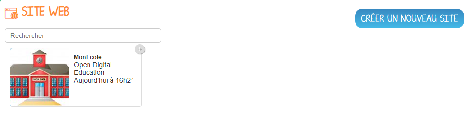
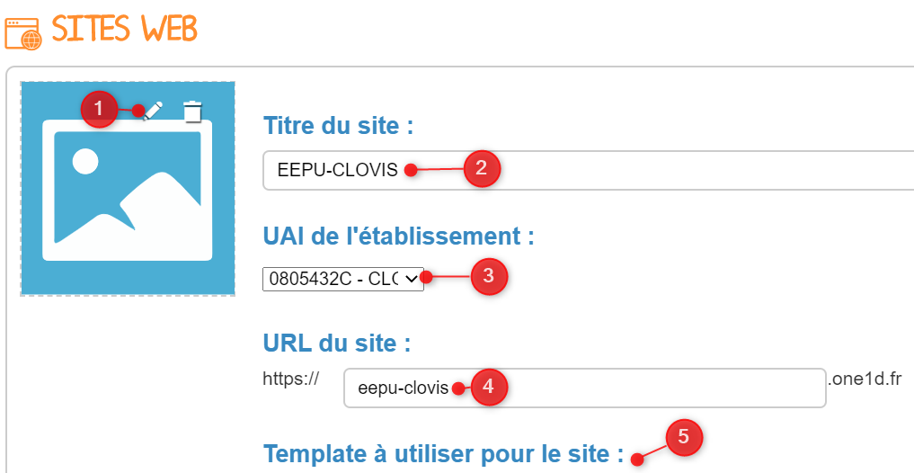
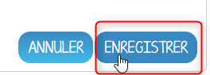
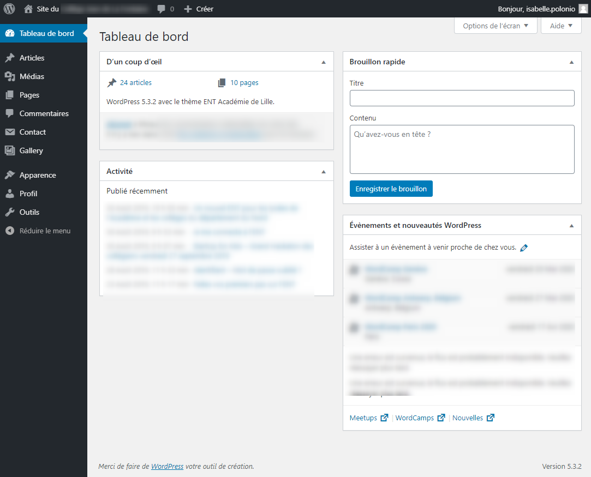

# Site web

Vous souhaitez créer un site externe référencé pour votre école ou votre établissement ? L’application Site web permet d’éditer un site en quelques clics !

## Créer un nouveau site web

Aussi simple à prendre en main que n’importe quelle application, il suffit de cliquer sur le bouton “Créer un nouveau site” en haut à droite de votre écran, pour initier la création de votre site web.

Dans la fenêtre d’édition de site, renseigner les informations suivantes :

1. Une image pour la vignette 
2. Le titre de votre site
3. l'UAI de l'établissement à choisir si votre compte est rattaché à plusieurs établissements
4. L’url personnalisée de ce site, sans accent, caractères spéciaux et sans espaces

5. Choisissez un modèle de site parmi plusieurs maquettes.  
6. Cliquer sur le bouton **Enregistrer**, en bas à droite pour valider et lancer la création de votre site web

_N.B. : La création du site peut prendre plusieurs minutes \(5 à 10 minutes\), pendant ce délai l’icône est présente dans l’application mais le site n’est pas accessible._

L’édition du site ne sera possible pour les administrateurs locaux de l'école que le lendemain \(la création des comptes sur wordpress pour les administrateurs et la liaison avec l’ENT se fait toutes les nuits\). Pendant ce délai, pour les administrateurs locaux de l'école, l’icône du site est présente dans l’application, le site est consultable mais n’est pas éditable.

## Ouvrir et gérer votre site web

Depuis le menu de l’application, vous pouvez cliquer sur la vignette pour accéder au site web ou cliquer sur le signe “**+**” pour éditer votre site. 

_NB : l'édition Wordpress d'un site n'est possible que le lendemain de sa création pour les administrateurs locaux. La création des comptes sur wordpress pour les administrateurs et la liaison avec l’ENT se faisant la nuit suivante._

L'édition vous redirige sur un back-office WordPress, qui va vous permettre d’ajouter des pages et des articles. Vous y aurez également la possibilité de personnaliser plus finement l’apparence de votre site web \(thèmes, widgets, menus…\). Pour devenir incollable sur la création d’un site avec l’outil WordPress, consultez le manuel d’utilisation accessible [ici](https://wordpress.com/fr/support/)

