# Espace documentaire

À chacun son classeur numérique ! Grâce à l’application **Espace documentaire**, retrouvez, au même endroit, tous les documents utilisés à travers les applis du réseau. Stockez d’autres fichiers, organisez-les et partagez-les dans votre espace en fonction de leurs thématiques, du cours ou de la classe concernée !

## Présentation

En centralisant l’ensemble des documents accessibles par l’utilisateur, l’**Espace documentaire** permet d’intégrer facilement un contenu dans n’importe quelle appli.

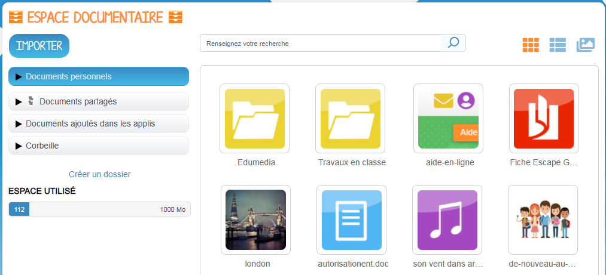

L’application Espace documentaire d’un utilisateur est composée de 4 sections :

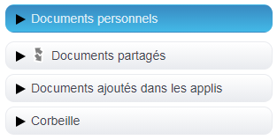

**Documents personnels :** cette section comporte les documents que vous avez importés dans l'espace documentaire mais que vous n'avez pas partagés à d'autres utilisateurs. Vous pouvez charger tous types de fichiers depuis votre ordinateur, qu’il s’agisse de documents texte ou PDF, d’images, de vidéos ou d’extraits audio.

**Documents partagés** Vous retrouvez dans ce dossier tous les documents partagés, que d’autres utilisateurs ont partagés avec vous, ou que vous leur avez partagés.

**Documents ajoutés dans les applis** Vous retrouverez ici tous les fichiers que vous avez ajouté dans d’autres applis \(par exemple image d’un billet de blog\).

**Corbeille** : Cette section contient tous les documents que vous avez supprimés des autres sections. Les documents présents dans la corbeille sont comptabilisés dans l'espace de stockage utilisé. 

## Importer un document

Pour importer un document dans votre espace documentaire, cliquez sur le bouton « Importer » situé en haut de l’interface.

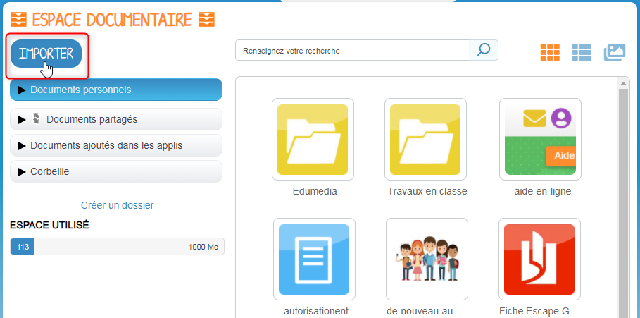

N.B. : _Le bouton IMPORTER apparait lorsque la section des "Documents personnels" ou celle des "Documents partagés" est sélectionnée. En cas de positionnement sur la section "Documents partagés", une fenêtre de partage s'ouvrira automatiquement suite à l'import de document._ 

Dans la fenêtre d'import, suivez les étapes suivantes :

1. Cliquez sur « Parcourir » et sélectionnez sur votre ordinateur le document que vous souhaitez enregistrer dans l’espace documentaire de la plateforme.
2. Cliquez sur « Importer ».

**Une icône d’attente s’affiche pour indiquer que le chargement du document est en cours.**

**Vous pouvez importer plusieurs fichiers en une seule fois, si vous en sélectionnez plusieurs sur votre ordinateur.**

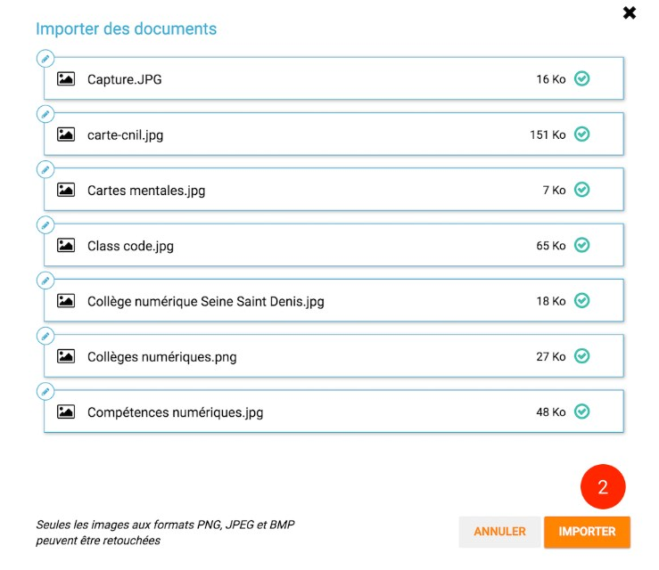

Il est possible d’**importer un fichier compressé** \(.zip\) et de choisir au moment de l’importation de conserver ou non la compression. 

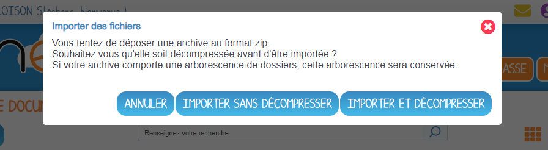

L’arborescence des documents de votre fichier sera parfaitement conservée au moment de l’import.

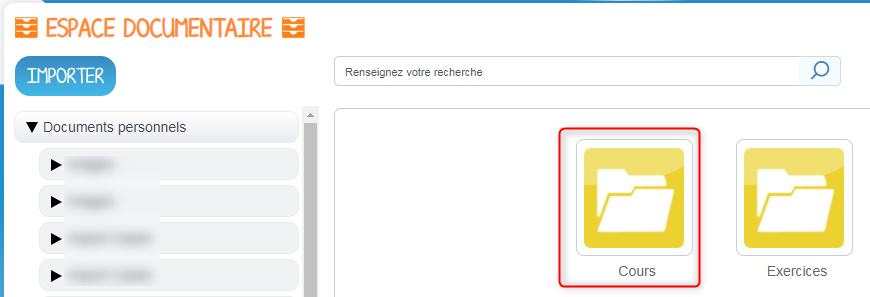

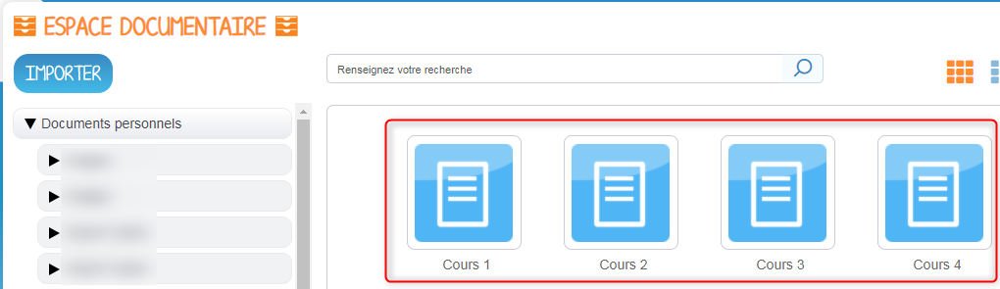

Vous pouvez aussi importer un document ou plusieurs documents en effectuant un glisser-déposer. Pour cela, sélectionnez le ou les documents à déplacer depuis votre espace de travail et glissez-le vers son nouvel emplacement.

## Naviguer dans mes Documents

Trois types d'affichage de vos documents sont disponibles en haut à droite de l'espace documentaire  : un affichage sous forme de vignettes \(A\), un affichage détaillé ou un carrousel d'images \(C\) qui permet de faire défiler automatiquement et manuellement les images du dossier sélectionné.  

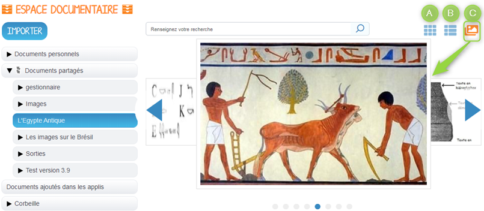

Pour **accéder au menu d’option** d’un fichier ou d’un dossier, vous devez **cliquer une fois** dessus. Le menu s’affiche ensuite en bas de la page et vous pouvez choisir les actions à effectuer.  
Vous devez cliquer une nouvelle fois sur le fichier ou le dossier pour le désélectionner.

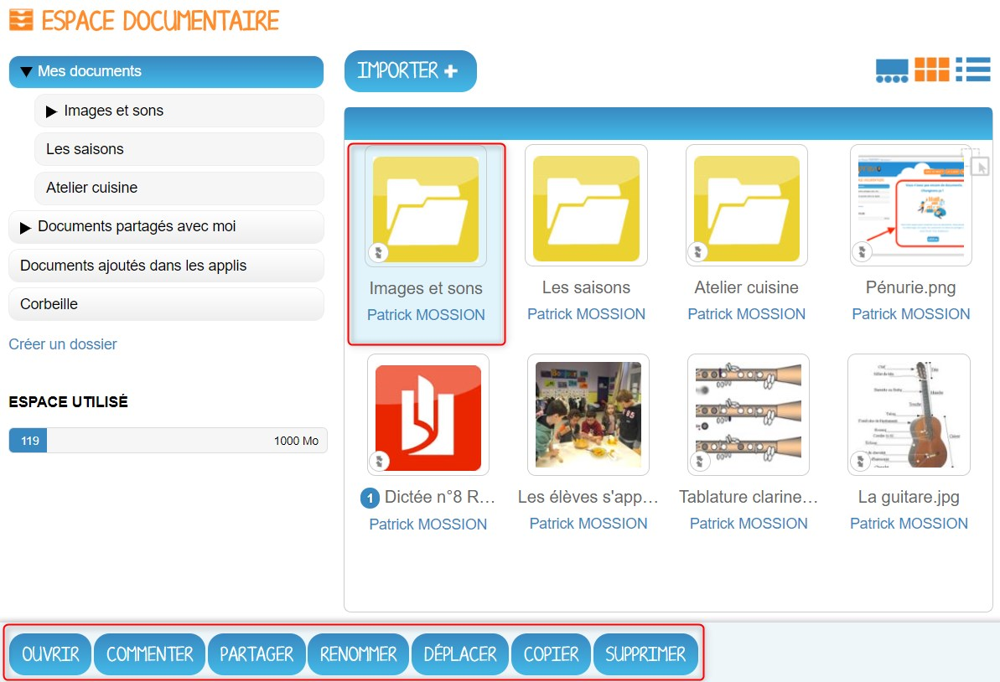

Pour **visualiser un fichier** sur la visionneuse de la plateforme ou pour **ouvrir un dossier**, vous devez **double-cliquer dessus**.

Depuis la visionneuse de document, vous pouvez accéder à un aperçu du document :

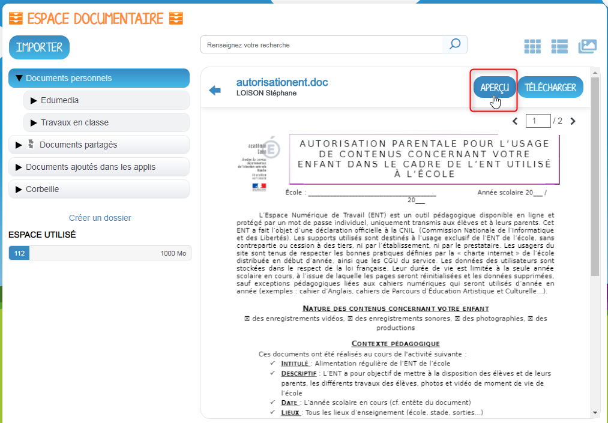

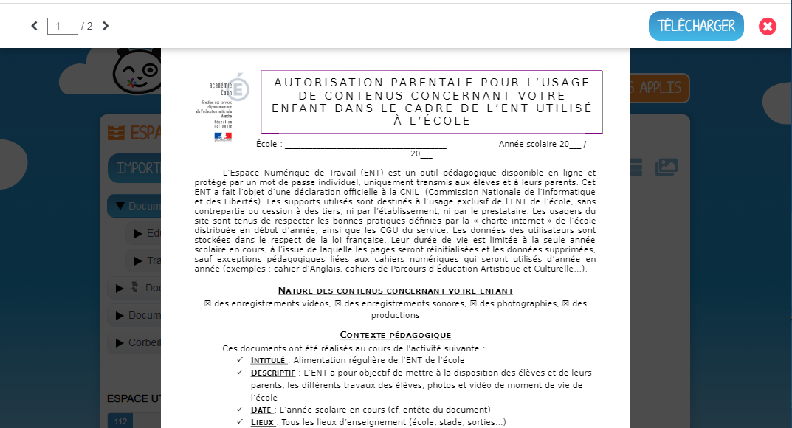

Vous pouvez également sélectionner plusieurs fichiers ou dossiers si vous souhaitez effectuer une action sur tous ces documents simultanément.

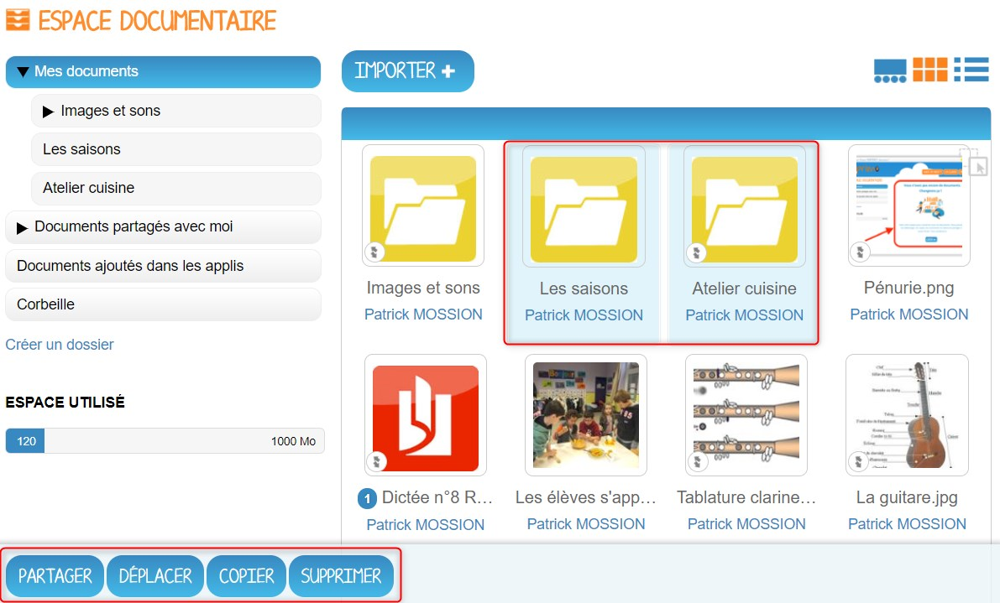

**ATTENTION**  
Si vous effectuez une action de partage sur plusieurs fichiers ou dossiers alors que l’un de ces fichiers ou dossiers possède déjà un partage, vous supprimerez l’ancien partage effectué sur ce fichier ou dossier.

## Partager un document

Pour partager un document à d'autres utilisateurs, sélectionnez le document \(1\), puis cliquez sur "Partager" \(2\).

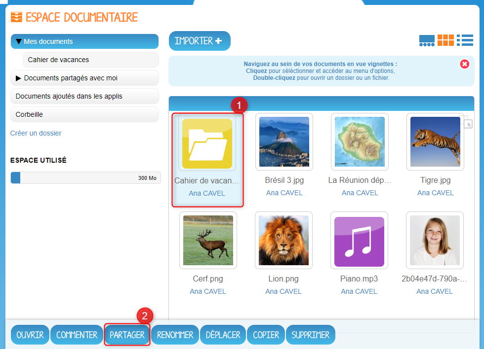

Si vous partagez un dossier, un message vous indiquera que le partage concernera également tous les fichiers et sous dossiers contenus dans le dossier en question.

Cliquez sur copier et partager ou sur partager sans copier pour accéder à la fenêtre de partage. Recherchez les utilisateurs ou les groupes d'utilisateurs avec lesquels vous souhaitez partager le document \(1\), sélectionnez-les dans les suggestions qui apparaissent en dessous \(2\). Accordez leur les droits que vous souhaitez \(3\) et validez votre sélection en cliquant sur "Partager" \(4\).

Les droits sont les suivants :

* Consulter : droit de lecture
* Contribuer : droit de modification sur le document et d'import de fichiers dans le dossier partagé
* Gérer : droit de propriété sur le document ou dossier. L'utilisateur peut ainsi décider de supprimer le document ou dossier s'il le souhaite
* Commenter : droit de commentaire sur le document ou dossier

## Déplacer un document ou un dossier

Vous pouvez déplacer vos documents et vos dossiers facilement dans votre espace documentaire. Pour cela, sélectionnez le document ou le dossier à déplacer \(1\) et glissez-le vers son nouvel emplacement \(2\).

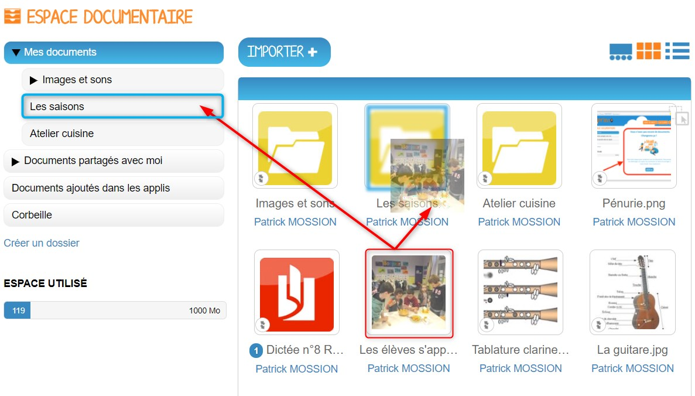

Vous ne pouvez pas déplacer un fichier du dossier « Mes documents » vers les dossiers « Documents partagés » et « Documents ajoutés dans les applis ».

Le dossier se trouve maintenant à l’emplacement choisi.

## Télécharger un document

Vous souhaitez récupérer, sur votre poste de travail, un ou plusieurs documents présents dans votre espace documentaire,  rien de plus simple : 

1. Sélectionner dans votre espace documentaire, le ou les documents à télécharger.
2. Cliquer sur le bouton TÉLÉCHARGER présent dans le menu du bas qui s'affiche.
3. Dans l'explorateur de document, choisir l'emplacement d'enregistrement du document ou de l'archive de documents, personnaliser le nom d'enregistrement du fichier puis cliquer sur le bouton Enregistrer.

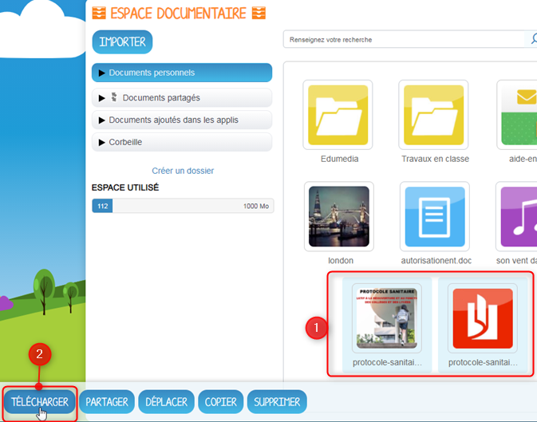

 Vous pouvez également télécharger un document ouvert dans la visionneuse de document : 

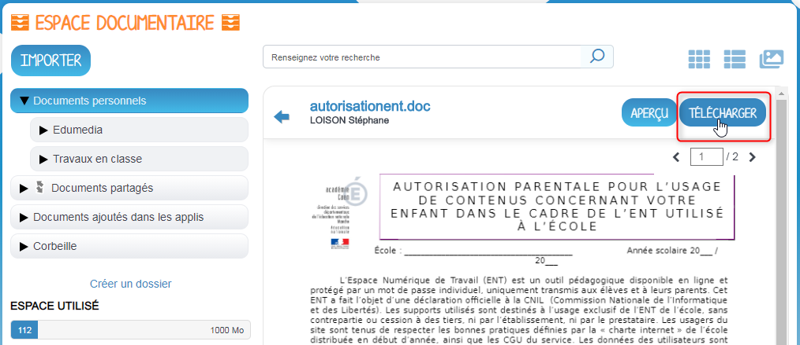

## Connaître l’espace de stockage disponible

La jauge affichée sous la liste des dossiers de l’espace documentaire vous permet de connaître l’espace de stockage dont vous disposez. L’espace utilisé est indiqué sur la gauche. Le chiffre situé sur la droite indique l’espace total de l’utilisateur.

