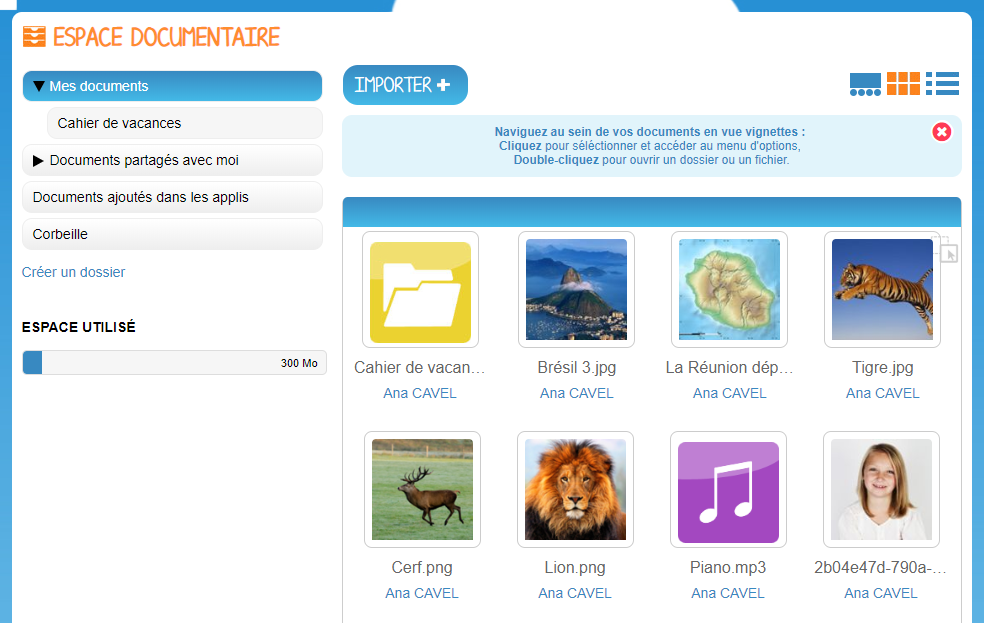
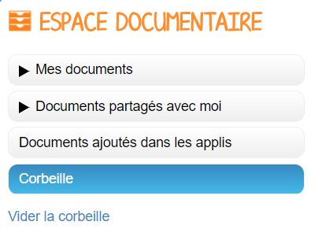
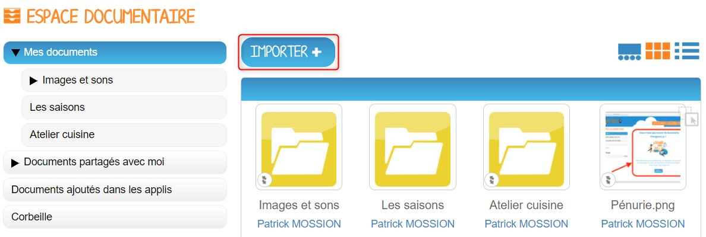
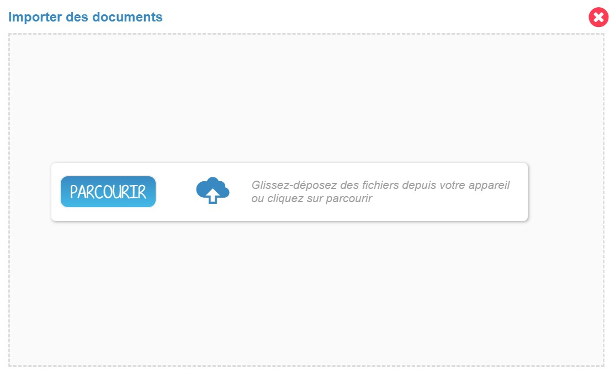
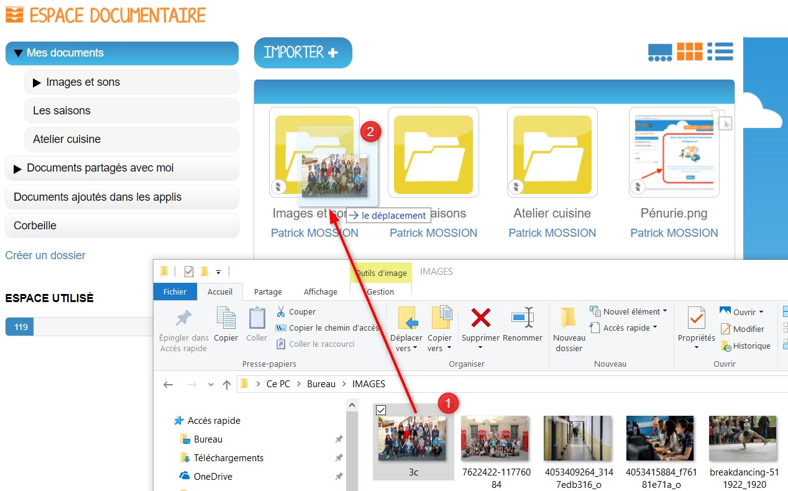
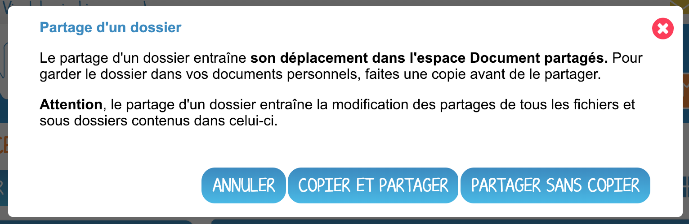
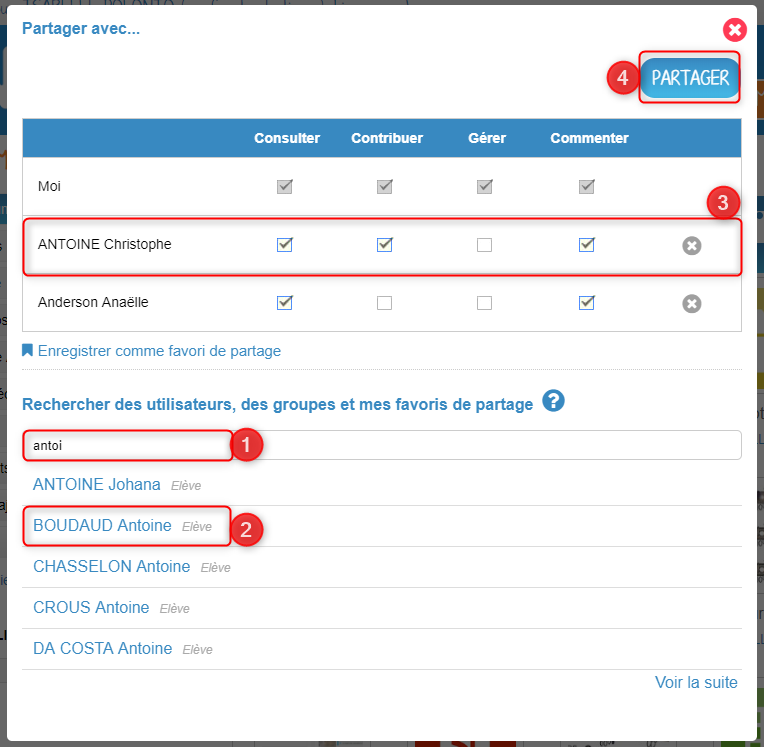
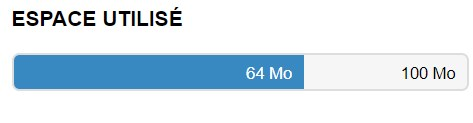

# Espace documentaire

À chacun son classeur numérique ! Grâce à l’application **Espace documentaire**, retrouvez, au même endroit, tous les documents utilisés à travers les applis du réseau. Stockez d’autres fichiers, organisez-les et partagez-les dans votre espace en fonction de leurs thématiques, du cours ou de la classe concernée !

## Présentation

L’application Espace documentaire d’un utilisateur est composée de 4 dossiers :

**Documents partagés** Vous retrouvez dans ce dossier tous les documents partagés, que d’autres utilisateurs ont partagés avec vous, ou que vous leur avez partagés.

**Documents ajoutés dans les applis** Vous retrouverez ici tous les fichiers que vous avez ajouté dans d’autres applis \(par exemple image d’un billet de blog\).

**En centralisant l’ensemble des documents accessibles par l’utilisateur, l’appli Documents permet d’intégrer facilement un contenu dans n’importe quelle appli.**

## Importer un document

Pour importer un document dans votre espace de stockage personnel, cliquez sur le bouton « Importer » situé en haut de l’interface.

Dans la nouvelle fenêtre, suivez les étapes suivantes :

1. Cliquez sur « Parcourir » et sélectionnez sur votre ordinateur le document que vous souhaitez enregistrer dans l’espace documentaire de la plateforme.
2. Cliquez sur « Importer ».

**Une icône d’attente s’affiche pour indiquer que le chargement du document est en cours.**

**Vous pouvez importer plusieurs fichiers en une seule fois, si vous en sélectionnez plusieurs sur votre ordinateur.**

Vous pouvez aussi importer un document ou plusieurs documents en effectuant un glisser-déposer. Pour cela, sélectionnez le ou les documents à déplacer depuis votre espace de travail et glissez-le vers son nouvel emplacement.

## Partager un document

Pour partager un document à d'autres utilisateurs, sélectionnez le document \(1\), puis cliquez sur "Partager" \(2\).

Si vous partagez un dossier, un message vous indiquera que le partage concernera également tous les fichiers et sous dossiers contenus dans le dossier en question.

Cliquez sur copier et partager ou sur partager sans copier pour accéder à la fenêtre de partage. Recherchez les utilisateurs ou les groupes d'utilisateurs avec lesquels vous souhaitez partager le document \(1\), sélectionnez-les dans les suggestions qui apparaissent en dessous \(2\). Accordez leur les droits que vous souhaitez \(3\) et validez votre sélection en cliquant sur "Partager" \(4\).

Les droits sont les suivants :

* Consulter : droit de lecture
* Contribuer : droit de modification sur le document et d'import de fichiers dans le dossier partagé
* Gérer : droit de propriété sur le document ou dossier. L'utilisateur peut ainsi décider de supprimer le document ou dossier s'il le souhaite
* Commenter : droit de commentaire sur le document ou dossier

## Déplacer un document ou un dossier

Vous pouvez déplacer vos documents et vos dossiers facilement dans votre espace documentaire. Pour cela, sélectionnez le document ou le dossier à déplacer \(1\) et glissez-le vers son nouvel emplacement \(2\).

Vous ne pouvez pas déplacer un fichier du dossier « Mes documents » vers les dossiers « Documents partagés » et « Documents ajoutés dans les applis ».

Le dossier se trouve maintenant à l’emplacement choisi.

## Naviguer dans mes Documents

Pour **accéder au menu d’option** d’un fichier ou d’un dossier, vous devez **cliquer une fois** dessus. Le menu s’affiche ensuite en bas de la page et vous pouvez choisir les actions à effectuer.  
Vous devez cliquer une nouvelle fois sur le fichier ou le dossier pour le désélectionner.

Pour **visualiser un fichier** sur la visionneuse de la plateforme ou pour **ouvrir un dossier**, vous devez **double-cliquer dessus**.

Vous pouvez également sélectionner plusieurs fichiers ou dossiers si vous souhaitez effectuer une action sur tous ces documents simultanément.

**ATTENTION**  
Si vous effectuez une action de partage sur plusieurs fichiers ou dossiers alors que l’un de ces fichiers ou dossiers possède déjà un partage, vous supprimerez l’ancien partage effectué sur ce fichier ou dossier.

## Connaître l’espace de stockage disponible

La jauge affichée sous la liste des dossiers de l’espace documentaire vous permet de connaître l’espace de stockage dont vous disposez. L’espace utilisé est indiqué sur la gauche. Le chiffre situé sur la droite indique l’espace total de l’utilisateur.

