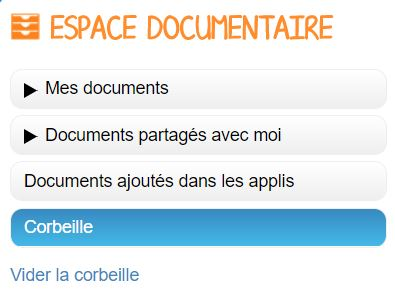
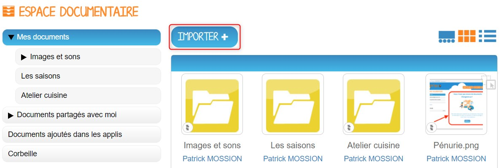
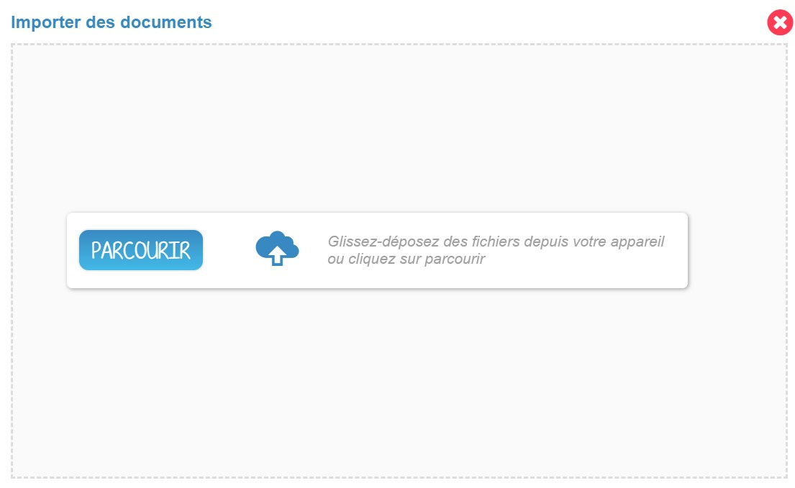
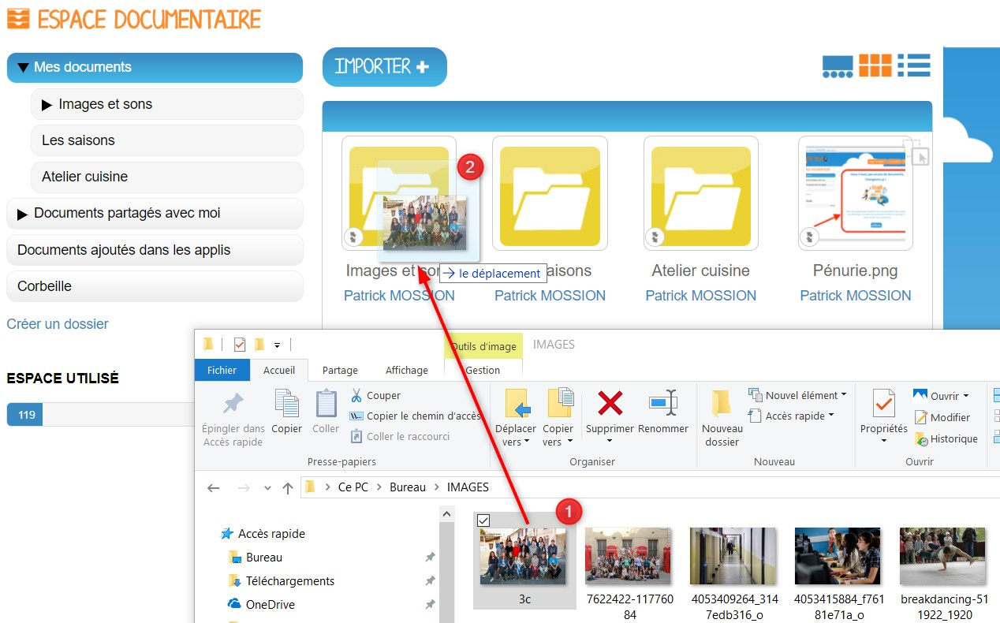
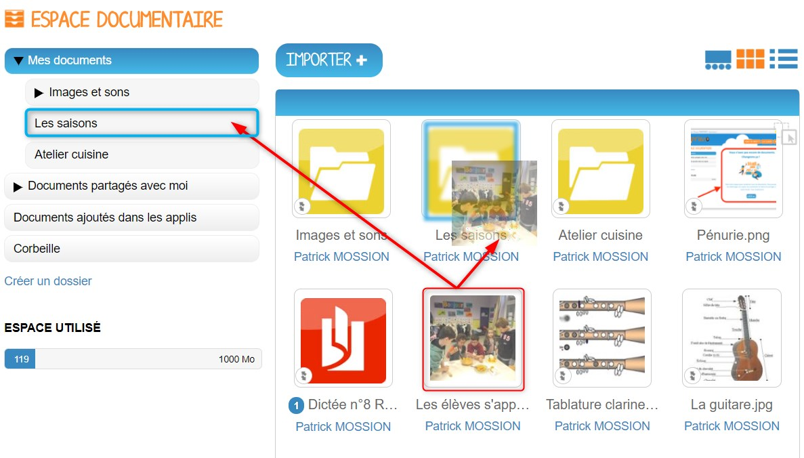
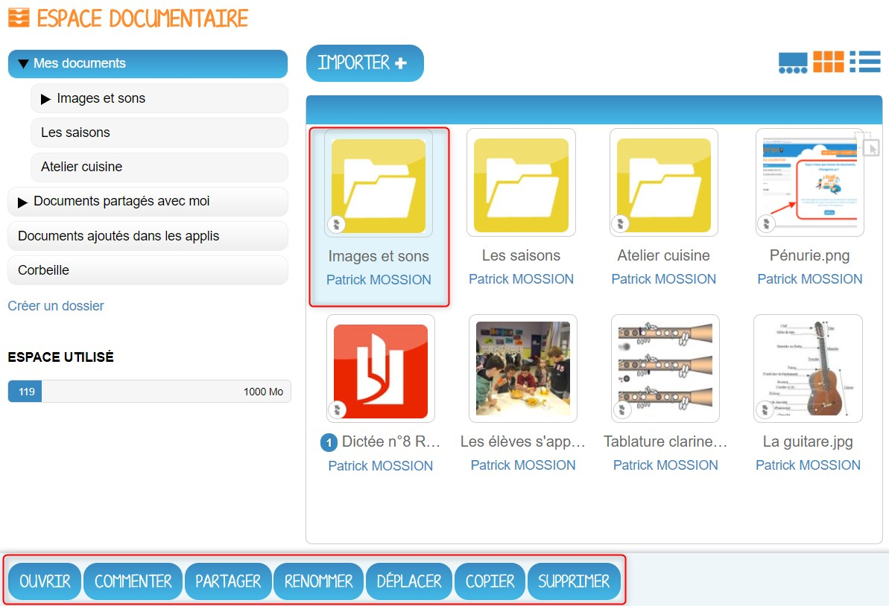
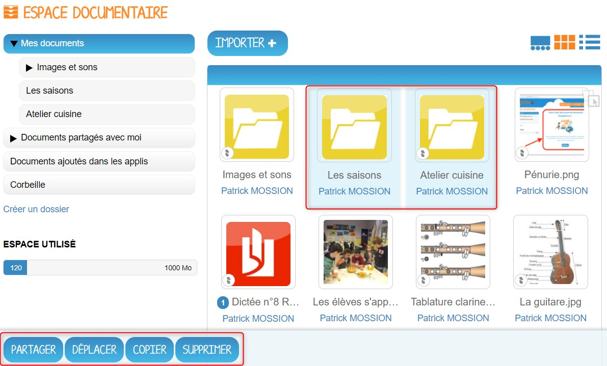

# Espace documentaire

À chacun son classeur numérique ! Grâce à l’application **Espace documentaire**, retrouvez, au même endroit, tous les documents utilisés à travers les applis ONE Stockez d’autres fichiers et organisez-les dans votre espace en fonction de leurs thématiques, du cours ou de la classe concernée !

* [Présentation](https://github.com/web-education/application-help-1d/tree/ad32183a1d403a859b77c57fb7a49b74169d99cc/application/workspace/index.html?iframe=true#presentation)
* [Importer un document](https://github.com/web-education/application-help-1d/tree/ad32183a1d403a859b77c57fb7a49b74169d99cc/application/workspace/index.html?iframe=true#cas-d-usage-1)
* [Déplacer un document ou un dossier](https://github.com/web-education/application-help-1d/tree/ad32183a1d403a859b77c57fb7a49b74169d99cc/application/workspace/index.html?iframe=true#cas-d-usage-2)
* [Naviguer dans mon Espace Documentaire](https://github.com/web-education/application-help-1d/tree/ad32183a1d403a859b77c57fb7a49b74169d99cc/application/workspace/index.html?iframe=true#cas-d-usage-3)
* [Connaître l’espace de stockage disponible](https://github.com/web-education/application-help-1d/tree/ad32183a1d403a859b77c57fb7a49b74169d99cc/application/workspace/index.html?iframe=true#cas-d-usage-4)
* [Ajouter la nouvelle version d’un document](https://github.com/web-education/application-help-1d/tree/ad32183a1d403a859b77c57fb7a49b74169d99cc/application/workspace/index.html?iframe=true#cas-d-usage-5)
* [Accéder aux anciennes versions de son document](https://github.com/web-education/application-help-1d/tree/ad32183a1d403a859b77c57fb7a49b74169d99cc/application/workspace/index.html?iframe=true#cas-d-usage-6)
* [Note de version](https://github.com/web-education/application-help-1d/tree/ad32183a1d403a859b77c57fb7a49b74169d99cc/application/workspace/index.html?iframe=true#notes-de-versions)

mage:../../wp-content/uploads/2015/03/CC-BY-NC-SA-3.0-FR-300x105.png\[\]

## Présentation

L’application Document d’un utilisateur est composée de 4 dossiers :

**Mes documents** Dans ce dossier, vous pouvez charger tous types de fichiers depuis votre ordinateur, qu’il s’agisse de documents texte ou PDF, d’images, de vidéos ou d’extraits audio. Classez ces fichiers dans des dossier pour les retrouver plus facilement. En quelques clics, partagez vos documents personnels avec d’autres utilisateurs en leur attribuant des droits de consultation, de contribution ou de commentaire, selon vos besoins.

**Documents partagés avec moi** Vous retrouvez dans ce dossier les documents que d’autres utilisateurs ont partagés avec vous.

**Documents ajoutés dans les applis** Vous retrouverez ici tous les fichiers que vous avez ajouté dans d’autres applis \(par exemple image d’un billet de blog\).

**En centralisant l’ensemble des documents accessibles par l’utilisateur, l’appli Documents permet d’intégrer facilement un contenu dans n’importe quelle appli.**

== Importer un document

Pour importer un document dans votre espace de stockage personnel, cliquez sur le bouton « Importer » situé en haut de l’interface.

Dans la nouvelle fenêtre, suivez les étapes suivantes :

1. Cliquez sur « Parcourir » et sélectionnez sur votre ordinateur le document que vous souhaitez enregistrer dans l’espace documentaire de la plateforme.
2. Cliquez sur « Importer ».
3. Lorsque la case est cochée, cela signifie que le document a bien été importé dans votre espace documentaire. Vous pouvez fermer la fenêtre.

**Une icône d’attente s’affiche pour indiquer que le chargement du document est en cours.**

**Vous pouvez importer plusieurs fichiers en une seule fois, si vous en sélectionnez plusieurs sur votre ordinateur.**

 _'_''

Vous pouvez aussi importer un document ou plusieurs documents en effectuant un glisser-déposer. Pour cela, sélectionnez le ou les documents à déplacer \(1\) depuis votre espace de travail et glissez-le vers son nouvel emplacement \(2\).

## Déplacer un document ou un dossier

Vous pouvez déplacer vos documents et vos dossiers facilement dans votre espace documentaire. Pour cela, sélectionnez le document ou le dossier à déplacer \(1\) et glissez-le vers son nouvel emplacement \(2\).

Vous ne pouvez pas déplacer un fichier du dossier « Mes documents » vers les dossiers « Documents partagés avec moi » et « Documents ajoutés dans les applis ».

Le dossier se trouve maintenant à l’emplacement choisi.

## Naviguer dans mes Documents

Pour **accéder au menu d’option** d’un fichier ou d’un dossier, vous devez **cliquer une fois** dessus. Le menu s’affiche ensuite en bas de la page et vous pouvez choisir les actions à effectuer.  
Vous devez cliquer une nouvelle fois sur le fichier ou le dossier pour le désélectionner.

Pour **visualiser un fichier** sur la visionneuse de la plateforme ou pour **ouvrir un dossier**, vous devez **double-cliquer dessus**.

Vous pouvez également sélectionner plusieurs fichiers ou dossiers si vous souhaitez effectuer une action sur tous ces documents simultanément.

**ATTENTION**  
Si vous effectuez une action de partage sur plusieurs fichiers ou dossiers alors que l’un de ces fichiers ou dossiers possède déjà un partage, vous supprimerez l’ancien partage effectué sur ce fichier ou dossier.

## Connaître l’espace de stockage disponible

La jauge affichée sous la liste des dossiers de l’espace documentaire vous permet de connaître l’espace de stockage dont vous disposez. L’espace utilisé est indiqué sur la gauche. Le chiffre situé sur la droite indique l’espace total de l’utilisateur.

