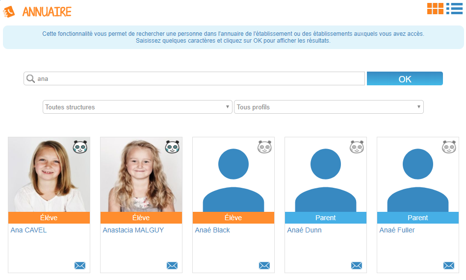

# Annuaire

Besoin de rentrer en contact rapidement ? Pas de panique, grâce à l’appli **Annuaire**, recherchez facilement un utilisateurs avec lequel vous pouvez communiquer !

## Présentation

Pour effectuer une recherche, il suffit de saisir les premières lettres du nom ou du prénom de l’utilisateur et de filtrer les résultats par structure ou type de profil.

Le code couleur présent sur chaque vignette permet d’identifier rapidement le profil des utilisateurs \(enseignant, élève, parent, etc.\). En cliquant sur une vignette, il est possible d’accéder aux **informations personnelles** de l’utilisateur \(photo, classe, statut…\) et **d’interagir avec lui en quelques clics** \(envoi d’un message par exemple\).

