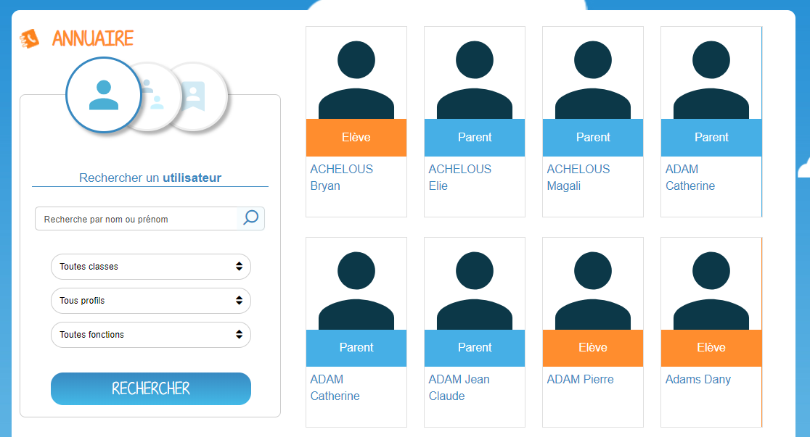
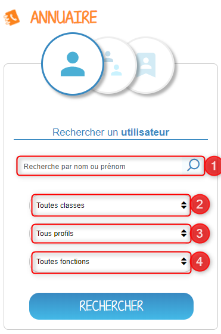
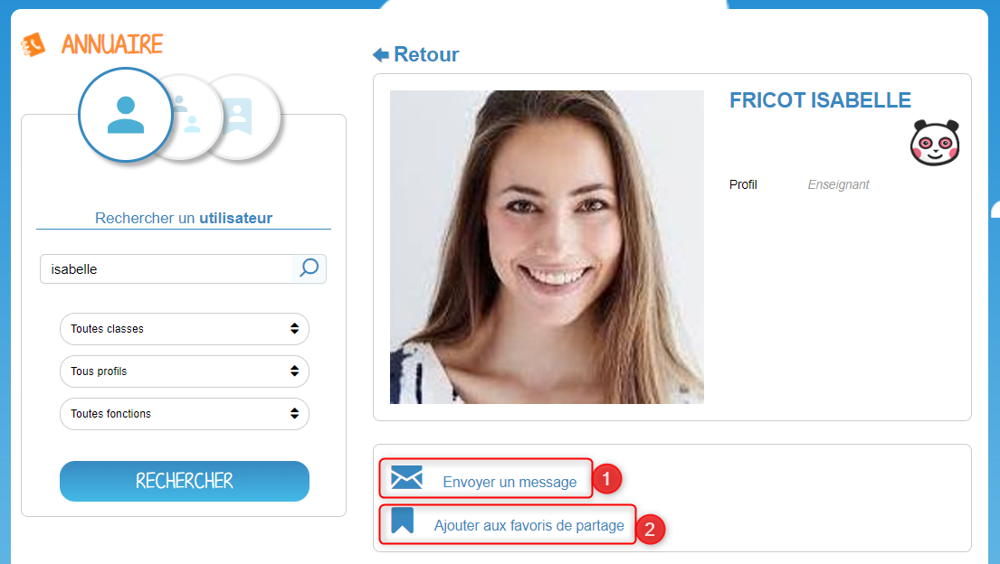
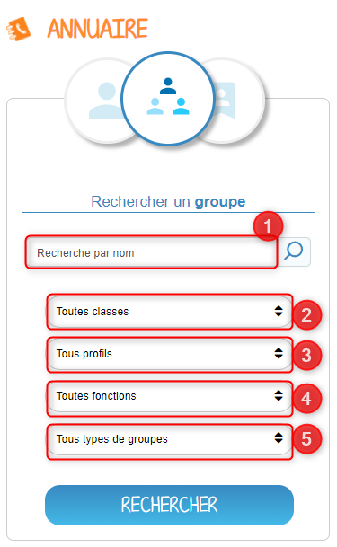
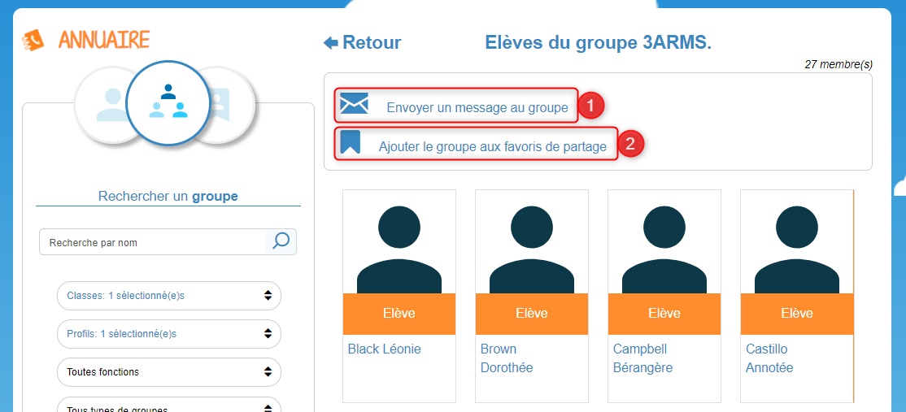

# Annuaire

 Grâce à l’**Annuaire**, vous allez pouvoir rechercher les utilisateurs et les groupes avec lesquels vous pouvez communiquer. Vous pourrez également créer et gérer vos favoris de partage. Tout votre réseau accessible au même endroit !

## Présentation

Grâce au service "Annuaire", vous allez pouvoir :

* Rechercher un utilisateur
* Rechercher un groupe
* Créer et gérer des favoris de partage

## Rechercher un utilisateur {#rechercher-un-utilisateur}

Vous pouvez rechercher facilement et rapidement un utilisateur. Pour effectuer votre recherche, vous disposez un onglet de recherche \(1\) et de filtres afin d’affiner les résultats. Vous pourrez filtrer par :

* Classe \(2\)
* Profil \(élève, enseignant, parent, personnel, invité\) \(3\)
* Fonction \(administrateur\) \(4\)

 Une fois l’utilisateur trouvé, vous pouvez consulter sa fiche. Vous avez la possibilité de lui envoyer un message \(1\), l’ajouter dans vos favoris de partage \(2\), ou consulter tout simplement les informations disponibles sur sa fiche.

## Rechercher un groupe {#rechercher-un-groupe}

Vous pouvez rechercher facilement et rapidement un groupe d’utilisateurs. Pour effectuer votre recherche, vous disposez un onglet de recherche \(1\) et de filtres afin d’affiner les résultats. Vous pourrez filtrer par :

* Classe \(2\)
* Profil \(élève, enseignant, parent, personnel, invité\) \(3\)
* Fonction \(administrateur\) \(4\)
* Type de groupe \(Groupe d’enseignement, groupe de communauté, groupe manuel\) \(5\)

Une fois le groupe trouvé, vous pouvez accéder à la liste des utilisateurs concernés. Vous avez la possibilité d’envoyer un message au groupe \(1\), d’ajouter le groupe à vos favoris de partage \(2\), ou consulter leurs fiches individuelles.

## Gérer vos favoris de partage {#gerer-vos-favoris-de-partage}

En cliquant sur la fenêtre des favoris, vous pourrez gérer des listes d’utilisateurs avec lesquels vous communiquez régulièrement. Vous retrouverez vos listes de favoris à chaque fois que vous aurez besoin de partager un contenu, à travers l’onglet de recherche d’utilisateurs dans la fenêtre de partage, ainsi que dans la messagerie. Dans cet espace, vous voyez apparaître vos favoris préalablement enregistrés \(1\). Vous avez la possibilité d’effectuer une recherche dans vos listes de favoris grâce à la barre de recherche \(2\), ou bien de créer directement une liste \(3\).

